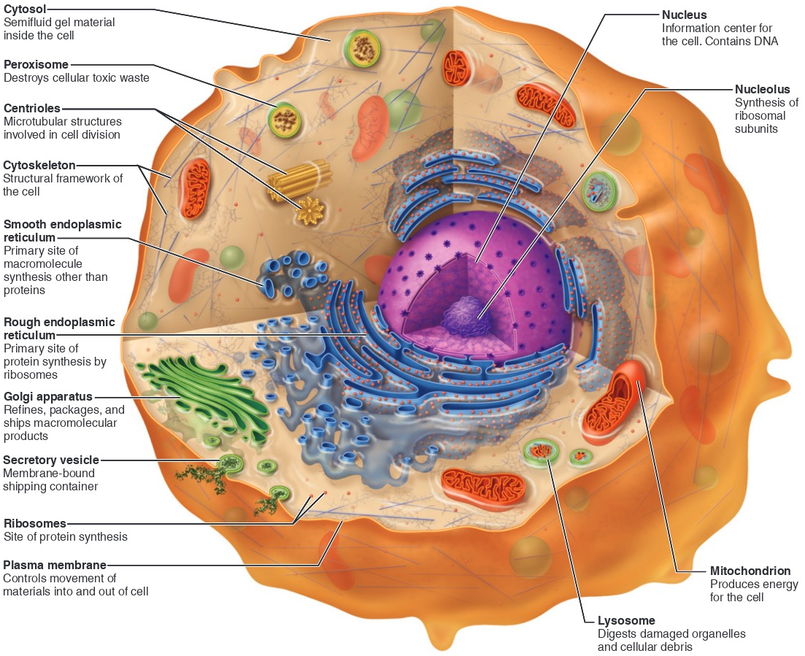
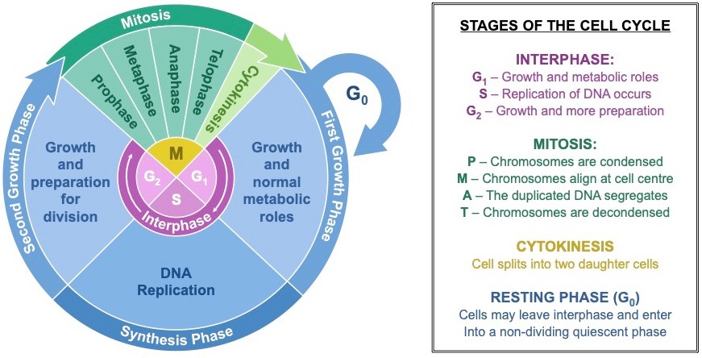
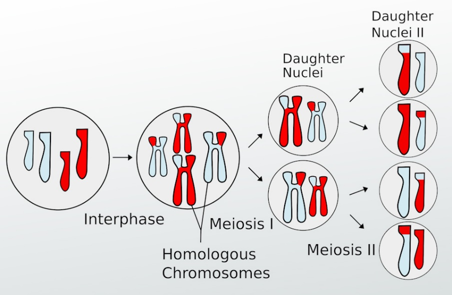
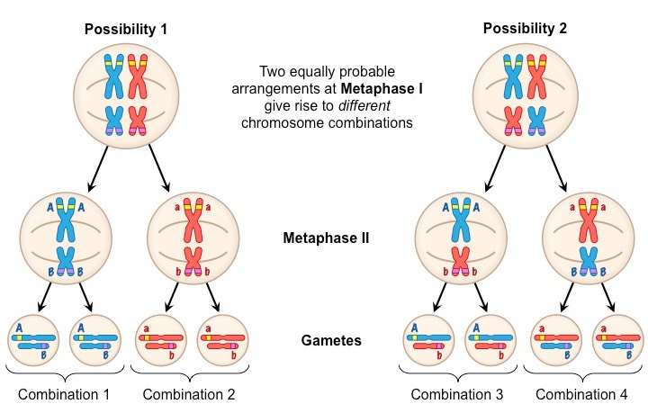
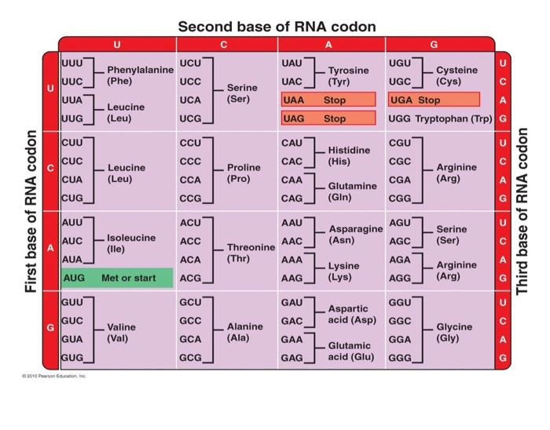
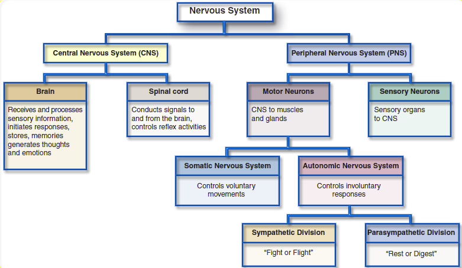
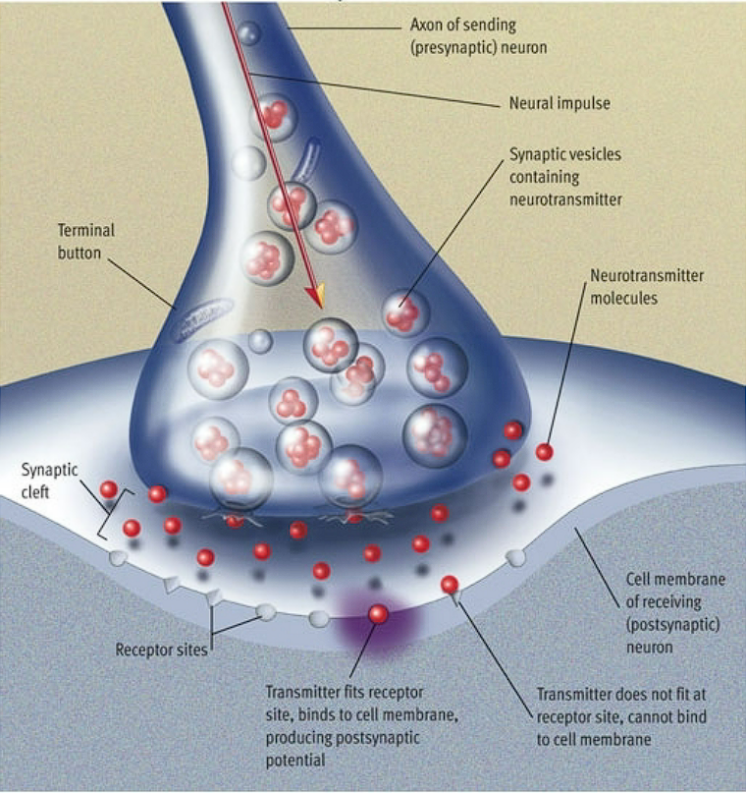
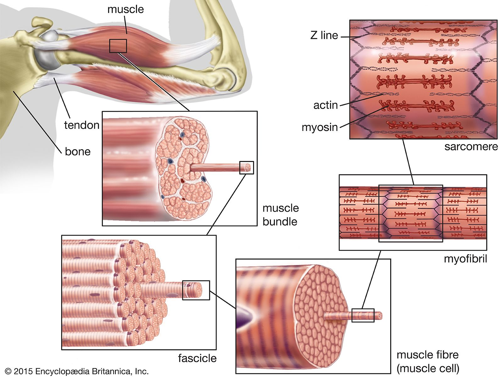

Critical Thinking 

- Correlation/Causation

- Question qualifications:

  - Paid and whether that matters

    - Who they're paid by

  - Anecdote vs. Evidence

  - Facts and Conclusions

 

Cells

- Levels of Organization:

  - Atom

  - Molecule

  - Organelle

  - Cell

  - Tissue

  - Organ

  - Organ System

  - Organism

- Organelle/Organ/Organ System

  - Does a particular job in a lifeform

- Cell Theory

  - All living things are made out of cells

  - A single cell is the smallest unit of life

  - All cells come from other cells

- Cell Functions

  - Gather raw materials

  - Excrete waste

  - Make biological molecules

  - Grow and reproduce

  - Other specialized jobs

- Eukaryotic Cells

  - 

  - 

<table>
<colgroup>
<col style="width: 27%" />
<col style="width: 47%" />
<col style="width: 24%" />
</colgroup>
<thead>
<tr class="header">
<th>Prokaryotic</th>
<th>Eukaryotic</th>
<th>Both</th>
</tr>
</thead>
<tbody>
<tr class="odd">
<td>Bacteria</td>
<td>Human</td>
<td>Ribosomes</td>
</tr>
<tr class="even">
<td>Small</td>
<td>Large</td>
<td>DNA</td>
</tr>
<tr class="odd">
<td>No Nucleus</td>
<td>Nucleus</td>
<td>
Plasma

Membrane
</td>
</tr>
<tr class="even">
<td> </td>
<td>Mitochondria</td>
<td> </td>
</tr>
<tr class="odd">
<td> </td>
<td>
Membrane-bound

Organelles

(ER, Lysosomes, Golgi)
</td>
<td> </td>
</tr>
</tbody>
</table>

 

 

Cells to Organ Systems

- Levels of Organization:

  - Cell

    - Smallest unit of life

    - Cell Junctions

      - Proteins holding cells together

      - Types of Junctions:

        - Tight

          - Leak-proof seal

        - Adhesion

          - Flexible anchor

        - Gap

          - Direct transfer from cell-to-cell

          - Heart muscles

            - Want them all to work together

  - Tissue

    - Group of specialized cells that are similar in structure and function

    - Tissue types:

      - Epithelial

        - Sheets of cells that line or cover body surfaces and cavities

        - Cell types (increasing in height from Basement Membrane):

          - Squamous

          - Cuboidal

          - Columnar

            - Some have Goblet Cells in them

              - Produce mucus

        - Basement Membrane

          - Provides structural support

        - Tissues can be single or many layers thick

          - Simple - One layer thick

          - Stratified - Multiple layers thick

      - Connective

        - Matrix that supports and connects body parts

        - Fibers and cells embedded in gel-like Ground Substance

          - What the Ground Substance is depends on the area the connective tissue is in

        - Fibroblasts

          - Produce protein fibers of different types

        - Types of Fibers:

          - Collagen Fibers

            - Strong and slightly flexible

            - Found in bones

          - Elastic Fibers

            - Stretch without breaking

          - Reticular Fibers

            - Framework

      - Muscle

        - Fibers that shorten to produce movement

        - Types of Muscles:

          - Muscles

            - Attach to and move skeleton

            - Long, thin cells arranged in parallel

            - Voluntary

          - Cardiac

            - Found only in the heart

            - Gap junction between cells

            - Involuntary

          - Smooth

            - Found in places like the digestive tract

            - Surrounds hollow organs and tubes

            - Gap junctions between cells

            - Involuntary

      - Nervous

        - Rapid communication network for the body (avg. of 20 ms)

        - Located in brain, spinal cord, nerves

        - Use electrical signals

        - Nervous tissue cells are called neurons

  - Organ

    - Two or more tissue types joined together to perform a specific function

  - Organ System

    - Group of organs that work together for a specific function

 

The Chemistry of Living Things

- Elements and Atoms

  - Matter

    - Anything that has mass and occupies space

  - Elements

    - Atoms that cannot be broken down by chemical means

  - Atoms

    - Smallest functional unit of any elements

- Atomic Structure

  - Subatomic Particles

    - Proton

      - Positive

    - Neutron

      - Neutral

    - Electron

      - Negative

      - Full shell is 8 electrons

  - Nucleus

    - Contain Neutrons and Electrons

- Chemical Bonds

  - Most stable when outermost shell is completely filled

  - Atoms interact to fill outermost shell

- Ion

  - Charged atom

    - Loss or gain of an electron

- Bonds

  - Ionic Bond

    - Electron from one atom to another, bonding them (Transfer)

    - Medium

  - Covalent Bond

    - Strong

    - Shared electron

      - Polar

        - Not shared equally

      - Non-polar

        - Shared equally

  - Hydrogen Bond

    - Bond between polar molecules (attraction)

    - Weakest

      - Partial charge

- Solutions

  - Solvent

    - Something that dissolves something else

    - Often liquid

  - Solute

    - Something that get dissolved

    - Often solid

  - Hydrophobic

    - Doesn't mix well with water

    - Non-Polar Covalent bonds

  - Hydrophilic

    - Mixes well with water

    - Polar and Ionic bonds

- pH

  - Water can be separated into two charged particles

    - H+ (acid) and OH- (base)

  - Water-based solutions can be acidic, basic, or neutral

  - Body range is 7.35-7.45 pH in the blood

 

The Molecules of Cells

- Organic Compounds

  - Molecules the contain carbon and other atoms held together by covalent bonds

  - Carbon's covalent bonds mean organic compounds can have almost any shape

  - Molecule vs Macromolecule

    - Biological Macromolecules:

      - Carbohydrates

      - Fats/Lipids

      - Proteins

      - Nucleic Acids

- Molecules

  - Terms:

    - Monomer

      - Single building block

    - Polymer

      - Monomers chemically bonded together

  - Dehydration Synthesis

    - Take away water and make a chemical bond

  - Hydrolysis

    - Combine with water to break a bond

- Carbohydrates

  - Functions:

    - Energy

      - Immediate and/or Stored

    - Structural Support

      - Found mostly in Plants

  - Atoms Involved:

    - Carbon

    - Hydrogen

    - Oxygen

  - Forms:

    - Monosaccharide (1 Sugar)

      - Glucose

      - Fructose

      - Galactose

    - Disaccharide (2 Sugars)

      - Sucrose

        - Glucose and Fructose

      - Lactose

        - Galactose and Glucose

    - Polysaccharide (Many Sugars)

      - All made from Glucose (just arranged differently)

      - Energy Storage

        - Glycogen (Animals)

        - Starch (Plants)

      - Structural Support

        - Cellulose (Plants)

          - Fiber

- Lipids

  - Functions

    - Moving and storing energy

    - Absorbing vitamins

    - Making hormones

  - Atoms (Non-Polar Covalent Bonds):

    - Carbon

    - Hydrogen

  - Forms:

    - Triglycerides (Fats and Oils)

      - Made from:

        - Glycerol

        - 3 Fatty Acid Chains

          - Saturated

            - Complete chains

            - Solid at room temperature

            - Not good for cardiovascular health

            - Examples:

              - Animal Origin:

                - Butter

                - Cheese

          - Unsaturated

            - Chains that are no completely filled out

            - Liquid at room temperature

            - Examples:

              - Plant Origin:

                - Oil

    - Phospholipids

      - Similar to triglyceride but has a phosphate in place of a fatty acid chain

      - Made from:

        - Phosphate

          - Hydrophilic

        - Glycerol

          - Hydrophobic

        - Fatty Acids

          - Hydrophobic

    - Steroids

      - Examples:

        - Cholesterol

          - Building block for other steroids

        - Testosterone

        - Estrogen

- Proteins

  - Functions:

    - 3D folding of proteins allow for a variety of functions

      - Enzymes

        - Speed up chemical reactions

          - Does so with no alteration with itself

        - Necessary for life because most chemical reactions are typically too slow

      - Muscle Contraction

      - Hormones (Insulin)

      - Membrane Transport

      - Structural Support

  - Chains of Amino Acids

  - Structure:

    - Amino Group

    - R Group (Side Chain)

    - Carboxyl Group

  - R Group:

    - Every Amino Acid has a different one

      - Property of the protein depends on the property of the R Groups

    - Can be:

      - Non-Polar

      - Polar

      - Charged (+/-)

  - Polypeptides (Polymer of Amino Acids)

    - Bonded by a peptide bond

      - Only found in amino acid bond

  - Levels of Structure:

    - Primary

      - Sequence of amino acids

    - Secondary

      - Hydrogen bonds between neighboring amino acids

    - Tertiary

      - 3D folding of the polypeptide

    - Quaternary

      - Assembly of multiple polypeptides

  - Denaturation

    - Bonds forming a protein's 3D shape are disrupted

    - Weaker bonds like hydrogen bonds

      - Secondary, Tertiary, Quaternary

    - Covalent bonds are not disrupted

      - Primary

- Nucleic Acids

  - Functions:

    - DNA

      - Stores genetic information

        - Recipes for proteins

      - Found in the nucleus

    - RNA

      - Working copy of the DNA

        - Directly involved in making proteins without risking DNA

  - Monomer

    - Nucleotides

      - A - Adenine

      - C - Cytosine

      - T - Thymine

      - G - Guanine

    - A - T

    - C - G

 

Digestive System

- Digestion

  - Process of breaking down food into substances that can be absorbed by the body

  - Two types of digestion:

    - Mechanical

      - Physical process of breaking down food into smaller pieces

        - Allows chemical to better react, and therefore, process the food

      - Occurs in:

        - Mouth

        - Stomach

    - Chemical

      - Enzymes break macromolecules into monomers

      - Occurs in:

        - Mouth

        - Stomach

        - Small Intestine

- Gastrointestinal (GI) Tract

  - Function:

    - Organs that are directly in contact and responsible for digestion of food

  - Same parts between them all:

    - Lumen

      - Space within hollow tube that food and liquid travel through

    - Mucosa

      - Layer that first absorbs nutrients

        - High surface area

    - Submucosa

      - Connective tissue layer

        - Contains:

          - Blood vessels

          - Lymph vessels

          - Nerves

    - Muscularis

      - Two layers (Three in stomach) of smooth muscle

        - Used for Peristalsis

          - Movement of muscles that forces food and liquid through the GI Tract

    - Serosa

      - Thin connective tissue sheath that surrounds, protects, and connects to body cavity

  - Specific Organs:

    - Mouth

      - Saliva

        - Salivary Amylase

          - Enzyme that digests Carbohydrates

        - Bicarbonate

          - Makes pH of mouth 6.5 - 7.5

            - Important for enzymes in Saliva

        - Produced by Salivary Glands

      - Mechanical Digestion

    - Esophagus

      - Bolus

        - Ball of Food

        - Pushed by muscles into the stomach

      - Lower Gastroesophageal Sphincter relaxes and food enter the stomach

      - Peristalsis

        - Movement of the muscles that moves food through the digestive system

          - Also occurs in the intestines

      - Heartburn

        - Stomach acid being splashed into the esophagus

          - Can damage the esophagus

    - Stomach

      - Functions:

        - Stores food

        - Regulates movement of food to the small intestine

        - Digestion

          - Mechanical

            - Layer of muscle that squeezes food to a pulp

          - Chemical

            - Pepsin

              - Digests proteins

      - Mucosa Layer Makes:

        - Mucus

          - Protect the stomach from the stomach acid

        - Gastric Juice

          - Liquid

            - Aids in making food a pulp

            - Mostly water

          - Acid

            - pH of around 2

              - Slightly less acidic than battery acid

          - Pepsin

      - Stomach Acid

        - Not strong enough to break down macromolecules (covalent bonds)

    - Accessory Organs

      - Function:

        - Secretion

          - Producing digestive enzymes/liquids that help with digestion

      - Specific Organs:

        - Salivary Glands

          - Produce saliva to mix with food

        - Liver

          - Produce Bile

            - Emulsifies fats

              - Helps fat to evenly mix with food

        - Gall Bladder

          - Stores and concentrates Bile

            - Useful/Needed for really fatty meals

        - Pancreas

          - Digestive Enzymes for:

            - Proteins

            - Lipids

            - Carbohydrates

          - Neutralizes stomach acid with Bicarbonate

            - Makes pH ~7

    - Small Intestine

      - Main Functions:

        - Digestion

        - Absorption

      - Methods to Increase Surface Area:

        - Fold

        - Villi

        - Microvilli

      - Function of the Capillaries:

        - Absorb and Transport nutrients to the rest of the body through the blood

        - Smallest blood vessels

      - Lacteal

        - Lymphatic Capillaries

          - Carries Lymph, not Blood

    - Large Intestine

      - Absorb water

        - Also any nutrients that slipped through small intestine

          - Not a lot usually

      - Store waste

        - Feces

          - Undigested Food

          - Contains Bacteria that produce nutrients from digesting things we can't digest

            - Fiber and similar

          - Dead Cells

      - Appendix

        - No one is sure of true use

          - One possibility is that it stores bacteria for if it ever gets wiped out somehow

  - Chemical Digestion

    - Carbohydrate

      - Turns into Monosaccharides

        - Absorbs into Blood Capillaries

      - Mouth and Small Intestine

    - Proteins

      - Turns into Amino Acids

        - Absorbs into Blood Capillaries

      - Stomach and Small Intestine

    - Lipids

      - Turns into Monoglycerides (Glycerol) and Fatty Acids

        - Packaged into Chylomicron (fats and proteins)

          - Travel through Lymphatic Capillaries (Lacteal) because they are too big

            - Eventually mixes with blood near the heart

      - Small Intestine only

- Nutrients to Energy for Cells

  - Adenosine Triphosphate (ATP)

    - Universal source for cells

    - High energy phosphate bond

    - Release energy when bond is broken

    - Reform bond using energy from food

  - Cellular Respiration

    - Oxygen from Respiration gets transported to cells through blood

      - Necessary for Cellular Respiration

        - Source of Carbon Dioxide in Respiration

    - With Oxygen:

      - 36 ATP

        - Glycolysis

          - 2 ATP

        - Citric Acid Cycle

          - 2 ATP

        - Electron Transport System

          - ~32 ATP

    - Without Oxygen

      - 2 ATP

        - Glycolysis would be only source

    - Steps:

      - Glycolysis

        - Occurs in Cytoplasm

          - Glucose (6 Carbon Sugar) is broken in half

            - 2 Pyruvates (3 Carbon Sugar) are produced

          - Anaerobic

        - Produces

          - 2 ATP

            - Good for fast, short term ATP production in muscles

          - 2 NADH (high energy electron carriers) are produced

            - Used for electron transport chain

        - Formula:

          - C6H12O6 (Glucose) + 6O2 ---\> 6CO2 + 6H2O + ATP

      - After Glycolysis:

        - No Oxygen

          - Fermentation

            - Occurs with No Oxygen

            - Allows Glycolysis to continue going

              - Regenerates NAD+

            - Types:

              - Lactic Acid Fermentation

                - Bacteria and Mammal Muscle

<!-- -->

- Allows glycolysis to continue

  - Produces:

<!-- -->

- 2 Lactic Acid

  - Alcohol Fermentation

    - Yeast

    - Produces:

<!-- -->

- 2 Ethanol + CO2

  - With Oxygen

    - Preparatory Step

      - Mitochondria

      - Prepare Pyruvate for Citric Acid Cycle

        - 2 CO2 is produced

          - 2 of the 6 Carbon from Glucose

    - Citric Acid Cycle

      - Produces:

        - 2 ATP

        - 6 NADH and 2 FADH2

        - 4 CO2

          - All the carbons from glucose are now in CO2

      - Fatty Acids and Amino Acids

        - Can also be used for energy in this cycle

    - Electron Transport System

      - Energy from NADH (high energy electron carriers) is used to produce ATP

        - Requires oxygen to capture the electrons

          - If no Oxygen available, Citric Acid Cycle will get backed up

        - Forms water when electrons are capture by Oxygen

 

Unit 1 and 2 - Review

- Critical Thinking

  - Anecdote vs Data Driven

  - Goal of each author in writing the article

- Cell Structures

  - Nucleus

    - Stores genetic information

      - DNA/RNA

  - Ribosome

    - Create proteins

  - Rough Endoplasmic Reticulum

    - Protein to Cytoplasm

  - Smooth Endoplasmic Reticulum

    - Create Carbohydrates

  - Golgi Apparatus

    - Process Proteins

  - Vesicles

    - Transport cell proteins

    - Digest metabolic waste

    - Types:

      - Secretory

      - Peroxisomes

  - Mitochondria

    - Create energy for the cell

  - Cytoskeleton

    - Gives structure for the cell

  - Cilia and Flagella

    - Moves the cell

    - (Cilia) Moves things outside the cell

  - Lysosomes

    - Digestive enzymes for large molecules

  - Plasma Membrane

    - Protect cells from unwanted entry/exit

- Epithelium Tissue

  - Shape:

    - Squamous (Flat)

    - Cuboidal (Cube)

    - Columnar (Tall)

  - \# of Layers:

    - Simple (1)

    - Stratified (2+)

 

 

Unit 3 - Cellular Reproduction and Cancer

- Down Syndrome

  - Copy of chromosome 21

    - Developmental disorders

      - Short stature/distinct facial features

      - Mild to Moderate physical and cognitive impairment

      - Increased risk of problems involving heart, respiratory, digestive, hearing, vision, and/or thyroid glands

- Chromosomes

  - Wrapped around protein Chromatin

    - DNA/Protein make up Chromosome

  - 46 Chromosomes in 23 Pairs

    - 23rd pair are the sex chromosomes

      - X and/or Y

    - Homologous Chromosomes

      - Same genes in the same location

- Cell Division

  - Duplicate:

    - Organelles

    - Cytoplasm

    - Chromosomes

  - Separate into daughter cells

- Cell Cycle

  - Interphase

    - Growth Phase 1 (G1)

      - More organelles and cytoplasm

    - DNA Synthesis (S)

      - Copying all of the DNA in the cell

        - Centromere

          - Where Sister Chromatids are attached to each other

        - Sister Chromatids

          - Identical Chromosomes still attached after DNA Replication

            - Considered one chromosome until they split apart

        - Count Centromeres to determine number of chromosomes

      - Steps to Replication:

        - Untwisting and "Unzipping" (breaking Hydrogen Bonds)

        - Complementary Nucleotides are added to form a new DNA strand

          - Template

            - Pattern to make a copy of something

          - DNA Polymerase

            - Enzyme that catalyzes the synthesis of DNA

          - Steps:

            - Parental molecule of DNA separate and serve as templates

            - Free (roaming) Nucleotides join on broken apart parental strands

            - Nucleotides join parental strands until two daughter DNA molecules are made

              - Identical to each other and the original parental molecule

            - Daughter DNA molecules recoil back into Double Helix Structure

              - Parental and Daughter Strand make up each sister chromatid after replication process

    - Growth Phase 2 (G2)

      - Preparing for Mitosis (M)

      - Make the proteins necessary for Mitosis

  - Mitosis (M) - Cell Division

    - Prophase

      - Chromosomes condense

      - Creation of Mitotic Spindle forms

      - Nuclear Membrane breaks down

    - Metaphase

      - Chromosomes line up in middle of cell

      - Mitotic Spindle join with Chromosomes

    - Anaphase

      - Mitotic Spindle segregates sister chromatids

        - Cut Centromeres to allow Sister Chromatids to segregate

        - Become their own Chromosomes with their own Centromeres

    - Telophase (opposite of Prophase)

      - Chromosomes are decondensed

      - Mitotic Spindle breaks down

      - Nuclear Membrane reforms

  - Cytokinesis

    - Splitting of Daughter Cells

      - Contractile Ring of microfilaments

        - Acts like a drawstring that closes a bag

    - Same time as Telophase

      - Cell as opposed to Nucleus

- 

- DNA

  - A polymer of Nucleotides

    - Made of:

      - Phosphate

      - Sugar

      - Nitrogen-containing base

    - Covalent Bonds Between Sugar and Phosphates of two different Nucleotides

      - Made through Dehydration Synthesis

  - Double Helix Structure

    - Two strands of DNA held together by Hydrogen Bonds through:

      - Complementary Base Pairing

        - Adenine (A) and Thymine (T)

        - Cytosine (C) and Guanine (G)

 

 

Genetics

- Asexual Reproduction

  - Single Parent

  - Offspring identical to each other and parent

- Sexual Reproduction

  - Two Parents

    - Offspring are unique

    - Offspring are similar to each other and parents

    - Combine DNA from two individuals

    - Combines characteristics of both individuals

  - Sex Cells

    - Diploid Organisms

      - Individual (223 = 8 Million possibilities), Couple (8 Million2 = 64 Trillion possibilities)

      - Somatic (Body) Cells

        - 2n (2 x chromosomes in one set)

          - For humans it's 23 pairs/46 chromosomes

          - Reason for the name Diploid

      - Gametes (Sex Cells)

        - Sperm or Egg

        - Allow for traits to be combined from two organisms

        - Haploid

          - n (one set of chromosomes)

            - One from each parent

        - Meiosis

          - 

          - Specialized Cell Division

            - 2 Cell Divisions

              - DNA only replicated once

              - 4 Cells (each containing n chromosomes)

                - 2 from 1 daughter cell, 2 from another

          - Meiosis 1

            - Homologous Chromosomes separate in Meiosis 1

              - End as Haploid (1n)

            - Phases:

              - Interphase

                - Crossing over

              - Prophase

              - Metaphase

              - Anaphase

          - Independent Alignment

            - How one pair of chromosomes line up is independent of how the other pairs line up

            - 

          - Meiosis 2

            - Starting cell is Haploid

              - Duplicate DNA for Gametes to also be Haploid

            - Sister chromatid separate

        - Nondisjunction

          - Can occur in stage 1 or 2

          - Homologous chromosomes don't properly separate

            - Gamete either loses or gains a chromosomes

              - Usually results in miscarriage due to improper development

  - Diagnosis Procedures of Potential Genetic Problems

    - Screenings:

      - Blood Screening

        - Look at maternal blood for fetal DNA (look for extra chromosome 21 DNA)

          - Followed by Karyotyping

      - Ultrasound Screening

      - STORK

        - Sequencing instead of Karyotyping

          - \$200, 2 Hours

    - Invasive Tests:

      - Karyotyping

        - Used to diagnose Down Syndrome

        - Arrange Chromosomes by size

          - 1 is biggest, 23 is smallest, sex genes are separate

      - CVS

        - Biopsy of Placenta

      - Amniocentesis

        - Sample of Amniotic Fluid

 

 

Cell Reproduction

- Why do cells reproduce?

  - Growth

  - Repair

  - Maintenance

- Cancer is uncontrolled growth of cells

  - Conditions for Division:

    - Normal - Divide when given signal to do so

    - Cancer - Dividing indefinitely

  - Genes control when a cell should make a copy of itself and when it should stop dividing

    - Proto-oncogenes

      - Promote cell growth/reproduction

    - Tumor Suppressor Genes

      - Stop cell growth/reproduction

    - Changes (mutations) in these genes can lead to cancer

    - Changes in chromosome structure and number can also lead to cancer

      - Deletion

        - Missing genetic information

      - Inversion

        - Portions of chromosome invert

          - Could break a gene apart

          - Some "triggers" are controlled by a "control switch"

            - Wouldn't be able to turn off and on gene

      - Duplication

        - Extra genetic information

          - Not enough to equal another chromosome worth of data

      - Reciprocal Translocation

        - Non-Homologous Genes

          - Switch portions of the chromosome with each other

            - Similar to Crossing Over

            - More likely to cause problems in Meiosis

  - Tumors

    - Cell Mutates

    - Hyperplasia

    - Dysplasia

    - In Situ Cancer

      - Cancer is contained, not spreading

    - Malignant Tumor

      - Tumor can spread

        - Can break through normally barrier membranes

    - Metastasis

      - The spread of cancer to another area

 

 

 

How Traits are Determined

- Traits

  - Physical and behavioral characteristics that are the result of genetics

- Bases in DNA stores information which results in the traits that we observe

  - Contain Nucleotides

    - A - T - C - G

      - Adenine (A), Thymine (T), Cytosine (C), Guanine (G)

- Every Cell in your body will contain your entire genome

- Hierarchy of Genetics

  - Genome

    - All 46 Chromosomes

  - Chromosome

    - A set of Genes

  - Gene

    - A set of instructions formed from the Bases

  - Bases

    - Individual Nucleotides

- Traits are derived from the proteins that are instructed to be made by DNA (subsequently RNA) in ribosomes

- RNA

  - Single Stranded

  - Made from Nucleotides

    - U - A - C - G

      - U = Uracil

  - Three Main Types

    - mRNA

      - Messenger

      - Recipe for protein

    - rRNA

      - Ribosomal

      - Part of ribosomes

    - tRNA

      - Transfer

      - Brings Amino acids to ribosomes

  - Codon is sets of 3 Nucleotides that are read together to instruct when and what proteins are made

    - Genetic Code Dictionary

> 

- Information Flow from Genes to Proteins

  - DNA to RNA

    - In Nucleus

    - Transcription

      - DNA Nucleotides to RNA Nucleotides

        - A - T - C - G to U - A - C - G

      - RNA Polymerase making RNA using DNA as a template

  - RNA to Polypeptide (Protein)

    - Nucleus to Cytoplasm

    - Translation

      - Codon (Set of 3 Nucleotides in RNA) to Amino Acids

      - Initiation

        - Amino acids brought to start codon by tRNA

      - Elongation

        - Polypeptide getting longer

      - Termination

        - Polypeptide chain detaches at Stop

- Autosomal Disorder

  - Any genetic disorder within non-sex chromosomes

- Genetics/Punnett Square

  - Dominant/Recessive (Normal)

    - Two controlling genes

  - Incomplete Dominance

    - When heterozygous, combine phenotype

      - Red + White = Pink

  - Codominance

    - When heterozygous, simultaneous phenotype

      - Red + White = Red and White

  - Polygenic Traits

    - 3 or more controlling genes

 

 

 

Unit 4 - Genetics and Evolution

- Central Dogma of Biology

  - Genes code for proteins

    - Different genes means different proteins

- Alleles

  - The differing information in genes

    - Dominant

    - Recessive

  - Genotype

    - The alleles that are present for a particular gene

  - Phenotype

    - The expression of the gene based on the alleles that are present

- Evolution

  - Galapagos Islands - Charles Darwin

    - Observations made on birds on the islands that inspired and catalyzed the theory of evolution

  - Natural Selection

    - Heritability

      - DNA-based variations can be inherited

    - Struggle for Existence

      - Not all individuals in a population survive and reproduce

      - Some individuals are more successful at reproducing

        - Can be the determinates of the main genetic makeup of a population due to a higher prevalence of their DNA and subsequent survival

    - Individuals with favorable variations are more likely to survive and reproduce

      - Passed through offspring

      - Adaptations are specific to one environment

    - Over time, gradual changes can form new species

 

 

 

Unit 5 - Nervous System

 

 

Plasma Membrane

- Function

  - Controls what goes in and out of the cell

    - Selective Permeability

      - Size and Charge determine the rate of diffusion

      - Most to Least Permeable

        - Hydrophobic Molecules

          - O2, CO2, N2

        - Small, Uncharged Polar Molecules

          - H2O, Indole, Glycerol

        - Large, Uncharged Polar Molecules (Doesn't make it through on it's' own)

        - Ions (Doesn't make it through on it's own)

- Fluid Mosaic Model

  - The collection of the components to make one cohesive structure (membrane)

- Components

  - Phospholipids

  - Cholesterol

  - Proteins

    - Protein type depends on the cell type

- Movement In/Out of the Cell

  - Vocabulary:

    - Solute

      - Substance that gets dissolved

    - Solvent

      - Liquid that does the dissolving

    - Solution

      - Solute and Solvent together

    - Concentration

      - How much Solute is in the Solvent

  - Passive Transport

    - Types:

      - Diffusion

        - Random Molecular Motion

          - Molecules move around/into empty space due to this motion

        - Concentration Gradient

          - Difference in concentration in a solution

          - Emphasis on the difference between the outside and inside of the cell in biology

        - Dynamic Equilibrium

          - Concentration is the same but molecules still move

      - Facilitated Diffusion

        - Proteins allow for the movement molecules/ions that can't make it through the membrane on their own

  - Active Transport

    - Proteins pull things through

    - Low to High Concentration

    - Energy is required (ATP)

  - Exocytosis

    - Export bulky material through vesicles

  - Endocytosis

    - Phagocytosis by white blood cells

      - Vesicles form to carry things from the outside to the inside of the cell

 

 

Homeostasis

- Homeostatic variable

  - Something body wants to keep within a normal range

    - Heartbeat, Temp, Blood Pressure, pH

- Set point

  - Normal for the variable

    - 98.6 Fahrenheit for Temp

- Sensor

  - Senses the variable

    - Only give reading and doesn't determine if it's good or bad

- Control Center

  - Determines if variable is too high or low

  - If variable needs to be changed, sends message to effector

- Effector

  - Specific part of the body (usually muscles or glands) to carry out a body response

    - Too hot = start sweating and blood vessels in skin dilate

 

 

Nervous System

- Central Nervous System (CNS)

  - Brain and Spinal Cord

  - Receives, processes, stores, and transfers information

- Peripheral Nervous System

  - Nerves outside of the CNS

  - One half - Sends info to the CNS

  - Other half - Carries info from the CNS to other parts of the body

- Organization of the Nervous System

> 

- Sensory Inputs

  - External Stimuli

    - Special Senses

  - Internal Stimuli

- Somatic Division

  - Voluntary

  - Skeletal

- Autonomic Division

  - Involuntary

<!-- -->

- Neuron Types

  - Sensory Neurons

  - Motor Neurons

  - Interneuron

    - Integrating information between the two neurons

- Information Flow

  - Dendrites

    - Collect electrical information

  - Cell Body

    - Integrates incoming signals and generates outgoing signal to axon

  - Axon

    - Passes electrical signals to dendrites of another cell or to an effector cell

- Neuroglial Cells

  - Physical support and protection for neurons

  - Help maintain healthy levels of important chemicals

  - Schwann Cells (PNS) or Oligodendrocytes (CNS)

    - Make up Myelin Sheath

      - Wraps around it to form layers

      - Nodes of Ranvier

        - Gaps in Myelin Sheath

- Resting Potential

  - Energy that is stored in a useful form but has not yet been used

  - Separation of charge - One end negative, other positive

  - Chemical energy to electrical energy

    - Sodium/Potassium Pump

      - 3 Na+ out (high outside), 2 K+ inside the cell (high inside)

      - Uses ATP - Active Transport

        - Ions can't freely move through membrane

      - DNA and Many Proteins are negatively charged

        - Inside is negatively charged due to this and the pumping of positive charges out

          - -70 mV

- Graded Potential

  - Dendrites

  - Electrical signal the cell receives

  - Positive/Negative Charge (Variable over the course of activation)

    - Different amounts and length

  - Take a Resting Potential to Threshold to activate an Action Potential

- Action Potential

  - Axon

  - Sends and electrical signal given by the Dendrites and Cell Body

  - Always the same amount and length (all or nothing)

    - +40 mV

  - Mechanisms of the Action Potential (Sodium/Potassium Pump)

    - Depolarization

      - Na+ channel opens and moves into the cell (high to low concentration)

        - Facilitated when the channel is open

      - Cell becomes more positively charged (depolarized)

    - Repolarization

      - Na+ channel closes and K+ channel opens

      - K+ moves out of the cell (high to low)

      - Cell becomes more negative (repolarized)

    - Normalization

      - K+ channel closes and pump returns to normal resting potential

  - Propagation of an Action Potential

    - Unmyelinated Axons

      - Wave-like across the axon

    - Myelinated Axons

      - Jump over Myelin Insulation (quicker for longer axons found in arms/legs)

        - Can see the effects that a lack of myelin has with MS (Multiple Sclerosis) where Myelin is attacked by immune system

- Synaptic Cells

  - 

  - Presynaptic Cell

    - Sending signal

    - Neurotransmitter

      - Chemical signal

      - Vesicles

  - Postsynaptic Cell

    - Receiving Signal

    - Neurotransmitter Receptors

      - Can only accept certain chemical signals

  - Synapse

    - Tiny area between Synaptic Cells

  - Synaptic Transmission

    - Action potential causes Calcium to diffuse into Axon Terminal

    - Calcium causes Neurotransmitter Release

    - Neurotransmitter binds to Receptors on Sodium Channels on Postsynaptic Cell and they open

    - Open Channel generates Graded Potential in Postsynaptic Cell

- Sensory Receptors of the PNS

  - Stimulus

    - Signal that is detected by sensory receptor

      - Light, Sound, Temperature

  - Types:

    - Chemoreceptors

      - Chemical Stimuli

        - O2, taste, smell

    - Pain Receptors

      - Sends message that something is interacting with the body that is dangerous and harmful

        - Doesn't let up

    - Photoreceptors

      - Light and vision

    - Mechanoreceptors

      - Mechanical force

        - Touch, hearing, pressure

    - Thermoreceptors

      - Temperature

  - Special Senses

    - Taste

      - Types of Taste Chemoreceptors:

        - Sweet

        - Sour

        - Salty

        - Bitter

        - Umami

    - Smell

      - Important to perception of taste

      - ~900 Different Olfactory Chemoreceptors

    - Vision

      - Chemoreceptors

        - Rods

          - Low light

        - Cones

          - Color vision

    - Hearing

      - Mechanoreceptors

        - Cochlear Hair Cells

  - The Central Nervous System

    - Brain

    - Spinal Cord

  - Motor Division of the PNS

    - Somatic system

      - Skeletal Muscle

      - Spinal Reflex

        - Actions can be taken before the signal has reached the brain

      - Voluntary

        - Somatic motor neurons send signals telling skeletal muscle to contract

    - Autonomic system

      - Organs, Cardiac, Smooth Muscles, Glands (sweat, adrenal)

      - Involuntary

      - Two Divisions:

        - Sympathetic

          - Excite

          - Fight-or-Flight

        - Parasympathetic

          - Calm

          - Rest-and-Digest

 

Muscular and Skeletal Systems

- Types of Muscle Tissue:

  - Skeletal

    - Attach to and move Skeleton

    - Long, thin cells arranged in parallel

    - Voluntary

  - Cardiac

    - Found only in the Heart

    - Gap Junctions between cells

    - Involuntary

  - Smooth

    - Surrounds hollow organs and tubes

    - Gap Junctions between cells

    - Involuntary

- Skeletal Muscles

  - Can only:

    - Contract

    - Relax

  - Usually work in pairs with an Antagonistic Muscles

    - One contracts while one relaxes

  - Cells:

    - Tube shaped

    - Larger and longer than most other cells

    - Multi-nucleated

    - Parts of the Cell:

      - Packed with Myofibrils

        - Packed with Sarcomere

          - Contractile unit of the muscle

          - Gets shorter as the muscle contracts

            - Myosin (thick) head binds to Actin (thin) molecules and then bends

              - Bending pulls the thin filaments towards sarcomere center

              - Requires ATP

      - Sarcoplasmic Reticulum

        - Stores Ca2+

      - T-Tubule

        - Brings action potential into interior of muscle fiber

  - 

- Tendons

  - Attach Muscles to Bones

  - Made of connective tissue

    - Similar to ligaments

    - Limits the ability to heal quickly because they don't get all the nutrients from blood

  - Origin

    - The Tendon that is connected to a relatively stationary bone

  - Insertion

    - The Tendon that is connected to a relatively moveable bone

- Motor Neuron

  - Sends message to muscles to contract

- Activation of Skeletal Muscles

  - Action Potential in Motor Neuron leads to Action Potential in the Muscles Cell

  - The Action Potential is caried into the Muscle Cell by the T-Tubule

  - Muscle Action Potential releases Calcium from the Sarcoplasmic Reticulum

  - Calcium initiates Sliding Filament Mechanism

  - Contraction ends when Nerve Activation ends

- Sliding Filament Mechanism

  - Tropomyosin normally prevents Myosin thick filaments from binding Actin thin filaments

  - When Calcium binds Troponin, Tropomyosin moves out of the way and Myosin thick filaments can bind the Actin thin filaments

- Energy Usage

  - Requires ATP to:

    - To form Myosin-Actin cross bridge

    - To release Myosin-Actin cross bridge

    - Transport Calcium back into SR

  - 

<table>
<colgroup>
<col style="width: 23%" />
<col style="width: 24%" />
<col style="width: 24%" />
<col style="width: 27%" />
</colgroup>
<thead>
<tr class="header">
<th>Energy Sources</th>
<th>Quantity</th>
<th>Time of Use</th>
<th>Comments</th>
</tr>
</thead>
<tbody>
<tr class="odd">
<td>Stored ATP</td>
<td>Small</td>
<td>~10 sec</td>
<td>Only direct energy source</td>
</tr>
<tr class="even">
<td>Stored Creatine-P</td>
<td>3-5x ATP</td>
<td>~30 sec</td>
<td>Quickly converted to ATP</td>
</tr>
<tr class="odd">
<td>Stored Glycogen</td>
<td>Variable</td>
<td>First 3-5 minutes 
of heavy exercise</td>
<td>ATP Yield depends on 
O2 availability</td>
</tr>
<tr class="even">
<td>Aerobic Respiration</td>
<td>Nutrients constantly 
supplied by blood</td>
<td>Always present, 
increases w/ exercise</td>
<td>High ATP yield</td>
</tr>
</tbody>
</table>

- Types of Muscles:

  - Slow-Twitch Muscles

    - Endurance

    - Breaks down ATP slowly

    - Contract slowly

    - Aerobic respiration

    - Myoglobin

  - Fast-Twitch Muscles

    - Break down ATP quickly

    - Contract quickly

    - Anaerobic Respiration

    - Glycogen and Creatine

 

 

Skeletal System

- Functions

  - Support

  - Protection

  - Movement

  - Blood Cell Formation

  - Mineral Storage

- Joints

  - 2 or more bones joined together

  - Types of Joints

    - Immovable Joint (Skull)

      - Fixed Joint

    - Joint with Limited Movement (Spine)

      - Vertebrae and Disks

    - Moveable Joint (Hip)

      - Saddle Joint

      - Hinge Joint

    - Moveable Joints (Hand)

      - Ball-and-Socket Joint

- Ligaments

  - Join bones together

  - Connective Tissue

    - Strong in one direction (vertical or horizontal)

  - Slow to heal because not many cells, poor blood supply

  - Sprains damage ligaments

 

 

Cardiovascular System

- Functions:

  - Transport

    - Nutrients, oxygen, waste, products, etc.

  - Protection

    - Immune system, blood clotting

  - Regulation

    - Body temperature, pH and water content of cells

- Components

  - Heart

  - Blood Vessels

- Oxygen

  - Red blood cells contain hemoglobin

    - Protein that carries oxygen by temporarily binding to an iron atom (heme group)

    - Makes the blood red and the cell can even give up nucleus for more space to hold hemoglobin

- Blood Vessels

  - Arteries

    - Moves blood away from heart

      - Pushed by pressure created in heart

    - Characteristics:

      - High Pressure

      - Thick-Walled

      - Small Lumen (empty space)

      - Stiff and Elastic

  - Veins

    - Moves blood to the heart

      - Fight against Gravity

        - Skeletal Muscle Pump

          - Skeletal muscles squeeze veins (as muscles contract) pushing blood up

          - One-way valves prevent back flow

        - Respiratory Pump

          - Pressure changes from breathing push blood from abdomen towards the chest

    - Characteristics:

      - Low Pressure

      - Thin-Walled

      - Large Lumen (empty space)

      - High Distensibility

  - Capillaries

    - Exchange gasses, nutrients, and waste products

    - Capillary Beds:

      - Highly branched (web)

    - Precapillary Sphincters:

      - Controls blood flow into a capillary bed

      - Ring of smooth muscle that constricts entry to capillary bed

        - Usually still some blood flow

    - Slits

    - Pores

      - Openings to filter things out of blood

    - Jobs of Different Capillaries:

      - Lungs

        - Oxygen in, CO2 out (from blood)

      - Small Intestine

        - Nutrients enter blood

      - Kidneys

        - Cleans blood

        - Larger Pores

      - Tissue

        - Oxygen and Nutrients out, CO2 and Wastes in (blood)

      - Liver

        - Detoxify

        - Longer, twisted

- Organization of Cardiovascular System

  - Heart

  - Systemic Circuit

    - Blood Flow:

      - Heart

      - Systemic Arteries

        - Low O2, High CO2

      - Systemic Capillaries

        - O2 in, CO2 out

      - Systemic Veins

        - High O2, Low CO2

      - Heart

  - Pulmonary Circuit

    - Blood Flow:

      - Heart

      - Pulmonary Arteries

        - Low O2, High CO2

      - Lung Capillaries

        - O2 in, CO2 out

      - Pulmonary Veins

        - High O2, Low CO2

      - Heart

- Heart

  - Components

    - Myocardium

      - Cardiac muscle the forms the bulk of the heart

    - Epicardium

      - Outer layer of epithelial and connective tissue

    - Endocardium

      - Inner layer of epithelial and connective tissue

  - Blood Vessels Connected to the Heart

    - Superior Vena Cava

      - Largest Vein

      - Returns blood to the heart from the upper portion of the body

    - Inferior Vena Cava

      - Returns blood to the heart from the lower portion of the body

    - Aorta

      - Takes blood to body

    - Pulmonary Artery

      - Blood to lungs

    - Pulmonary Veins

      - Blood from lungs

  - Portions of the Heart

    - 

<table>
<colgroup>
<col style="width: 33%" />
<col style="width: 36%" />
<col style="width: 30%" />
</colgroup>
<thead>
<tr class="header">
<th>Chambers</th>
<th>Atria</th>
<th>Ventricles</th>
</tr>
</thead>
<tbody>
<tr class="odd">
<td>Right</td>
<td>
Low O2

from Body
</td>
<td>Low O2 
to Lungs</td>
</tr>
<tr class="even">
<td>Left</td>
<td>
High O2

from Lungs
</td>
<td>High O2 
to Body</td>
</tr>
</tbody>
</table>

- Atria - Collection Chambers

  - Right Atrium

    - Low O2 from Body

  - Left Atrium

    - High O2 from Lungs

- Ventricles - Pumping Chambers

  - Right Ventricle

    - Low O2 to Lungs

  - Left Ventricle

    - High O2 to Body

- Septum

  - Separation of the Atrial Chambers

- Valves

  - Function:

    - Keep blood going in one direction

    - Function due to pressure in blood opening and closing the valves

  - Atrioventricular Valves

    - Between Atrium and Ventricles

  - Semilunar Valves

    - Between veins and arteries that leave the heart

<!-- -->

- Cardiac Cycle

  - Heartbeat is stimulated by electrical signals

  - Rate controlled by nerves and hormones

  - Sound is made by closing of heart valves (lub-dub)

  - Pulses of contraction and relaxation the pump blood

    - Systole (Sys-toe-ly) - Contraction

      - Atrial Systole

        - Atria contract

        - Ventricles fill fully

        - AV valves open

        - SL valves closed

      - Ventricular Systole

        - Ventricles contract

        - AV valves close (lub)

        - SL valves open

        - Blood enters arteries

    - Diastole (Di-a-stoe-ly) - Relaxation

      - Atria and ventricles

      - SL valves close (dub)

      - AV valves open

      - Blood passively enters

- Blood Pressure

  - Force blood exerts on wall of blood vessels as a result of pumping of heart

    - Maintaining constant blood pressure is important for homeostasis

  - Blood flow is separate from pressure and controlled variably

    - Metabolically active tissues use more O2 and nutrients and give off more CO2 and waste

      - Meaning it needs more blood flow

  - Baroreceptors - Sensor

    - Sense blood pressure through the amount of stretching in blood vessels

    - Carotid (artery bringing blood to head)

    - Aortic

  - Signal to Change Blood Pressure - Effector

    - 

<table>
<colgroup>
<col style="width: 20%" />
<col style="width: 38%" />
<col style="width: 40%" />
</colgroup>
<thead>
<tr class="header">
<th>Pressure</th>
<th>Too High</th>
<th>Too Low</th>
</tr>
</thead>
<tbody>
<tr class="odd">
<td>Heart</td>
<td>Lower HR and force</td>
<td>Increase HR and force</td>
</tr>
<tr class="even">
<td>
Blood

Vessels
</td>
<td>
Dilate - Increasing

Blood Flow
</td>
<td>Constrict - Decreases 
Blood Flow</td>
</tr>
</tbody>
</table>

- Measuring Blood Pressure

  - Measured from Arteries (mm Hg)

    - Systolic Blood Pressure

      - During Contraction

        - Higher Number

    - Diastolic Blood Pressure

      - During Relaxation

        - Lower Number

  - Hypotension

    - Low Blood Pressure

      - Symptoms

  - Hypertension

    - High Blood Pressure

      - Symptoms

        - None

      - Causes

        - Age, obesity, high salt, smoking, not exercising, stress, diabetes, etc.

      - Increased Risk of cardiovascular disease (heart attack, stroke) and atherosclerosis

        - Atherosclerosis

          - Fatty plaques build up in arteries

            - Can lead to blood clots

        - Embolism

          - Sudden blockage of a blood vessel (often via blood clot)

            - Cerebral

<!-- -->

- Stroke

  - Pulmonary

  - Cardiac

<!-- -->

- Heart Attack

 

- Cardiovascular Disease

  - Types

    - Heart Attack

      - Heart receives blood from coronary arteries

        - Blockage of Coronary Arteries make not enough Oxygen get to Heart Muscle(s) which leads to Cell Death

          - Heart Attack

            - Bypass Surgery

              - Insertion of new blood vessel around a blocked artery

            - Angina

              - Chest pain

                - Not enough O2

    - Aneurysm

      - Weakened blood vessel

        - Blood vessel bursts

    - Heart Failure

    - Arrythmia

      - Irregular Heartbeat

        - Pacemaker

  - Reducing Risk

    - Don't smoke

    - Watch cholesterol

    - Exercise and maintain a healthy weight

    - Treat high blood pressure, diabetes

    - Avoid stress

 

 

Respiratory System

- Cellular Respiration

  - Breathing is necessary

    - Need Oxygen to produce ATP for the cells in the body

 

- Respiration

  - 4 Main Parts:

    - Breathing

      - Physically moving air in + out of lungs

    - External Respiration

      - Gas exchange between the air in lungs + blood

    - Internal Respiration

      - Gas exchange between blood + tissues

    - Cellular Respiration

      - The creation of ATP (energy) for the cells of the body

  - Respiratory Tract (Upper)

    - Parts:

      - Nose

        - Passageway for air

      - Mouth

        - Passageway for food and air

      - Nasal Cavity

        - Filters, warms and moistens air

          - Reason why only breathing though mouth causes dryness

      - Pharynx

        - Throat

      - Larynx

        - Production of sound

    - Infections

      - Sinusitis

        - Inflammation/Infection of Sinus

      - Otitis Media

        - Inflammation/Infection of Ear

      - Tonsillitis

        - Inflammation/Infection of Tonsil

      - Laryngitis

        - Inflammation/Infection of Larynx

  - Airflow through Respiratory Tract (Lower)

    - Trachea

    - Bronchi

    - Bronchiole

    - Alveoli in the Lungs

      - Each Alveoli surrounded by capillaries

        - Blood in the Pulmonary Artery (O2 low, CO2 high)

          - Goes to Pulmonary Capillaries

            - O2 in, CO2 out

              - Goes to Pulmonary Vein

                - O2 high, CO2 low

  - Lower Respiratory Tract Infections

    - Bronchitis

    - Pneumonia

    - Asthma

      - Bronchioles' smooth muscles (control of diameter) spasm and create instability in movement of air in/out

 

- Respiratory Cycle

  - Relaxed

    - Diaphragm relaxed

      - Under lungs

    - Intercostals relaxed

      - Under ribcage

    - No air movement

  - Inspiration

    - Diaphragm contracts

    - Intercostals contracts

    - Lung Volume increases

    - Air flows in

  - Expiration

    - Diaphragm relaxes

    - Intercostals relax

    - Lung volume decreases

    - Air flows out

  - Concentration Gradient (diffusion) as means of transport for all of respiration

- Gas Exchange

  - Gas concentration are measured in partial pressure (PO2)

    - Move by diffusion, from high PO2 to low PO2

  - External Respiration

    - 

<table>
<colgroup>
<col style="width: 40%" />
<col style="width: 27%" />
<col style="width: 32%" />
</colgroup>
<thead>
<tr class="header">
<th>
Movement

= High to Low
</th>
<th>Air 
(Alveoli)</th>
<th>Blood 
(Capillaries)</th>
</tr>
</thead>
<tbody>
<tr class="odd">
<td>PO2</td>
<td>High</td>
<td>Low</td>
</tr>
<tr class="even">
<td>PCO2</td>
<td>Low</td>
<td>High</td>
</tr>
</tbody>
</table>

- Internal Respiration

  - 

<table>
<colgroup>
<col style="width: 41%" />
<col style="width: 36%" />
<col style="width: 22%" />
</colgroup>
<thead>
<tr class="header">
<th>
Movement

= High to Low
</th>
<th>
Blood

(Capillaries)
</th>
<th>Tissues</th>
</tr>
</thead>
<tbody>
<tr class="odd">
<td>PO2</td>
<td>High</td>
<td>Low</td>
</tr>
<tr class="even">
<td>PCO2</td>
<td>Low</td>
<td>High</td>
</tr>
</tbody>
</table>

- O2 and CO2 diffuse through plasma membrane

<!-- -->

- O2 Transport

  - Hemoglobin

    - Hemoglobin binds when:

      - High PO2

      - Low temp and neutral pH

      - In lungs

    - Hemoglobin releases O2 when:

      - Low PO2

      - Higher temps and more acidic pH

  - Plasma (2%)

- CO2

  - Converted to bicarbonate

    - Reason for higher acidity

    - Converted back to CO2 in lungs

  - Transported by Hemoglobin or Dissolved in Plasma

    - Most transported as bicarbonate (70%)

    - H+ produced helps hemoglobin release O2 (20%)

    - Plasma (10%)

    - CO2 enhances delivery of O2 to sites where most needed

- Regulation of Breathing

  - Hierarchy

    - Voluntary Control or Sensors

    - Respiratory Center

    - Nerves

    - Inspiratory Muscles or Expiratory Muscles

  - Sensors

    - Central Chemoreceptors

      - Located in brain

      - Sense CO2 by sensing H+

        - Only requires 2-3% change

      - Main driver of breathing

    - Peripheral Chemoreceptors

      - Located in arteries

      - Sense O2

        - Require large change

 

 

Immune System

- Pathogens

  - Bacteria

    - Single-celled prokaryotes treatable with antibiotics

  - Viruses

    - Tiny infectious agents that replicate inside the living cells of a host

  - Fungi

    - Eukaryotic organisms including microorganisms

  - Parasites

    - Organism that live in or on another organism, typically causing harm to it

- Defense Mechanisms

  - Innate Immunity - Prevent

    - Barriers to Entry

      - Skin

      - Mucus

    - Nonspecific Defense Mechanisms

      - Inflammation

        - Neutrophils (Phagocytic cells) eat something then die, making pus

          - More brought to site via:

            - Mast Cell detects injury/pathogen

              - Releases histamine

                - Makes capillaries bigger/leakier

<!-- -->

- Allows things to get to pathogens easier (more blood)

  - Redness, heat, swelling, pain

  <!-- -->

  - Adaptive Immunity - Removal

    - Specific Defense Mechanisms

      - Advantages

        - Specific to pathogens

        - Protects whole body

        - Memory

      - Disadvantages

        - Slow (~10 Days)

        - Has to be detected before actions can taken

  - Components of lymphatic and circulatory systems that defend the body

<!-- -->

- White Blood Cells

  - Innate Immune System

    - Phagocytes

      - Macrophages and Neutrophils

    - Natural Killer Cells

      - Chemically kill infected cells, abnormal human cells

    - Dendritic Cells

      - Eat pathogens and carry info to adaptive immune system

  - Adaptive Immune System

    - Lymphocytes

      - B Cells

        - Antibody-mediated immunity

          - Produce and release antibodies

        - Work in blood and body fluids before cells are infected

      - T Cells

        - Cell-mediated immunity

          - Directly attack cells and coordinate immune response

        - Work on already infected cells and cancer cells

- Pathogens and Antigens

  - Pathogen has molecules (proteins) on surface and always a particular shape

    - Antigen is the molecules on the pathogen

      - A part of the pathogen that is unique and identifiably distinctive

  - B and T cells target the antigens of pathogens

    - Antigen Receptor

      - B Cells

        - Provide antibody-mediated immunity

          - Antigen Recognition

          - Clonal Expansion

          - Cell Types:

            - Plasma

              - Antibody factory

                - Pathogen-fighting Protein

            - Memory

              - Remember the learned antigen for future responses

      - T Cells

        - Need help of antigen-presenting cell to see antigen

          - Phagocyte "eats" bacteria and presents the antigen to a helper T cell by sending the antigen to the surface

            - The "showing" of the antigen activates the helper T cell

        - Functions

          - Antigen Recognition

          - Clonal Expansion

            - Cytotoxic Cells

              - Perform "mercy killings" for infected cells

                - Chemicals poke holes in the infected cells and then kill them

            - Helper T Cells

              - Coordinate many aspects of immune system response

                - Target of HIV virus which causes the immune system to be largely ineffective if it turns into AIDS

            - Memory T Cells

              - Remember the learned antigen for future responses

      - Antibodies

        - Functions

          - Block infection by pathogens

            - Coat the antigens so they can't infect other cells

          - Promote recognition of pathogens by phagocytic cells

  - 

<table>
<colgroup>
<col style="width: 51%" />
<col style="width: 48%" />
</colgroup>
<thead>
<tr class="header">
<th>Antibody-Mediated 
Immunity</th>
<th>Cell-Mediated 
Immunity</th>
</tr>
</thead>
<tbody>
<tr class="odd">
<td>B Cells: 
Plasma Cells 
Memory Cells</td>
<td>T Cells: 
Cytotoxic Cells 
Helper T Cells 
Memory Cells</td>
</tr>
<tr class="even">
<td>
Prevent cells from

being infected
</td>
<td>Kill already infected 
cells (like cancer) w/ 
Cytotoxic T Cells</td>
</tr>
<tr class="odd">
<td>Use antigen receptor 
to recognize 
antigen/pathogen</td>
<td>Need help of antigen 
presenting cells to 
recognize antigens</td>
</tr>
<tr class="even">
<td>Produces Antibodies</td>
<td> </td>
</tr>
</tbody>
</table>

- Immunological Memory

  - Detect immune response through antibodies

  - Memory response is mediated by:

    - First Exposure

      - Slower and weaker (learning)

    - Second+ Exposure

      - Faster and stronger (memorized)

  - Result of Immunological Memory

    - Quicker and Stronger for longer

  - Vaccines

    - Types:

      - Inactivated Pathogens

        - Antiquated

          - Seen with Polio vaccine

      - Antigens of Pathogens

        - Most Common Version Today

      - mRNA of Antigen

        - Newest Form

          - Faster to develop

            - Don't need to make the antigen, just the instructions

          - Not stable enough to survive long, but long enough to make antigens and memory cells

    - Drawbacks:

      - Need specific vaccine of each pathogen

      - Prevention only

      - Mutation requires a new vaccine

    - Advantages:

      - Can help to eradicate, or at the least minimize the prevalence of, immensely harmful pathogens

 

Cumulative Review:

1\. Differences between prokaryotic and eukaryotic cells:

\- Prokaryotic cells lack a nucleus, while eukaryotic cells have a well-defined nucleus.

\- Prokaryotic cells are typically smaller and simpler than eukaryotic cells.

\- Prokaryotic cells lack membrane-bound organelles, while eukaryotic cells have various membrane-bound organelles such as mitochondria, endoplasmic reticulum, Golgi apparatus, etc.

\- Prokaryotic cells have circular DNA, while eukaryotic cells have linear DNA.

\- Prokaryotic cells divide by binary fission, while eukaryotic cells divide by mitosis or meiosis.

 

2\. Functions of mitochondria, ribosomes, and nucleus:

\- Mitochondria: They are responsible for cellular respiration, generating energy in the form of ATP.

\- Ribosomes: They are involved in protein synthesis, translating mRNA into proteins.

\- Nucleus: It houses the cell's DNA and is responsible for regulating gene expression and controlling cell activities.

 

3\. Characteristics of the four tissue types:

\- Muscle tissue: It is responsible for contraction and movement. Types include skeletal, smooth, and cardiac muscle.

\- Nervous tissue: It transmits and processes electrical signals. It comprises neurons and supporting cells.

\- Connective tissue: It provides support and connects different tissues and organs. Examples include bone, blood, cartilage, and adipose tissue.

\- Epithelial tissue: It covers body surfaces, lines organs, and forms glands. It functions in protection, secretion, absorption, and filtration.

 

4\. Chemical bonds:

\- Covalent bonds: Formed by the sharing of electrons between atoms.

\- Ionic bonds: Formed by the transfer of electrons between atoms, resulting in charged ions that attract each other.

\- Hydrogen bonds: Weak bonds between a hydrogen atom and an electronegative atom (e.g., oxygen or nitrogen).

\- Van der Waals interactions: Weak attractions between temporary dipoles in molecules.

 

5\. Digestion locations for carbohydrates, proteins, and lipids:

\- Carbohydrates: Digestion starts in the mouth (salivary amylase), continues in the small intestine (pancreatic amylase), and is completed by enzymes on the surface of intestinal cells (disaccharidases).

\- Proteins: Digestion starts in the stomach (pepsin) and continues in the small intestine (proteases like trypsin and chymotrypsin).

\- Lipids: Digestion primarily occurs in the small intestine, where bile salts emulsify fats, and pancreatic lipases break them down into fatty acids and glycerol.

 

6\. End products of digestion:

\- Carbohydrates: Monosaccharides (e.g., glucose, fructose).

\- Proteins: Amino acids.

\- Lipids: Fatty acids and glycerol.

 

7\. Cellular respiration and oxygen:

\- The electron transport chain, the final step of cellular respiration, requires oxygen as the final electron acceptor to generate ATP.

 

8\. ATP production in cellular respiration:

\- The majority of ATP is produced during the electron transport chain (oxidative phosphorylation), specifically through the process of chemiosmosis.

 

9\. ATP production without oxygen:

\- Without oxygen, cellular respiration cannot proceed efficiently. Instead, a limited amount of ATP can be generated through glycolysis alone, resulting in a net gain of 2 ATP molecules.

 

10\. Differences between mitosis and meiosis:

\- Mitosis: It is a process of cell division that results in two identical daughter cells with the same number of chromosomes as the parent cell. It is involved in growth, tissue repair, and asexual reproduction.

\- Meiosis: It is a process of cell division that occurs in specialized cells called germ cells, leading to the formation of gametes (sperm and eggs). It involves two divisions and results in four daughter cells with half the number of chromosomes as the parent cell.

 

11\. Importance of cell reproduction:

\- Cell reproduction is vital for growth, development, and the replacement of damaged or worn-out cells in the body. It allows for the maintenance and perpetuation of life.

 

12\. Effects of mutations in somatic cells vs. in gametes:

\- Mutations in somatic cells are not passed on to offspring and primarily affect the individual in which they occur.

\- Mutations in gametes (sperm or eggs) can be inherited by offspring and potentially impact future generations.

 

13\. DNA coding for traits and the role of mutations:

\- DNA contains the genetic information that codes for traits. Genes are specific segments of DNA that provide instructions for the production of proteins, which ultimately determine traits.

\- Mutations are changes in the DNA sequence that can alter the instructions encoded in genes, potentially leading to variations in traits. Some mutations may be harmful, beneficial, or have no significant effect.

 

14\. Dominant and recessive inheritance:

\- Dominant inheritance: When a dominant allele is present, it masks the effect of the recessive allele. Only individuals with two copies of the recessive allele express the recessive trait.

\- Recessive inheritance: A recessive trait is expressed only when an individual has two copies of the recessive allele.

 

15\. Natural selection in humans:

\- Natural selection is the process by which certain traits become more or less common in a population over generations due to differential reproductive success.

\- In humans, natural selection can act on traits that affect survival, reproduction, and adaptation to the environment, leading to evolutionary changes over time.

 

16\. Homeostasis components:

\- Variable: The aspect or condition being regulated.

\- Sensor: Detects changes in the variable and sends information to the control center.

\- Control center: Receives input from the sensor, compares it to a set point, and initiates a response if needed.

\- Effector: Responds to signals from the control center and produces a physiological response to adjust the variable.

 

17\. Plasma membrane structure and function:

\- The plasma membrane is composed of a phospholipid bilayer embedded with proteins.

\- Its functions include regulating the passage of substances into and out of the cell, maintaining cell shape, facilitating cell communication, and protecting the cell from the external environment.

 

18\. Selective permeability of the plasma membrane:

\- The plasma membrane selectively allows the passage of certain substances while restricting the movement of others, based on factors such as size, charge, and solubility.

 

19\. Similarities and differences between active and passive transport:

\- Passive transport: It does not require energy and relies on the concentration gradient to move substances across the membrane (e.g., diffusion, osmosis).

\- Active transport: It requires energy (usually in the form of ATP) to move substances against the concentration gradient, from areas of lower concentration to higher concentration.

 

20\. Membrane transport in cardiovascular and respiratory systems:

\- In the cardiovascular system, active transport is involved in the transport of ions across cell membranes in the heart and blood vessels, contributing to electrical signals and maintaining proper fluid balance.

\- In the respiratory system, passive transport mechanisms like diffusion and osmosis occur in the exchange of gases (oxygen and carbon dioxide) between the alveoli and capillaries.

 

21\. Graded potentials, action potentials, and synaptic transmission:

\- Graded potentials: Local changes in membrane potential that vary in magnitude, often resulting from sensory input or synaptic signals.

\- Action potentials: Rapid, brief, and all-or-nothing electrical signals that propagate along the axon of a neuron, enabling long-distance communication.

\- Synaptic transmission: The process by which information is transmitted from one neuron to another across a synapse, involving the release, diffusion, and binding of neurotransmitters.

 

22\. Organization of the nervous system:

\- Central Nervous System (CNS): It includes the brain and spinal cord, responsible for processing and integrating information.

\- Peripheral Nervous System (PNS): It comprises nerves and ganglia outside the CNS, transmitting signals between the CNS and the rest of the body. It is divided into the somatic and autonomic nervous systems.

\- Somatic Nervous System: Controls voluntary movements and transmits sensory information.

\- Autonomic Nervous System: Regulates involuntary processes and is further divided into the sympathetic and parasympathetic divisions.

 

23\. Fight or flight vs. rest and digest:

\- Fight or flight response: It is an automatic physiological response to a perceived threat or stress, preparing the body for action by increasing heart rate, releasing stress hormones, and redirecting blood flow to essential organs.

\- Rest and digest response: It is a state of relaxation and digestion that occurs when the body is in a safe and resting state. It promotes digestion, conservation of energy, and maintenance of homeostasis.

 

24\. Nervous system control over the cardiovascular and respiratory systems:

\- The autonomic nervous system regulates the cardiovascular system by adjusting heart rate, blood pressure, and blood vessel diameter.

\- The respiratory system is regulated by the brainstem, which controls breathing rate and depth in response to the body's oxygen and carbon dioxide levels.

 

25\. Sliding filament mechanism of muscle contraction:

\- Muscle contraction occurs when myosin filaments slide past actin filaments, resulting in the shortening of muscle fibers.

\- Calcium ions released from the sarcoplasmic reticulum trigger the interaction between actin and myosin, allowing myosin heads to bind to actin and exert force.

 

26\. Characteristics of cardiac muscle in relation to the cardiovascular system:

\- Cardiac muscle is striated, involuntary muscle found in the heart.

\- It contracts rhythmically and continuously to pump blood throughout the body.

\- Cardiac muscle cells are interconnected by intercalated discs, allowing coordinated contraction and electrical signaling.

 

 

 

Cardiovascular Review:

1\. A. Functions of the cardiovascular system:

\- Transporting oxygen, nutrients, hormones, and other substances to tissues and organs.

\- Removing waste products and carbon dioxide from tissues.

\- Regulating body temperature and pH balance.

\- Providing immune system components for defense against pathogens.

\- Maintaining fluid balance within the body.

 

B. Differences between hormonal signaling and nerve signaling:

\- Hormonal signaling: Involves the release of hormones into the bloodstream by endocrine glands. Hormones travel throughout the body and bind to specific receptors on target cells to initiate a response. It is slower but can have widespread effects.

\- Nerve signaling: Involves the transmission of electrical signals (action potentials) along specialized cells called neurons. Nerve signals are fast and precise, allowing for rapid communication and coordination in the body.

 

C. Main structures of the circulatory system:

\- Heart: Pumping organ responsible for circulating blood.

\- Blood vessels: Tubes that carry blood throughout the body. They include arteries (carry blood away from the heart), veins (carry blood toward the heart), and capillaries (connect arteries and veins, allowing exchange of substances with tissues).

 

D. Basic function of the heart:

\- The heart pumps oxygenated blood to the body's tissues through systemic circulation and receives deoxygenated blood from the body and sends it to the lungs for oxygenation through pulmonary circulation.

 

E. Pulmonary circulation:

\- Pulmonary circulation refers to the flow of blood between the heart and the lungs. Deoxygenated blood from the body enters the right side of the heart and is pumped to the lungs for oxygenation.

 

F. Systemic circulation:

\- Systemic circulation refers to the flow of oxygenated blood from the heart to the body's tissues. Oxygenated blood leaves the left side of the heart, enters the systemic circulation, and supplies oxygen and nutrients to the body's organs and tissues.

 

2\. A. Structures of the human heart/circulatory system:

\- Right atrium: Receives deoxygenated blood from the body through the superior and inferior vena cava.

\- Left atrium: Receives oxygenated blood from the lungs through the pulmonary veins.

\- Right ventricle: Pumps deoxygenated blood to the lungs through the pulmonary artery.

\- Left ventricle: Pumps oxygenated blood to the body through the aorta.

\- Superior vena cava: Brings deoxygenated blood from the upper body to the right atrium.

\- Inferior vena cava: Brings deoxygenated blood from the lower body to the right atrium.

\- Aorta: Carries oxygenated blood from the left ventricle to the body.

\- Pulmonary artery: Carries deoxygenated blood from the right ventricle to the lungs.

\- Pulmonary veins: Carry oxygenated blood from the lungs to the left atrium.

\- Semi-lunar valves: Valves located at the exit of the heart's ventricles (pulmonary valve and aortic valve), preventing backflow of blood.

 

B. Diagram: Please provide a diagram to locate the structures accurately.

 

C. Path of blood from the left ventricle:

Left ventricle → Aortic valve → Aorta → Systemic circulation → Body tissues → Superior/inferior vena cava → Right atrium → Right ventricle → Pulmonary valve → Pulmonary artery → Lungs → Pulmonary veins → Left atrium.

 

D. Oxygenated blood: Pulmonary veins, Aorta.

Deoxygenated blood: Superior/inferior vena cava, Pulmonary artery.

 

3\. A. Blood vessels:

\- Arteries: Carry oxygenated blood away from the heart to the body's tissues. They have thick, elastic walls to withstand high pressure.

\- Veins: Carry deoxygenated blood toward the heart from the body's tissues. They have thinner walls and contain valves to prevent backflow.

\- Capillaries: Microscopic vessels that connect arteries and veins. They have thin walls, allowing for the exchange of gases, nutrients, and waste products between blood and surrounding tissues.

 

B. Main function of capillaries:

\- Capillaries facilitate the exchange of oxygen, nutrients, and waste products between the bloodstream and surrounding tissues.

 

C. Capillary structure and exchange:

\- Capillaries have thin walls, consisting of a single layer of endothelial cells. This thin structure allows for efficient diffusion of substances between the blood and surrounding tissues.

\- Materials move into and out of the capillaries due to concentration gradients and pressure differences. Oxygen and nutrients diffuse out of the capillaries into tissues, while carbon dioxide and waste products diffuse from tissues into the capillaries.

 

D. Skeletal muscle pump, respiratory pump, and valves in veins:

\- Skeletal muscle pump: Contraction of skeletal muscles surrounding veins helps propel blood forward and prevent backflow.

\- Respiratory pump: During inhalation, the decrease in thoracic pressure and the expansion of the chest cavity help draw blood towards the heart, enhancing venous return.

\- Valves in veins: Valves within veins ensure one-way flow of blood, preventing backflow and aiding in the return of blood to the heart.

 

4\. A. Cardiac cycle:

\- The cardiac cycle refers to the complete sequence of events that occur in the heart during one heartbeat, including both systole and diastole.

 

B. Duration of the cardiac cycle:

\- The duration of the cardiac cycle varies but is typically around 0.8 seconds at rest.

 

C. Diastole and systole:

\- Diastole: The relaxation phase of the cardiac cycle when the heart chambers fill with blood.

\- Systole: The contraction phase of the cardiac cycle when the heart chambers pump blood out.

 

D. Heart sounds (lub-dub):

\- The "lub" sound is caused by the closure of the atrioventricular (A-V) valves (mitral and tricuspid valves) during ventricular contraction (systole).

\- The "dub" sound is caused by the closure of the semilunar valves (pulmonary and aortic valves) during ventricular relaxation (diastole).

 

E. Possible cause for a heart murmur:

\- A heart murmur can be caused by abnormal blood flow through the heart valves, such as leakage (regurgitation) or narrowing (stenosis) of the valves.

 

5\. A. Blood pressure:

\- Blood pressure is the force exerted by circulating blood against the walls of blood vessels.

 

B. Two numbers in blood pressure measurement:

\- The two numbers represent systolic pressure over diastolic pressure (e.g., 120/80 mmHg).

 

C. Systolic and diastolic:

\- Systolic pressure: The higher number represents the pressure in the arteries when the heart contracts (during ventricular systole).

\- Diastolic pressure: The lower number represents the pressure in the arteries when the heart relaxes (during ventricular diastole).

 

D. Blood vessels with the greatest blood "pressure":

\- Arteries have the highest blood pressure due to their proximity to the heart and their ability to withstand the forceful contraction of the heart

 

.

 

E. Blood pressure lower in other vessels:

\- Blood pressure decreases as blood flows through smaller arteries, arterioles, and capillaries, as these vessels have a larger total cross-sectional area, allowing for reduced velocity and increased exchange of substances with tissues.

 

6\. A. Baroreceptors and communication with the cardiovascular control center:

\- Baroreceptors are specialized sensory receptors that detect changes in blood pressure. They communicate this information to the cardiovascular control center.

 

B. Location of the cardiovascular control center:

\- The cardiovascular control center is located in the medulla oblongata, a part of the brainstem.

 

C. Activation of parasympathetic neurons and blood pressure:

\- Parasympathetic activation leads to a decrease in heart rate and vasodilation, resulting in a decrease in blood pressure.

 

D. Activation of sympathetic neurons and blood pressure:

\- Sympathetic activation leads to an increase in heart rate and vasoconstriction, resulting in an increase in blood pressure.

 

E. Increasing heart rate and blood pressure:

\- Increasing heart rate leads to an increase in cardiac output, which, in turn, increases blood pressure.

 

F. Decreasing the diameter of blood vessels and blood pressure:

\- Decreasing the diameter of blood vessels (vasoconstriction) increases peripheral resistance, which raises blood pressure.

 

G. Decreasing heart rate and blood pressure:

\- Decreasing heart rate leads to a decrease in cardiac output, which, in turn, decreases blood pressure.

 

H. Importance of maintaining blood pressure at a "just right" level:

\- Maintaining blood pressure within an appropriate range is critical for ensuring adequate perfusion of organs and tissues while preventing damage to blood vessels and organs due to excessive pressure or insufficient blood flow.

 

7\. A. Contribution of hypertension to atherosclerosis:

\- Hypertension (high blood pressure) increases the strain on blood vessel walls, promoting the development of atherosclerosis (build-up of plaque in arteries).

 

B. Health problems associated with atherosclerosis:

\- Atherosclerosis can lead to coronary artery disease, heart attacks, strokes, peripheral artery disease, and other cardiovascular complications.

 

C. Problems caused by embolism:

\- Embolism occurs when a blood clot or foreign material (embolus) blocks a blood vessel. It can lead to heart problems (if it blocks coronary arteries), brain problems (if it blocks cerebral arteries), or lung problems (if it blocks pulmonary arteries).

 

D. Ways to decrease the risk of cardiovascular diseases:

\- Maintaining a healthy lifestyle, including regular exercise, a balanced diet, maintaining a healthy weight, managing stress, avoiding tobacco use, and controlling blood pressure and cholesterol levels.

\- Regular medical check-ups and adherence to prescribed medications or treatments.

\- Managing underlying conditions such as diabetes or obesity.

\- Avoiding or minimizing exposure to risk factors such as smoking, excessive alcohol consumption, and unhealthy dietary choices.

 

 

 

Respiratory Review:

1\. A. We need to breathe in oxygen and breathe out carbon dioxide because oxygen is necessary for cellular respiration, the process by which cells produce energy. Oxygen is used by cells to break down glucose and produce ATP (adenosine triphosphate), which is the energy currency of cells. During this process, carbon dioxide is produced as a waste product, and it needs to be removed from the body.

 

B. The four components of respiration are:

\- Ventilation: The process of breathing in and out, which involves the movement of air into and out of the lungs.

\- External respiration: The exchange of oxygen and carbon dioxide between the lungs and the bloodstream.

\- Transport of gases: The transportation of oxygen from the lungs to the body's tissues and the transportation of carbon dioxide from the tissues to the lungs.

\- Internal respiration: The exchange of oxygen and carbon dioxide between the bloodstream and the body's tissues.

 

2\. A. Major structures of the respiratory system and their functions:

\- Nose/Mouth: Entry points for air into the respiratory system.

\- Pharynx: Passageway for air and food.

\- Larynx: Contains the vocal cords and produces sound.

\- Trachea: The windpipe that connects the larynx to the bronchi.

\- Bronchi: Branches of the trachea that lead to the lungs.

\- Lungs: Main organs of respiration where gas exchange occurs.

\- Alveoli: Tiny air sacs in the lungs where oxygen enters the bloodstream and carbon dioxide is removed.

 

B. Air conducting and gas exchange structures:

\- Air conducting: Nose, pharynx, larynx, trachea, and bronchi.

\- Gas exchange: Alveoli.

 

C. Locating structures on a diagram and following the path:

\- The path of air: Nose/Mouth → Pharynx → Larynx → Trachea → Bronchi → Lungs → Alveoli.

 

D. Production of sound by the larynx:

\- The larynx contains vocal cords that vibrate when air passes over them, producing sound. The tension and position of the vocal cords, controlled by muscles, determine the pitch and volume of the sound produced.

 

3\. A. Inhalation/Inspiration:

\- During inhalation, the diaphragm contracts and moves downward, while the intercostal muscles between the ribs contract, causing the ribcage to expand. These actions increase the volume of the chest cavity, lowering the pressure inside the lungs. As a result, air flows into the lungs from the higher atmospheric pressure.

 

B. Exhalation/Expiration:

\- During normal exhalation, the diaphragm and intercostal muscles relax. This causes the chest cavity to decrease in volume, increasing the pressure inside the lungs. As a result, air is expelled from the lungs.

 

C. Structures that expand during air intake:

\- The diaphragm and intercostal muscles expand to allow the chest cavity to expand during air intake.

 

4\. A. Partial pressure:

\- Partial pressure refers to the pressure exerted by a specific gas in a mixture of gases. It represents the concentration of that gas.

 

\- Partial pressure of O2 (PO2) is high in the lungs and arterial blood. It is low in the tissues.

\- Partial pressure of CO2 (PCO2) is high in the tissues. It is low in the lungs and arterial blood.

 

B. Direction of CO2 and O2 movement during external respiration:

\- Oxygen (O2) moves from the alveoli into the bloodstream (pulmonary capillaries) due

 

to a concentration gradient. Carbon dioxide (CO2) moves from the bloodstream (pulmonary capillaries) into the alveoli.

 

C. Direction of CO2 and O2 movement during internal respiration:

\- Oxygen (O2) moves from the bloodstream (systemic capillaries) into the tissues due to a concentration gradient. Carbon dioxide (CO2) moves from the tissues into the bloodstream (systemic capillaries).

 

D. Partial pressures of O2 and CO2 in arterial blood:

\- Partial pressure of O2 in arterial blood (PaO2) is typically around 75-100 mmHg.

\- Partial pressure of CO2 in arterial blood (PaCO2) is typically around 35-45 mmHg.

 

E. Partial pressures of O2 and CO2 in venous blood:

\- Partial pressure of O2 in venous blood (PvO2) is typically around 35-40 mmHg.

\- Partial pressure of CO2 in venous blood (PvCO2) is typically around 40-45 mmHg.

 

5\. A. Oxygen transport through the body:

\- Oxygen is mainly carried through the body by binding to hemoglobin molecules in red blood cells.

 

B. Driving force for oxygen movement into tissues:

\- The driving force for oxygen movement into tissues is the concentration gradient, with higher oxygen levels in the blood compared to the tissues.

 

C. Ways carbon dioxide is carried from the tissues in the blood:

\- Carbon dioxide is transported in three ways: dissolved in plasma, bound to hemoglobin, and as bicarbonate ions (HCO3-) in the plasma.

 

D. Driving force for carbon dioxide movement from tissues to blood:

\- The driving force for carbon dioxide movement from tissues to the blood is the concentration gradient, with higher carbon dioxide levels in the tissues compared to the blood.

 

E. Driving force for CO2 movement from blood into alveoli:

\- The driving force for carbon dioxide movement from the blood into the alveoli is the partial pressure gradient, with higher levels of carbon dioxide in the blood compared to the alveoli.

 

6\. A. Central and peripheral chemoreceptors and their effects on breathing rate and depth:

\- Central chemoreceptors are located in the medulla oblongata and respond to changes in the concentration of carbon dioxide and pH in the cerebrospinal fluid. Peripheral chemoreceptors are located in the carotid bodies and aortic bodies and primarily respond to changes in the partial pressure of oxygen in the blood.

\- An increase in carbon dioxide or a decrease in pH (acidic conditions) stimulates the chemoreceptors, leading to an increase in breathing rate and depth.

 

B. Gas responsible for changes in breathing rate or depth:

\- Changes in the partial pressure of carbon dioxide (PCO2) are primarily responsible for changes in breathing rate and depth.

 

7\. A. Respiratory diseases discussed in class and their possible causes:

\- Examples of respiratory diseases include asthma, chronic obstructive pulmonary disease (COPD), pneumonia, bronchitis, and lung cancer.

\- Possible causes can include genetic factors, exposure to environmental pollutants (such as smoking or air pollution), infections, allergies, and other underlying medical conditions.

 

B. Effects of smoking on the respiratory system:

\- Smoking can lead to various respiratory problems, including chronic bronchitis, emphysema, lung cancer, and increased risk of respiratory infections. It damages the cilia in the respiratory tract, causing mucus buildup and impaired clearance, and it also irritates and inflames the airways, leading to reduced lung function and tissue damage.

 

 

 

Immune Review:

1\. a. The overall function of the body's immune system is to protect the body from harmful pathogens, such as bacteria, viruses, fungi, and parasites, and to eliminate them when they enter the body.

 

b\. The three lines of defense in increasing level of sophistication are:

\- First line of defense: Physical and chemical barriers, such as the skin, mucous membranes, and secretions, which act as the body's initial barrier to prevent pathogen entry.

\- Second line of defense: Non-specific immune responses, including inflammation, phagocytosis, and the complement system, which provide immediate protection against a wide range of pathogens.

\- Third line of defense: Adaptive or acquired immune responses involving specialized immune cells called lymphocytes (B cells and T cells), which provide targeted and long-lasting protection against specific pathogens.

 

2\. a. Pathogens are disease-causing microorganisms, including bacteria, viruses, fungi, and parasites.

 

b\. Categories of pathogens include bacteria (e.g., Streptococcus pneumoniae causing pneumonia), viruses (e.g., Influenza virus causing the flu), fungi (e.g., Candida albicans causing yeast infections), and parasites (e.g., Plasmodium falciparum causing malaria).

 

3\. a. The three criteria used to assess the health risk of pathogens are:

\- Pathogenicity: The ability of a pathogen to cause disease.

\- Virulence: The degree of pathogenicity, indicating the severity of the disease caused by a pathogen.

\- Transmission: The method by which a pathogen spreads from one individual to another.

 

b\. Comparing the health risk of the cold virus and the Ebola virus:

\- The cold virus (rhinovirus) has low pathogenicity and virulence. It spreads through respiratory droplets, which are easily transmitted. Although it causes mild symptoms, it is highly prevalent but rarely life-threatening.

\- The Ebola virus has high pathogenicity and virulence. It spreads through direct contact with infected body fluids, which limits its transmission. It causes severe and often fatal hemorrhagic fever, but its outbreak is relatively rare.

 

4\. a. Functions and locations of lymphatic structures:

\- Lymphatic vessels: Transport lymph (a clear fluid containing immune cells and waste products) throughout the body.

\- Lymph nodes: Filter lymph and contain immune cells that help fight infections.

\- Spleen: Filters blood, removes old or damaged red blood cells, and helps in immune responses.

\- Thymus gland: Site of T cell maturation during childhood.

\- Tonsils/adenoids: Lymphoid tissues in the throat that help trap and eliminate pathogens.

\- Red bone marrow: Produces blood cells, including immune cells.

 

5\. 1st line of defense:

a\. The skin is a good physical/chemical barrier to pathogens because it acts as a waterproof and protective barrier. It has a tough outer layer and contains antimicrobial substances that can kill or inhibit the growth of pathogens.

b\. Areas of the body that are more susceptible to infectious agents getting inside include mucous membranes (e.g., respiratory tract, gastrointestinal tract, and urogenital tract) and areas with thinner or damaged skin.

c\. Other methods used to prevent entry into the body include mucous secretions, coughing and sneezing reflexes, tears, saliva, and the flushing action of urine.

d\. Resident bacteria are normal, harmless bacteria that colonize certain areas of the body, such as the skin and intestines. They protect us from infection by occupying space, competing with harmful bacteria for nutrients, and producing substances that inhibit the growth of pathogens.

 

6\.

 

2nd line of defense:

a\. Phagocytosis is the process by which specialized cells called phagocytes engulf and destroy microbes. Phagocytes recognize and attach to pathogens, forming a vesicle called a phagosome, which fuses with lysosomes to form a phagolysosome. The phagolysosome then digests and eliminates the pathogen.

b\. The inflammatory response helps block the spread of infectious agents. It is initiated by the release of histamines, which cause blood vessels to dilate and become more permeable. This leads to increased blood flow, redness, and swelling at the site of infection. Phagocytes are attracted to the site and engulf and destroy pathogens.

c\. When the skin surface is breached, redness (caused by increased blood flow), warmth (caused by increased metabolic activity), swelling (due to increased vascular permeability and fluid accumulation), and pain (due to tissue damage and inflammation) may occur.

d\. The complement system is activated by various pathways, leading to the formation of membrane attack complexes that destroy pathogens, opsonization of pathogens for phagocytosis, and release of chemical mediators that promote inflammation and attract immune cells.

 

7\. Other non-specific (2nd line of defense) mechanisms:

\- Natural killer (NK) cells: Specialized immune cells that recognize and destroy infected or cancerous cells.

\- Interferon: Proteins released by cells in response to viral infections, which help limit the spread of the virus to other cells.

\- Fever: An increase in body temperature triggered by the release of pyrogens, which helps inhibit the growth of certain pathogens and enhances immune responses.

 

8\. a. The third line of defense, also known as adaptive or acquired immunity, works to protect us from infection by mounting specific immune responses against particular pathogens. It involves the activation and proliferation of lymphocytes and the production of specific antibodies or cell-mediated immune responses.

 

b\. The second line of defense recognizes pathogens using non-specific receptors that can recognize general patterns associated with pathogens, such as specific molecular structures present on microbes. In contrast, the third line of defense recognizes pathogens using highly specific receptors called antigen receptors, which are present on lymphocytes and can recognize unique antigens associated with specific pathogens.

 

c\. The third line of defense takes 7-10 days to launch an efficient immune response because it involves the activation, clonal expansion, and differentiation of specific lymphocytes that can recognize the antigen presented by the pathogen. In contrast, the second line of defense is available immediately and provides immediate but non-specific protection. The third line of defense is used when the second line of defense is insufficient to eliminate the pathogen or when encountering a new or recurring pathogen.

 

d\. Antigen: An antigen is a molecule or a part of a molecule that can be recognized by the immune system. Antigens can be proteins, carbohydrates, lipids, or nucleic acids.

 

Lymphocytes recognize antigens through their antigen receptors. Each lymphocyte has a unique antigen receptor on its surface. In a population of lymphocytes, there is a diverse repertoire of antigen receptors, allowing recognition of a wide range of antigens. Each individual lymphocyte, however, has receptors specific to a particular antigen.

 

9\. a. Lymphocytes are specialized white blood cells that play a central role in the immune response. Their general function is to recognize and respond to specific antigens, leading to the elimination of pathogens and the development of immunological memory.

 

b\. Lymphocytes are produced by mitosis in the bone marrow and the thymus gland.

 

c\. The two basic types of lymphocytes are B cells and T cells.

 

d\. Mature and functioning

 

lymphocytes can be found in lymphoid tissues, such as lymph nodes, spleen, tonsils, adenoids, and mucosa-associated lymphoid tissues (MALT) present in the respiratory, gastrointestinal, and urogenital tracts.

 

10\. a. B cells are a type of lymphocyte involved in antibody-mediated or humoral immune responses. They mature in the bone marrow and are responsible for producing antibodies and generating immunological memory.

 

b\. Antibodies, also known as immunoglobulins, are proteins produced by B cells in response to specific antigens. They can bind to antigens, neutralize pathogens, promote phagocytosis, activate the complement system, and facilitate the destruction of pathogens.

 

c\. Clones are identical copies of B cells that are derived from a single B cell. Plasma cells are fully differentiated B cells that secrete large amounts of antibodies into the bloodstream. Memory B cells are long-lived B cells that remain in the body and can mount a rapid and robust immune response upon re-exposure to the same antigen.

 

11\. When a foreign pathogen enters the body:

\- B cells with antigen receptors specific to the pathogen recognize and bind to the antigen on the pathogen's surface.

\- The activated B cells undergo clonal expansion, producing a large number of identical clones.

\- Some clones differentiate into plasma cells, which secrete antibodies specific to the antigen.

\- Antibodies bind to the pathogen, marking it for destruction or neutralizing its activity.

\- Memory B cells are formed and remain in the body, providing long-term immunity. Opsonization and neutralization help get rid of pathogens by promoting phagocytosis and blocking the pathogens' ability to infect cells, respectively.

 

12\. a. T cells are a type of lymphocyte involved in cell-mediated immune responses. They are activated by antigen-presenting cells (APCs), which present antigens to T cells. T cells mature in the thymus gland.

 

b\. Cell-mediated immunity is an immune response mediated by T cells, primarily targeting intracellular pathogens, cancer cells, and foreign tissues. It involves the activation and proliferation of T cells and the release of cytokines to coordinate the immune response.

 

c\. Helper T cells (CD4+ T cells) help coordinate and regulate immune responses by secreting cytokines that activate other immune cells. Cytotoxic T cells (CD8+ T cells) directly kill infected or cancerous cells. Memory T cells are long-lived T cells that provide long-term immunity and enable a faster and stronger immune response upon re-exposure to the same antigen.

 

13\. a. Mature but inactivated lymphocytes can be found in lymphoid tissues, such as lymph nodes, spleen, and tonsils, waiting for antigen presentation and activation.

 

b\. The number of mature, inactivated lymphocytes varies among individuals and depends on factors such as previous antigen exposure, immune history, and current health status.

 

14\. a. Immunological memory refers to the ability of the immune system to remember a previous encounter with a specific pathogen. It allows for a quicker and more effective immune response upon re-exposure to the same pathogen. During the first exposure, the immune response takes time to develop. However, subsequent exposures result in a faster and stronger immune response due to the presence of memory cells.

 

b\. Immunological memory is applied during immunization by introducing weakened or inactivated forms of pathogens or their components into the body. This stimulates the immune system to produce a specific immune response, including the production of memory cells. If the person is later exposed to the actual pathogen, the immune response is rapid and robust, leading to protection against the disease.

 

c\. Vaccines can be generated using various approaches,

 

including inactivated or attenuated pathogens, subunit vaccines containing specific pathogen components, toxoid vaccines derived from bacterial toxins, and nucleic acid-based vaccines, such as mRNA vaccines.

 

15\. a. Allergic reactions are generated when the immune system overreacts to harmless substances called allergens. During the first exposure to an allergen, the immune system recognizes it as foreign and produces specific antibodies called IgE antibodies. These antibodies bind to mast cells and basophils.

 

During the second exposure to the same allergen, the allergen binds to the IgE antibodies already attached to mast cells and basophils. This triggers the release of histamine and other inflammatory molecules, leading to allergic symptoms.

 

With repeated exposures to the allergen, the immune response becomes more intense, resulting in more severe allergic reactions.

 

b\. Anti-histamine drugs are a good treatment for allergic reactions because they block the action of histamine, reducing the allergic symptoms caused by histamine release.

