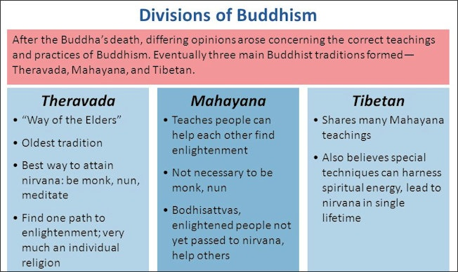

The Three Branches

- Branches are interdependent

  - Views on one branch shapes views on the other two branches

- Metaphysics

  - What is the basic nature of the universe?

  - Coined by Aristotle

    - What you study beyond/after physics (motion/nature)

  - Topics include:

    - Existence (ontology)

    - Time

    - Causation

    - Cosmology

- Epistemology

  - What is knowledge, how is it different from opinion, and how do we acquire it?

  - Coined by Plato

    - Episteme - knowledge; contrasted by doxa (opinion)

  - Topics include:

    - Nature of Knowledge

    - Scope of Knowledge

    - Acquisition of Knowledge

    - Justification of Knowledge

- Ethics

  - How can I improve my life? Is there a best way of living?

    - Ethos (Greek) - Custom or Habit

  - Topics include:

    - Meta-Ethics

      - Nature of ethical thought

    - Normative

      - Social ethics

    - Applied

 

 

What is the Philosophy of Religion?

- Theology

  - System of key beliefs and doctrines

  - Primary justification is sacred texts and/or historical figures

  - Focused on one religious tradition

- Philosophy of Religion

  - Critical examination of religious beliefs and concepts

  - What should count as justification

  - Topics apply to multiple religions

- Topics of Philosophy of Religion

  - Nature of Religion

    - What is a religion?

      - Michael Molloy: Eight Elements (the more they have, the more likely it is a religion)

        - Belief System/Worldview

        - Community

        - Central Myths/Stories

        - Ritual

        - Ethics

        - Characteristic Emotional Experiences

        - Material Expression

        - Sacredness

    - Are there necessary characteristics for something to be a religion?

      - Must it have a sacred text?

      - Must it involve the worship of a divine being?

      - Must present a basic set of ethical duties/commandments?

  - Epistemic Value of Religious Experiences

  - The Relationship Between Faith and Reason

  - Arguments Over God's Existence, Non-Existence

  - Possibility of Miracles

  - Possibility of Life and Death

  - Relationship Between Religion and Science

  - Relationship Between Different Religions

  - Relationship Between Religion and Ethics

 

 

 

 

Unit 1 - Religion and Ethics

 

Some Important/Interesting Terms that Appeared in the West Reading

- Pragmatism

  - “Pragmatism is a philosophical tradition that – very broadly – understands knowing the world as inseparable from agency within it” (Legg and Hookway – Stanford Encyclopedia of Philosophy entry on Pragmatism).

  - Pragmatism is also notable as the most distinct and recognizable philosophy that has originated in the United States.

- “The myth of the given” (20)

  - Cornel West writes, "American pragmatism rejects the idea of knowledge as a private affair where one begins with uninterpreted givens, theory-free entities, self-authenticating episodes, or intrinsically credible beliefs. Rather, it conceives of knowledge as within the conceptual framework of intersubjective, communal inquiry. ... For American pragmatists, the myth of the given must be demythologized" (20).

- Genteel Tradition in American Culture (38)

  - Cornel West references the “genteel tradition” in multiple parts of Chapter 1.

  - The word “genteel” literally means being polite and respectable and usually implies someone has high social status or wants to be viewed as having high social status. But West intends a more specific and substantial meaning when he speaks of America’s “genteel tradition”

  - West adopts the meaning of the term “genteel” from Spanish-American philosopher George Santayana:

    - To Santayana, the agonized conscience of Calvinism and the metaphysical comfort of transcendentalism weighted like a genteel incubus upon the American mind, partly explaining the odd American juxtaposition of intellectual conservatism with technological inventiveness (West 29).

  - West’s most detailed description of the genteel tradition:

    - American culture during the provincial period culminated in the Calvinist pietism, Enlightenment rationalism, and liberal republicanism of William Ellery Channing. The vernal American Schleiermacher, Channing is the pivotal figure of the Genteel tradition, in its transition from Calvinism to transcendentalism, at the turning point between the colonial provinciality and the postcolonial provinciality in American culture. His revolutionary humanitarianism, bordering on utopian socialism, condemned slavery, bigotry, and pagan worldliness. He proposed to overcome these through Christian pietism, moral use of scientific knowledge, and the perfection of human nature through self-realization in democratic communities (West 30).

- Calvinism

  - A Protestant branch of Christianity that emphasizes the importance of original sin on human nature. More specifically, its tenant of “total depravity” holds that Adam and Eve’s original sin is so fundamental to human nature that it permeates every part of human existence (Groenhout in the Stanford Encyclopedia of Philosophy entry on Sin in Christian Thought).

- Transcendentalism

  - Transcendentalism is a social and intellectual American movement that was most influential in the mid-1800s. It emphasized the goodness of solitude in nature. In the Stanford Encyclopedia entry on Transcendentalism, Russell Goodman writes,

    - Stimulated by English and German Romanticism, the Biblical criticism of Herder and Schleiermacher, and the skepticism of Hume, the transcendentalists operated with the sense that a new era was at hand. They were critics of their contemporary society for its unthinking conformity, and urged that each person find, in Emerson’s words, “an original relation to the universe”(O, 3). Emerson and Thoreau sought this relation in solitude amidst nature, and in their writing. By the 1840s they, along with other transcendentalists, were engaged in the social experiments of Brook Farm, Fruitlands, and Walden; and, by the 1850s in an increasingly urgent critique of American slavery. transcendentalists, were engaged in the social experiments of Brook Farm, Fruitlands, and Walden; and, by the 1850s in an increasingly urgent critique of American slavery.

 

"What are Prophets For?" - Abraham Heschel

- Feeling Fiercely

  - Feeling overwhelmed

    - Burdened by a duty to God

  - Feel strongly in broad ways

    - Everyday life or God

- The Supreme Problem

  - Importance of setting an example

  - Examine yourself, no matter how small, before you can display righteousness toward "bad people"

 

"Disorder" - Dorothy Day

- Fool for Justice

  - Dedicated to a cause that has little hope of succeeding

- Disorder of the World

  - Fundamentally Flawed

  - The ability of people to be so broken down they then have such a strong will to self-inflict pain

 

"Prophesy Deliverance" - Cornel West

- To Prophesy Deliverance (6)

  - Pursue freedom rather than otherworldly paradise

    - Give people love, hope, and faith

- The Sources (15-20) and Tasks (22) of Afro-American Critical Thought

  - Sources:

    - Prophetic Christian Thought

    - American Pragmatism

  - Tasks:

    - Put forward an overarching interpretive framework for the relationship between the African, American, and European elements

    - Engage in genealogical inquiry into the cultural and linguistic roots of the idea of white supremacy which has shaped the Afro-American encounter with the modern world

    - Provide a theoretical reconstruction and evaluation of Afro-American responses to white supremacy

    - Present a dialogical encounter between prophetic Afro-American Christian thought and progressive Marxist social analysis

      - Demystify the deep misunderstanding and often outright ignorance each side has of the other

    - Provide a political prescription for the specific praxis in the present historical moment of the struggle for liberation

- Four Stages of American Culture

  - Modernity, Colonial Provinciality, Localism \[1688-1789\]

  - Heyday of Modernity, Postcolonial Provinciality, Christian Practices \[1789-1871\]

  - Decline of Modernity, Industrial Provinciality, Inclusionary Practices \[1871-1950\]

  - End of Modernity, Postindustrial Cosmopolitanism, Dispersive Practices \[after 1950 - Published 1982\]

- W.E.B. Du Bois - Booker T. Washington Debate

  - Both: Inclusion/Integration into society through social, political, and economic channels

  - Du Bois:

    - Protests

    - Exceptionalism

      - "Talented Tenth"

        - Top 10% to lead the race

  - Washington

    - Build middle class for Black Americans

    - Personal responsibility

      - Self-help

  - West views inclusion as problematic:

    - Not a path to liberation (Marxist viewpoint)

      - Doesn't address structural society issues

    - Can fail to address racism

- Four Traditions of African-American Responses to Racism

  - Exceptionalist

  - Assimilationist

  - Marginalist

  - Humanist

- Christianity-Marxist Relationship

  - Marxist Critique of Christianity

    - Christianity is:

      - Imponent

        - Locate power in a transcendent God

      - Incorrect

        - Can't intellectually/conceptionally justify God

      - Ill-Informed

        - Lacks tools to analyze societies today

    - Cristian Reply:

      - Pragmatic

        - Helps people live and deal with existential issues

  - Christian Critique of Marxism

    - Marxism is:

      - Naïve

        - Exaggerate the Promethean possibilities

          - Power of technology

      - Narrow

        - Deal almost exclusively with the socioeconomic and political realities rather than existential and cultural realities

      - Near-Sighted

        - Provide profound insights of existing capitalist societies but blind to novel social configurations

- Tradition as Living and Changing

  - Traditions necessarily change

    - They become instruments of the status quo rather than challenging them

  - West: Being a Christian requires engaging economic and political issues

 

 

 

Buddhism

- One of the biggest religions today

- Originated in present-day Nepal

  - Spread east to China and Malaysia

- Types of Buddhism:

> 

- Four Noble Truths - Buddhist teachings as medical diagnosis and treatment

  - 1st - The Symptoms

  - 2nd - Diagnosis

  - 3rd - Cure

  - 4th - Eightfold Paths

- Buddhism as the "Middle Way"

  - Siddhartha Gautama (the historical Buddha)

    - Path between two opposite extremes

      - Life of indulgent pleasure seeking

      - Religious Ascetics

        - Self-Discipline and Abstention

          - Such as Hindu Brahmins

      - Avoid both extremes

        - Eliminate unnecessary desires but not through life destructing practices

 

Keiji Nishitani - "What is Religion?"

- Need for Religion

  - Not a natural need

    - Food, Water, etc.

    - Needed to live at all

  - Nor is it a culture

    - Learning, Arts, etc.

    - Needed to live well

  - Religion exists between these two forms of need

    - Religion as a Connection

      - Connects the aspects of our life that we feel we have lost

        - Can be a mending force for meaninglessness and disconnection from things around us

    - Religion as a Path to Answers for Existential Questions/Crises

      - Religion can access answers and knowledge that traditional human logic and reason can't access

    - See the Universe and Understand Your True Place in the Universe

      - Remove yourself as the center of the universe in your mind

        - Use this breakthrough as a way to better learn and understand the universe

          - Buddhists

            - Believe meditation is the key way of achieving this breakthrough

- Limits of Language

  - Koan - Paradoxical Anecdote from Zen Buddhism that demonstrates inadequacy of logical reasoning

    - Breakthrough experience that goes beyond reason

      - Used to provoke enlightenment

  - Heidegger

    - Know how as a form of knowledge

- "Turns the Light to What is Directly Underfoot"

 

Christopher Gowans' - "The Buddha's Message"

- Individual Self vs Over-Self-Centered Mode of Living

  - Examples of Self-Centeredness:

    - Obsession with finding meaning of my particular life

    - Extreme fear of death

  - Don't focus on yourself, you are not as important as the whole

- Nirvana/Enlightenment

  - Completely Mute/Deaf to Nature

  - Leaf in the Wind

 

 

 

Confucianism and Virtue Ethics

- Confucius is Kongzi

  - Translation differences

  - Master Kong

    - -zi is honorific title

 

Bryan Van Norden - "Introduction to Classical Chinese Philosophy"

- Revivalist Traditionalism

  - Preserve the morally good parts of historical core values

    - Opposed to Conservatism

      - Protect core culture

  - Focused on the aspects of a single tradition rather than pulling from others

    - Opposed to Prophetic Traditionalism

      - Identify problems/evils

      - Use whatever is the best means

  - Focused on societal impacts

    - Opposed to Buddhism

      - Individual improvements

- Rituals and Traditions

  - Rituals

    - Expressing emotion or meaning around an event

    - Examples:

      - Birthdays

      - Quinceañera

      - Prayer

      - Marriage

  - Traditions

    - Can degrade due to just following the social expectations rather than considering and including the meaning of the tradition

- Ethical Cultivation

  - Two Parts:

    - Learning = Internalization

      - Specifically of virtuous character traits

    - Thinking

  - The Odes (a set of poems) help to internalize virtuous ways of life

- Hermeneutics

  - Two Approaches:

    - Suspicion

      - Examine how a text or claim serves ulterior interests

        - Assessing the <u>person</u> and why they make the claims

    - Faith

      - Examine whether a text of claim is true or rationally justified

        - Assessing the <u>claims</u> a person based on the evidence

  - Both are valuable

  - Two Circles:

    - Understanding a Text

      - To understand passage, you need to understand whole text

        - Works the other way around too

        - Part to Whole, Whole to Part

    - Understanding a Perspective

      - Text/Perspective influences the reader

        - Works the other way around too

      - Question your assumptions if the text isn't comprehensible

- Virtue Ethics

  - Focus on character, not on action

    - Who should I be?

  - Types:

    - Moderate

      - Who one should be is determined by what one should do

        - Character from Action

    - Radical

      - What one should be is determined by who one is

        - Action from Character

 

 

 

Unit 2 - The Nature of Religion and Religious Experience

- Nature of Religion

  - Realism

    - Hermeneutic of Faith

      - Evaluate claim on its merits

        - Claim & Truth

  - Non-Realism

    - Hermeneutic of Suspicion

      - Evaluate claim on its service to ulterior motives

        - Claim & Purpose

 

Friedrich Nietzsche (Non-Realist) - "Critique of Religion"

- "Genealogical Method"

  - Search for Origins

    - Philologist

      - Study development of human languages

        - Specialized in Ancient Greek culture

    - Interested in deconstructing religion and morality

      - Through the use of language

      - "Beyond Good and Evil" and "On the Genealogy of Morals"

      - Objective Science

        - Uses and Abuses of History

  - "The Will to Truth"

- Origin of Religion

  - Explain forces that are not consciously occur

    - All effects has a cause

      - Religion is an explanation for unknown

        - Punishment from god(s) or other universal force

- Wilfrid Sellers

  - Development of Science

    - Scope of agency steadily shrinks

      - Will Science completely explain human will?

- Historical Jesus vs The Church

  - Historical Jesus

    - Not about repentance, feelings of guilt

    - Living "deified"

      - Live like god would

        - Beyond good and evil

        - Sign of mental health

          - Ashamed of remorse

            - Determinism

- "Humans are Flawed"

  - Original Sin

    - Wired to evil

  - Reason not essential feature of humans

 

 

Daniel Dennett (Non-Realist) - "An Evolutionary Account of Religion"

- Intentional Stance

  - Instinctive Reaction

    - Animal treats something/everything as an agent (something with beliefs and desires)

      - Agent: Motivations informed by desires \[and beliefs if conscious\]

        - Locomotion (purposeful motion) is primary form of agency

  - Everything in Nature Develops Through:

    - Reproduction

    - Variation

      - Intentional Stance

    - Selective Retention

      - Improves accuracy of Intentional Stance

- Religion and Morality

  - Don't require religion to be morally good

    - No data suggests religious people are morally better

    - Prison population sees random mix of religious and non-religious

- Non-Realism and Religion

  - Judging practical value of the religion

    - Not focused on the claims made nor their level of truthfulness

  - Better Way to Cultivate Ethics?

    - Role of Technology in promoting moral goodness

- Good Trick

  - Something that is "discovered" again and again through evolution

  - God as a "superagent"

    - Helps explain events before modern science

 

 

William James - "Religious Experiences As Feeling Forming the Root of Religion"

- Four Marks of Mystical Consciousness

  - Ineffable

    - Can communicate them

  - Noetic Quality

    - Some type of knowledge is attributed to it

  - Transient

    - Usually around 30 minutes to an hour

  - Not in Control of One's Will

    - Mystical experience happens without the consideration of the agency of the individual (higher power)

- Why do Mystical Experiences Happen?

  - Existential Crisis

    - State of extreme physical vulnerability

  - Meditation

  - Extreme Fasting

  - Drugs

    - Psychedelics

  - Supernatural force or agent interacting with you

    - Misinterpreting sensory information

- How to judge credibility of reported mystical experiences?

  - "Reported Experiences"

    - One's unreliable recounting of an experience

      - Judge the reports using empirical methods, like other knowledge claims

  - Need Philosophy to try to translate ineffable experiences into public language

 

 

Mikael Stenmark - "Competing Conceptions of God: the Personal God Versus the God Beyond Being"

- Personal Theism

  - Personal Connection to God

  - Risk of degrading God down to relatively being a human

    - Idolatry Objection

      - Standard Objection

        - God is not a being, but rather beyond being

          - Makes God limited

            - Makes God a false idol

        - God is also the source or ground for everything that exists, that is, for all beings

      - Non-Standard Objection

        - God is too close to humans when he is described as quantitatively better, rather than qualitatively better

          - Quantitatively different =/= above humanity, just a better/best version of humanity

- Alterity Theism

  - Believe in "God" but God is outside of what we can know

  - Risk of making God effectively nothing

    - No Sense Objection

- Ontological Atheism

  - Direct rejection of Personal Theism

    - Alterity Theists might be sympathetic to some ideas

  - Denies the existence of a personal God that made the universe

- Hermeneutical Atheism

  - Direct rejection of Alterity Theism

    - Personal Theists might be sympathetic, if not outright agreeing, to some ideas

  - A God that exists outside of human knowledge and conception is essentially meaningless

    - Positivistic Atheism

- Generic Atheism

  - The requirements for God (a) and/or (b) cannot be satisfied

    - \(a\) Be worthy of worship

    - \(b\) Be the source or ground for everything that exists in order to count as God

    - \(a\) and (b) are commonalities between Personal and Alterity Theism

  - Also seen as idea that the Universe is ontologically self-explanatory

    - Universe created/necessitates itself in some way

- Qualitative Difference of God

  - Unique Ontological Category

    - Necessary Being rather than a Contingent Being

      - God will never fail to exist, but all other beings/creatures/objects (Universe) can fail to exist

- Categorical Mistakes

  - Personal Theism

    - Attributing attributes to God that don't only exist within the category God is defined in

  - Alterity Theist

    - Need to do more to explain why God can't have these Categorical mistakes but can be worthy of worship

      - Such as love

    - If they argue that the categorical attributes are unknowable to humans, then they can't argue anything for or against categorical attributes/mistakes

 

 

Thomas Aquinas - "The Harmony of Reason and Revelation"

- Revealed Truth (Revelation)

  - Revelation that some higher power exists and impacts the world in a perceptible manner

  - Faith and God "revealing" himself to an individual

- Reason

  - All of humans' natural abilities

    - Thinking and Sensing

  - All that enables us to understand physical nature

- Reason and Revelation

  - Complement one another to allow for a better understanding of the world/universe

- Three Awkward Consequences If We Didn't Know God Through Faith (Reasoning-Only Knowledge of God)

  - It Would Take a Long Time to Know God

  - Many Doubts About God's Existence Would Remain

  - Few People Would Know God

 

 

Clare Carlisle - "Philosopher of the Heart - The Restless Life of Søren Kierkegaard"

- Main Question to be Tackled by Kierkegaard

  - "How do you meet social expectations while staying true to yourself?"

    - Challenges to Meeting Social Expectations While Staying True to Yourself

      - Beliefs/Lifestyles

        - Mainstream

          - Being a Mother

          - Career that Provides for Family

          - Maintain Social Relations

        - Individual

          - Do I want a child? Family?

          - Talent that Doesn’t Pay Well

          - Clinical Depression

- Story of Abraham

  - Sacrifice of only son

    - Promised male heir and extensive family line

      - Contradictory

  - Kierkegaard has ambivalent/mixed feelings between:

    - Martin Luther

      - Value of Faith

        - Belief can trump human reason's ability to do the right thing

        - Problem:

          - It may not be true

    - Kant

      - Value of Reason

        - Moral goodness as highest standard for humans

          - Doing the right thing comes from the ability to reason moral goodness

    - Appalled by Abraham's Actions

    - Faith Requires Risk

      - Knowing dissolves faith

- Tiers of Existence

  - Religion (Eternal Realm)

  - Ethics/Morality

  - Aesthetic Life/Hedonism

- Future of Christianity (1800's)

  - Would happen every generation

    - Completely Restart the Task of Faith

      - Believes to be the more likely of the two

    - Let Faith Dissolve into Rational Humanism

  - Science/Technology is always advancing and force the redefinition of faith and what religion functions as within the society at the time

    - Christianity centuries before is a far different Christianity as it is known in the present day

 

 

Can Reason Alone Justify Faith in God?

- Thomas Aquinas: Yes

- Soren Kierkegaard: Yes w/ Caveats

- William Clifford: No

- C. Stephens Evans: Yes

Relationship Between Faith and Reason?

- Messy question

- Significant disagreements among philosophers who think faith can give knowledge

 

 

William Clifford - "The Ethic of Belief"

- Shipowner Story

  - Owner has doubts on seaworthiness

    - Convinces himself to believe it is fine and do no inspections

  - Ship Sinks/Doesn't Sink

    - Moral duty to question belief in the face of a lack of enough evidence to hold the belief

- Belief as a Sacred Duty

  - Beliefs are the foundation for society

    - Having beliefs that are accurate and comport to reality allow us to make the best choices

      - Conspiracy Theories as undermining credibility of social institutions

    - True beliefs essential to social trust

- Belief as Everyone's Duty

  - Unless you have the time to examine a belief, don't hold a position

    - Don't just trust people without critically thinking/vetting the information given

 

 

C. Stephens Evans - "Critical Dialog in Philosophy of Religion"

- Criticism of Fideism

  - No way of knowing what to believe in

    - Pluralistic Society

- Criticism of Neutralism

  - Impractical, if not impossible, to be completely impartial

    - Oversimplification/Strawman

- Critical Dialog Approach

  - Willing to test one's commitments

    - A genuine faith will stand the test of scrutiny

 

 

Bruce Reichenbach - "The Cosmological Argument from Contingency"

- Basic Principles:

  - Principle of Sufficient Reason (Stronger Claim)

    - All contingent beings require a reason for why it exists

  - Principle of Causation (Reichenbach's View)

    - All contingent beings depend on something else for its existence

- Intuition Behind All Cosmological Arguments

  - Something cannot come from nothing

- Types of Explanations

  - Personal Explanation

    - Explanation based on intentions of an agent

    - If free will exists, then not everything is reducible to scientific explanation

  - Scientific Explanation

    - Brute physical processes as explaining an event/process

    - If determinism is true, then there are no truly "personal explanation"

- Advantage of Personal Explanations

  - Reichenbach's View

    - Scientific explanations of the universe's origin will always be incomplete

      - Principle of Causation (Personal rather than the scientific view of Principle of Sufficient Reason)

- Conclusion

  - Necessary being intentionally created contingent beings

- Objections to Cosmological

  - The Universe just is

  - Only need to explain the parts of the universe, not the whole

  - The conclusion of the cosmological argument is contradictory

  - All explanations start from brute, unintelligible facts

  - The cosmological argument is just a version of the ontological argument

  - Impossible to define "necessary being" without also accepting that the natural universe is necessary

  - Reichenbach's argument in ultimately another "god of the gaps" argument

  - The idea of God is just a projection of human beings

 

 

Robin Collins - "The Anthropic Teleological Argument"

- Conclusion of the Argument:

  - Most likely hypothesis that explains observable phenomenon is God's existence

    - Basic aspects of the universe (Natural Laws) explained through the Theism Hypothesis

    - Rather than Naturalism Hypothesis

      - Universe just exists as is and it exists alone

  - Design Hypothesis is <u>more likely</u> than Naturalism Hypothesis

- Probability

  - Types:

    - Statistical Probability

      - Objective Probability of an Event

    - Epistemic Probability

      - Likelihood based on available Evidence and Hypothesis

  - Inverse Gambler's Fallacy (Markov Property)

    - Thinking that double-sixes required many rolls

 

 

Elliot Sober - "The Design Argument"

- Two Types of Design Arguments

  - Features of Entire Universe

  - Features of Adapted Organisms

- Flaw of All Design Arguments

  - Must assume Designer's goals and abilities

- Observational Selection Effects (OSEs)

  - Fishing Net Example

    - Caught 50 fish in a lake, all greater than 10 inches

      - Assumed there were only fish 10+ inches in the lake

        - Not true because the fish had holes that were selecting for fish 10+ inches in size

    - Demonstrates Observational Bias due to the inability to collect all the fish and observe sizes

 

 

Mohammad Ghaly - "Evil and Suffering in Islam"

- Definition of Theodicy

  - God is always right

  - Demonstrate how God/divine goodness is not undermined by the problem of evil

- Definition of Anti-Theodicy

  - Cannot demonstrate God is not undermined by problem of evil

    - Human mind is limited

      - Authoritarian/restrictive

    - Danger of relying on revealed truth

- Median Approach

  - Revealed truth is more important than reason

 

 

J. L. Mackie - "Evil and Omnipotence"

- Basic Terms: "Good" "Evil" and "Omnipotence"

  - Good Opposes Evil

  - Good Eliminates Evil when Possible

  - Good Omnipotent Being Would Eliminate All Evils

- Adequate Solutions

  - Limit God's Omnipotence or Perfection

  - There's No Evil

- Fallacious Solutions

  - Human Free Will is the Origin of Evil

    - Human Free Will is untouchable by God

      - God made it so

 

 

Philip Kitcher - "The Many-Sided Conflict Between Science and Religion"

- Religion and science are incompatible

  - Best to view range of conflicts

- Religious Experiences

  - "Sense of Ultimacy"

    - Too big of a gap to meaningful religion

- Faith

  - Blind dogmatism is problematic

  - The intermediate strategy

    - Religion becomes unnecessary

 

 

Raynor Johnson - "Preexistence, Reincarnation, and Karma"

 

 

John Hick - "Resurrection"

- Continuity of Identity

  - Physical body in Heaven

    - Replica Example

      - Dead body in location A, exact replica in location B

    - Easier to accept as the same person than spirituality

      - Personal Identity might be essentially connected to physical circumstance

- Need for Resurrection

  - God creates finite beings to live in fellowship with him

    - Must have an afterlife so that the finite beings can fulfill their purpose to God

 

 

Grace Jantzen - "Do We Need Immortality?"

- Fulfilling Life without Immortality

  - Fulfillment is the making of significant choices

    - A finite life leads to more fulfilling/significant decisions due to limited time to make them

- Response to Helen Oppenheimer

  - Helen Oppenheimer

    - Unthinkable that a loving God would allow humans to stop existing upon their death

  - Grace Jantzen

    - God allows many precious things to stop existing after their death

      - God notices/mourns(?) your death

 

 

Pascal Boyer - "Why is Religion About Death?"

- Background on the Modularity of the Mind

  - The mind is to some extent relies on modular processes

    - There is little or no conscious control of the process

    - The process happens quickly

    - The process normally emerges at a particular stage of human cognitive development

    - There are "breakdown patterns" - cases where the process malfunctions/doesn't work that show that there is some process occurring

      - People who can't recognize faces

      - People who cannot recognize voices

  - Evolutionary psychologists believe modules operate even at high levels of cognition/mental activity

  - Boyer recognizes:

    - Contagion System

      - System for dealing with dangers that cannot be directly detected

        - Any contact can transmit the invisible containment/pollution

        - The dose of contaminant is irrelevant

      - The "untouchable caste" in Hindu society

    - Intuitive Psychology System

      - System for modeling how another person views a situation

    - Animacy System

      - System that deals with objects that move in a purposeful manner

    - Person-File System

      - System that tracks who is a member of one's own social group(s)

    - Face Recognition System

      - System that recognizes faces rather than just perceiving a generic object

    - Voice Recognition System

      - System that recognizes a voice as from a particular person rather than just generic sounds

- Religions as Terror-Management

  - Many religious outlooks on death are not comforting

- Double Funerals

  - They show that the passage from life is more meaningful than an afterlife

    - Transitionary Period

      - Analogy to other rites of passage

        - Coming of age

        - Marriage

    - Memory of dead person becomes more generic (spiritual force)

      - Talk through decisions as if they were there

    - Also some connection to Contagion System

- Corpses cause Cognitive Dissociation

  - Cognitive Dissociation

    - Inconsistency with your mind

  - Different parts of the mind engage with death

    - Engage animacy system (it's dead) but also person-file system (they're dead)

 

 

David Eagleman Stories about Afterlife

- Two interpretations:

  - Literal depiction of what your afterlife might be

  - Use the story to reflect on your own mortal life

    - Might it change the way you live your life?

    - Ursula K. Le Guin on science fiction

- Philosophy and Religion

  - Motivation to think of your life and human at different levels of generality

    - Entertain counterfactuals

- Subjunctive

  - Close to Friedrich Nietzsche's "Eternal Recurrence of the Same"

    - When making a decision, figure out if it is something you would do again and again

      - Deterministic-esque worldview

- Perpetuity and The Unnatural

  - Immortality would be a bad thing

    - Perpetuity

      - Suburbia lifestyle for the people who were bad

        - Boring

    - The Unnatural

      - Ability to artificially live forever that leads to social revolts and reversal of the technology usage

- Albert Camus'

  - Myth of Sisyphus

    - Inexhaustible meaning of reality

