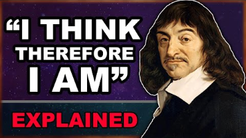

Reading Notes - 100

Thursday, August 25, 2022

00:16

 

Plato - Euthyphro

 

Key Takeaways

- Socrates tries to discern the true nature of piety and establish a logical foundation for it

- Euthyphro claims that piety cannot be logically based as by doing so it changes

  - Inherently intrinsic to every person, therefore different to everyone

- By trying to base it on what the gods want and love brings conflict as there is no real consensus on what is truly loved and therefore you still have to make your own rendition of piety, just, and god-loved

- Deriving real-world societal impacts of such a shaky, person-to-person, belief is detrimental to the idea of justice since it is derived from piety. Questioning said pious actions brings up the issue of being condemned by not only those around you but also those that run the idea of justice in society and can punish you for those same questions.

  - This is where Socrates comes in to the problem of going to trial and why his interest of piety is so deep with Euthyphro and his frustration with Euthyphro not giving a solid idea on what piety is.

 

 

- Socrates is somewhere beyond where is normally lives to be put on trial for claims of corrupting young people in the city in regards to religious thought

  - They believe he is creating new gods for not believing in the old ones

- Euthyphro is known to be a fortune teller or oracle and people laugh at him while the things he says become true, however he doesn't interact with people much leaving him open to criticism of the unknown.

- Socrates claims that the importance of investigating a murder has some basis on who the murdered is while Euthyphro claims the importance lies in whether the killing was just or not

  - This comes from Euthyphro saying he is investigating his father for murder

    - He claims his father killed a dependent of Euthyphro, who has previously killed a household slave of theirs in a drunken rage, by tying him up and throwing him in a ditch. He then called for a priest to ask him what he should do. The dependent died due to the cold and hunger before a messenger came back to his father.

    - The father and relatives are upset as they claim he did not personally kill him and that even if he did, he was a known killer and doesn't deserve the thought Euthyphro is giving him

      - They also claim it is impious to prosecute your own father, although Euthyphro believes they use piety and impiety incorrectly on this occasion

        - Euthyphro backs this up when questioned by saying that even Zeus did the same thing when faced with a similar issue of his father eating his own sons. Zeus responded to that action by castrating his father

          - Socrates follows up by going down a line of questioning laying the foundation for a conclusion where the different gods fight about what is right and wrong and that any action can be pious and impious at the same time due to these differences the gods hold towards one another, therefore any action that is claimed to be good and pious has the same possibility of being unjust and impious to anyone engaging the idea in good faith. Due to this, Euthyphro is obliged to agree as to not do so would be dishonest.

            - Socrates then walks Euthyphro through the idea that the dispute isn't about whether a person should be punished or not but rather who should be punished on the basis of who they were, what they did, and when they did it. He then pulls it back to the question of how one decides what is just and unjust, the implication being towards whether one is punished or not, when even the gods themselves cannot come to any solid conclusion.

  - Euthyphro believes that one who knowingly stays within the company of another who has committed morally reprehensible acts such as murder carries some of the same moral burden as the person who committed the act

    - "The pollution is the same if you knowingly keep company with such a man and do not cleanse yourself and him by bringing him to justice" (page 2)

- Socrates makes the argument back at Euthyphro that his thoughts towards the gods are equal to Euthyphro's father in the way that they can be considered immoral or impious and to wash his own guilt/sins it would be just to put Euthyphro to trial and not Socrates as he could be considered a student of Euthyphro

  - Euthyphro follows up with the fact that the onus of one's believe isn't on the teacher but on the student who adopted the beliefs

    - This falls in line with why Socrates is being put to trial in the first place as he is believed to be corrupting the youth of the city with his claims on the gods

- Socrates also asks Euthyphro whether what is considered just or unjust in society is led from the belief that the gods love the action making it just or whether society has picked things to be just or unjust because they believe the gods will love it

  - The implication here is that society is being strung along not by the beliefs of right or wrong, not by the people who have to undergo the punishments associated with actions that have to be judged, but rather that they arbitrarily follow a set of rules that may not even be correct in the first place and to question it in of itself is an immoral action

  - Socrates is making the point that the action of trying to blindly appease the gods leads to a circular argument because to make the gods love you and be pious, you must do the things that make them happy but since you do not know what makes them happy you end up just saying the action is just **because** it is loved by the gods and there is no clear concrete thing established. This backs up his ideas previously about the gods fighting about things they consider just and unjust and this further solidifies his point of chasing something unobtainable.

- Socrates tries to pin Euthyphro as to what piety really is, however Euthyphro slides out of it by saying the act of observing what piety is changes the idea of piety.

  - Euthyphro claims that Socrates is the one making the definition hard to pin down because he is asking what it is because Euthyphro feels that piety is

    - I think the implication here is that people have things that seem to feel more intrinsic to themselves and their worldview on how to approach the topic of what they value and that by asking them, the definition changes for the person that is being asked as they reevaluate what they feel to be more logically sound

  - Socrates explains that he wants to find out what piety is because that Euthyphro claims that being pious is the same as being just and because of this Euthyphro has to have a definition so that, the implication being, taking just actions against people are not just left to the eye of the beholder and they can be fairly applied to everyone

  - Euthyphro admits to Socrates that the true nature of following the gods and doing what they ask is to give in and beg to them

    - This is because there is nothing that Euthyphro can claim to trade the good things done for the gods for anything that a human can gain from them. He also claims that there is no real benefit to the gods for the actions that humans do

      - There is something he claims to gain though which is in the form of reverence, honor, and gratitude

- Socrates goes back around to the idea that piety and god-loved are the same even though before they claimed them to be two different things that were directly connected

>  
>
>  
>
>  

Plato - "Apology" - The Defense of Socrates

 

- Athens - On trial

  - Busybody

    - Inquires into what is beneath the Earth and in the sky

    - Turns the weaker argument into the stronger

    - Teaches others to do the same

- Socrates is known to be a very persuasive speaker and that his thoughts are known to be extremely tantalizing, even pulling people away from societal norms (implied)

  - Claims that these claims are nothing more than a deflection of what Plato perceives to be the truth

  - Claims to not omit anything and give whole truth

- Socrates makes claims that accusations have been levied on him for a long time (aged 70) and that those accusations have stuck and have put him on trial that day because they have permeated their lives since they were young and there for have had no reason to question the validity of the claims as they have just become considered common knowledge

  - Socrates says this type of knowledge puts him into a position to "shadow box" claims levied against him as there is nothing truthful or substantial to tackle

    - The implications of something like this in a broader society today are very relevant as people have fallen into these types of thought loops within more conspiratorial settings in small and large scale settings and that those who do not honestly engage with gathering the truth are forced to forever persecute people with baseless accusations they cannot refute in any meaningful sense

  - Calls upon their personal experience with listening to him talk in public to challenge whether the claims even make sense

    - Shows a level of confidence that Socrates hasn't done anything that has been levied against him beyond what a group of people are saying that dislike him and what he stands for

- Socrates made enemies among the people he talked to that claimed to have great knowledge and wisdom as the men he talked to did not truly hold wisdom but rather feigned it

  - The act of feigning knowledge to try and impress people not only is unwise because you are lying to yourself and others around you but it can be viewed, ultimately, as a very dangerous way to engage with difficult topics that can and will cause massive confusing on external and internal scales. The ability to claim you do not know and take the time to actually come up with a well thought out idea that is true to your own personal values is where one's interest should lie for the betterment of themselves and the ones around them

  - Socrates main drive for these actions is due to a story he told about someone who asked a Delphi oracle about who is the wisest to which the oracle responded with Socrates. Socrates then went around challenging people and as he found out that he indeed was truly the wiser of those he spoke to, he made it a mission of his to 'assist' the oracle in proving that claim is correct

- Socrates claims that those who make false accusations about things that may seem absurd are true in the sense that the people who made them are solely making them to discredit Socrates because their ignorance on topics was exposed by him and they can't come to grips with it

- Meletus and a group of critics that surround him claim Socrates is 'corrupting the young' 'failing to acknowledge the gods and introducing his new spiritual beings instead'.

- Socrates - Defense of Philosophy

  - Don't fear death

  - Purpose of Philosophy

    - To keep a society revigorated with curiosity and away from the monotony of normal life

      - Make you question what you really know and learn more about the world around you beyond the limiting factors of societal norms

    - Pursuit of wisdom, truth, and knowledge

 

 

Aquinas: The Existence of God - Summa Theologica (Summary of Theology)

- Question 2 - Article 1 (Aquinas' Objects to Anselm)

  - If God is supposed to be described as that than which means nothing greater can be meant, it is not a very strong definition beyond Anselm's argument

  - The thought of 'God' does not grant existence in the world of fact (Metaphysics vs Epistemic)

 

- Question 2 - Article 3 (Common Objections to the Belief in God)

  - Objection 1

    - If one of two contradicting things (good/bad) is infinite, the other would cease to exist

      - The Problem of Evil

  - Objection 2

    - If we account for something on the basis of a few original causes, we ought not to use many

      - We can account for everything found in the world on the basis of various original causes even without supposing God exists

    - Nature can be taken as the original cause for natural things

    - Human reason and will can be taken as the original cause of purposeful acts

    - God does not have to be supposed to account for facts found within the world that can be explained otherwise

  - Reply

    - Five ways to prove God exists:

      - Change - Everything changes because of something else

        - Not relevant today as it is based off of Aristotle's metaphysics - Efficient Causation is more relevant and works better within today's understanding

        - Must have potentiality to be what it changes into

          - Must draw out potentiality to actuality

            - Fire cause the potentiality of wood to be hot into an actuality of wood being hot, therefore altering and changing it

        - Something cannot change on its own and must have some external force act on it to change it

          - This applies to the thing that caused a change and so on, but not to infinity

            - God acts as this barrier to infinity - the first cause of change

      - Efficient Causation - Same as change

        - The thing that has agency to cause change

          - God is first thing with agency to cause change

      - Possibility and Necessity - Things either exist or fail to exist, things that exist and corrupted and therefore existed at times and not others

        - If something can fail to exist, then is must *have* failed to exist

          - If everything failed to exist, there would have been a time where nothing existed

          - World must have been brought to existence by something that already existed

            - God is necessary to the existence of the world as there had to be something that cannot fail to exist that caused everything else to exist

      - Gradations - Some things are found to be better, truer, or more noble

        - The more of a quality, the closer to maximality

        - There must be something that possess the greatest of a given trait

          - The thing with the greatest of a trait is the cause of that trait therefore God must exist to have given us traits that we deem to have potentiality to have gradations

      - Governance of the World - Things that lack consciousness act for a purpose

        - Teleological Argument - Intelligent Design Argument

        - They tend towards what is best and this shows they achieve their ends on purpose

        - Things without consciousness must have something with consciousness and intelligence directing it to act towards an end (Arrow directed by an archer)

          - This can be attributed to God

      - First 4 ways to prove God can be attributed to the Cosmological Argument

        - First brought about by Aquinas with him representing the 'first-cause argument' and 'the argument of contingency'

        - The origin of everything must come from supernatural being that can exist beyond the beginning of the universe

          - Something cannot come from nothing

    - Reply to First Objection

      - God is supremely good according to St. Augustine (354 A.D. - 430 A.D.) and therefore allows bad to occur in order to bring good things out of them

    - Reply to Second Objection

      - Nature works for a definite end under the direction of a higher agency

        - To find the higher agency, we must trace back what is directing nature until we reach the end of the efficient causation chain

          - This applies to human reason and will in reference to purposeful acts

      - Trace everything back to an original cause

 

 

"Pascal's Wager"

 

- Why expect religious people to explain and understand God

  - Outside of the bounds of our reasoning and understanding

- Why choose to wager not believing in a higher power

  - Belief in God is inherently a wager due to the nature of what God is and doesn't require reasoning to have a sound belief in Him

- The Wager

  - If you gain, you gain all

    - If you choose to believe in a higher power, you are able to gain everything you normally would after death if that belief is correct

  - If you lose, you lose nothing

    - If you are wrong and there is nothing you lose nothing after death

  - If you wager to not believe, if you lose that wager you may end up losing a second life

    - A person who choose to not believe would have to reason as to why they choose to not preserve their life - illogical choice

  - Certainty of what is at stake vs uncertainty of what is gained

    - Equal amount of both

 

 

 

Antony - For the Love of Reason

 

- Issue with Limbo

  - Good and unbaptized go to die

    - Tainted by original sin and must have it washed away to be accepted by God

  - Different from Purgatory

    - Souls do their owed time before going to Heaven

- Issue with original sin

  - Adam's punishment is also his own

    - Counter: The existence of free will (what Adam's sin gave humanity) is the reason the punishment is passed down

- Issue with being fit for the presence of God

  - One's soul can be unfit irrespective of the owner and their actions

    - Can get people who were seen as the best of humanity

      - Mentions Gandhi

 

- Reactions to Questions

  - Stock response of "Souls in Limbo don't suffer"

    - Maybe not in actual pain but deprived of Beatific Vision

      - Beatific Vision - ultimate direct self-communication of God to the individual person

      - Marketed as final goal of humanity

  - "They don't know they are being deprived of anything"

    - "Ignorance is bliss"

  - "You think too much"

    - "Just memorize your Catechism, belief will come"

  - Questions are sinful and prideful

    - Questions came from the devil

 

- Morally Moving Sermons

  - Every human being had an immortal soul of surpassing moral value

  - Our overarching duty on Earth was to demonstrate our love of God through our actions

 

- Confession after Communion

  - Too young to have knowingly and/or willingly commit a mortal sin

    - Offended by the accusation

    - Recognized she fit the criteria for a mortal sin:

      - It was a grievous wrong

      - I knew it was a grievous wrong

      - I wanted to do it anyways

 

- Convinced by the Argument from Evil

  - An omnipotent God could devise a better way to handle evil

 

 

 

Zhuangzi

 

- The Eight Virtues

  - Left

  - Right

  - Righteousness

  - Divisions

  - Debates

  - Competition

  - Contention

 

 

 

Descartes - Meditations on the First Philosophy - [Descartes' Most Famous Idea \| Explained](https://www.youtube.com/watch?v=lNdrQ2wf6xs)

 

 

- Rejection from doubt

  - Start from foundation and not individual beliefs

 

- Questioning the validity of human senses and existence

  - Reality could be a dream and these could not exist but in a dream things are patterned from reality therefore things in reality (if given to be a dream) must exist as they are patterned from something

 

- On the Question of God

  - Unsure and therefore must depart from his held beliefs

  - If God is not powerful as claimed, and evil demon could be creating the reality he currently perceives with all his worldly desires to keep him shackled

    - This would cause him to slide back to his old beliefs in fear of waking up to the dark reality of the questions he poses

 

- Existentialism

  - Even if he didn't exist in the way he perceives and he is being deceived, he would have to exist in some other fashion in order to be able to be deceived.

 

- "I am, I exist" - The Cogito (aka "I think therefore, I am")

  - The argument from the idea that one who thinks the statement must exist out of necessity of being able to conceptualize the statement

  - Brings up the question of what is "I"

    - The only guarantee is the ability to have thoughts. By doubting if you are thinking, you necessarily have to think, therefore you must always be thinking to exist

      - As long as something thinks, they exist

 

- Debate on whether it is a syllogism or intuition

  - Descartes himself says it's an intuition of the mind

    - Later admits there may be a major premise that is implicitly presupposed but the person doing the thinking is not explicitly aware of that premise

- Impossible to doubt and therefore a foundation of which to build off of

  - May not make it true but may make it a certainty

>  

- Only guarantee is that Descartes' existence is that of a thinking thing

  - A thinking thing being defined as something that doubts, understands, affirms, denies, wills, refuses, imagines, and senses

    - Applies regardless of dreaming hypothetical

  - Imagination and senses can also exist under this framework insofar as they are considered to be modifications of thoughts

 

- In Regards to Physical Objects

  - Calls them "particulars"

  - Objects like wax don't have a distinct shape as they can appear in innumerable forms

    - This leads to faults in the understanding of what objects are and can be as there are many ways to express a particular object and therefore many ways to have errors or misconceptions of said object

  - The understanding of an object is what makes an object real and not the ways in which it is perceived

    - The understanding of an object is much less prone to error (due to sensory data) assuming the understanding is correct

>  
>
>  
>
>  

Graham - Skepticism: Structure and Response

 

- Overview of Problem

  - Premise: You know you have hands by your sense-perceptual experience as of hands only if you know that you are not being fed your experience as of hands by a massive supercomputer

  - Premise: You do not know that you are not being fed your experiences by a massive supercomputer. How could you possibly know that?

  - Conclusion: You cannot know that you have hands.

- Since you cannot know that your hands are real, your knowledge of the external world as comes into question.

  - People intuitively disagree but agree with the premises and conclusion logically

    - Argued to show something of the human condition

- Nuts and Bolts of Skepticism

  - First: knowledge requires the *truth* of the claims in question

  - Second: knowledge requires *belief* that putative fact is so

  - Third: knowledge requires *evidence*, reasons or justification in favor of the belief in question

- Evidence can be rebutted or undercut by other evidence or your belief can take over your available evidence

