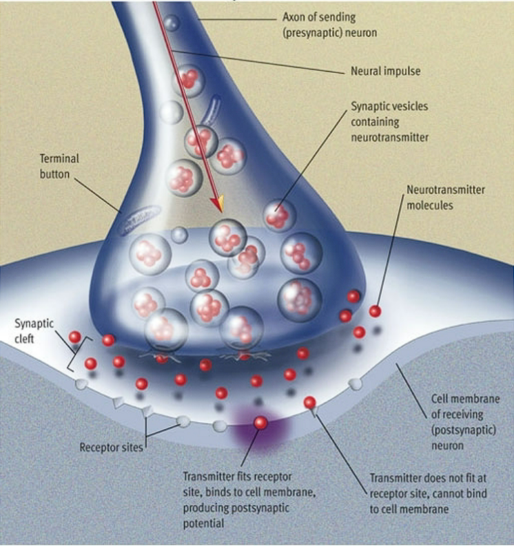
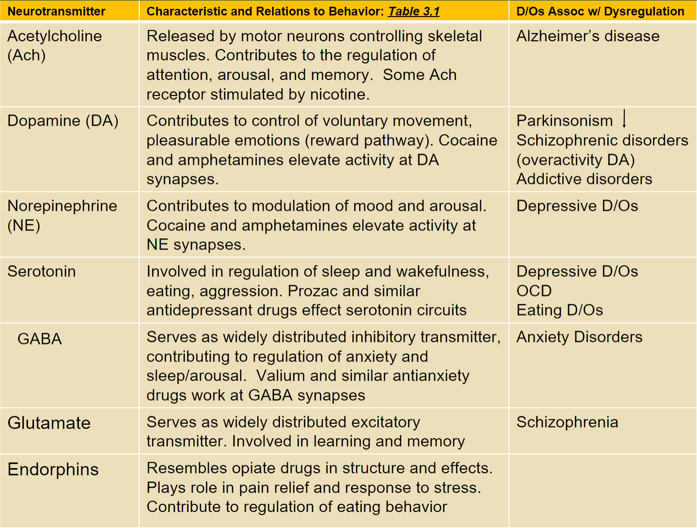
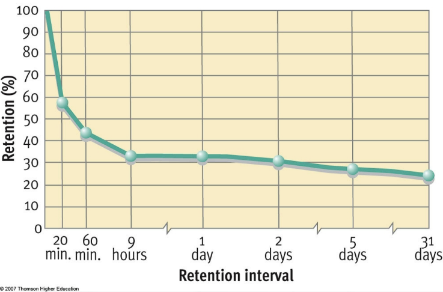
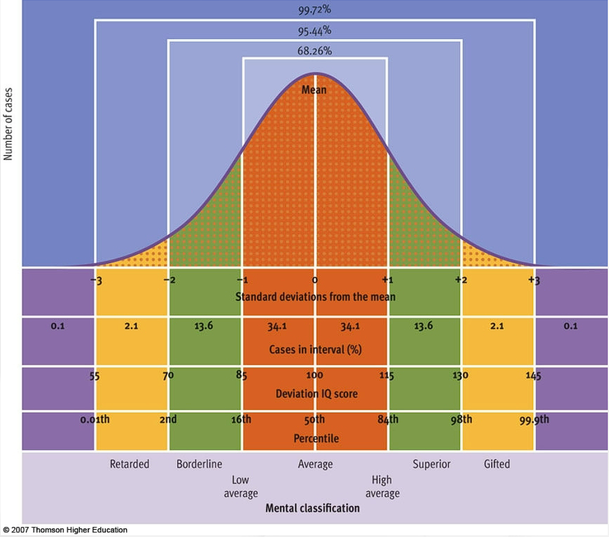

Psychology Notes - 100

Tuesday, August 23, 2022

13:12

 

Psychology

- The science that studies behavior and the physiological and cognitive processes that underlie it, and it is the profession that applies the accumulates knowledge of this science to practical problems

  - Research - Nine major areas

  - Applied Psychology - Four major areas

- 1879 is when psychology became recognized as an independent field from a combination of physiology and philosophy

- The study of the mind and behavior

  - Empirical Method - Must be found through science

    - Testable and repeatable way for gathering information

 

Types of Psychology

- Developmental Psychology - Psychology through all stages of development

- Social Psychology - Focuses on interpersonal behavior and the role of social forces in governing behavior

- Educational Psychology - Studies how people learn

- Health Psychology - Focuses on psychological factors affects the health of a person

- Physiological Psychology

- Experimental Psychology

- Cognitive Psychology

- Psychometrics

- Personality

- Clinical Psychology - Concerned with the evaluation, diagnosis, and treatment of disorders

- Counseling Psychology - Interviewing, testing, and providing therapy

- Industrial and Organizational Psychology - Human Resource department, staff morale and attitude, job satisfaction, etc.

- School Psychology - Promote cognitive, emotional, and social development of children in school

- Clinical Neuropsychology - assessment and treatment of people who suffer from central nervous system

- Forensic Psychology - Apply psychological principles to issues arising in the legal system, child custody, hearings on competency, violence risk assessment, involuntary commitment, etc.

 

 

History and Evolution of Psychology

- Relatively young field beginning in the 19th century

 

- Wilhelm Wundt (1832 - 1920)

  - First person considered to be a psychologist

  - Famous for "Principles of Physiological Psychology" published in 1873

  - Established lab for psychology in 1879

  - Viewed psychology as a scientific study of conscious experience

    - Goal was to identify components of consciousness and how they impact our conscious experience

  - Introspection - Internal Perception

    - Process by which someone examines their own conscious experience as objectively as possible

    - Considered it "Experimental Introspection" - used things such as measured reaction time

    - Little agreement between individuals due to being viewed as highly subjective

  - Voluntarism - Free will

    - People should know they are partaking in a psychological experiment

 

- Edward Titchener

  - Student of Wilhelm Wundt

  - Developed Structuralism

    - Focus on contents of mental processes rather than the function of them

    - Associated more with introspection

 

- Functional Psychology - Functionalism

  - William James, John Dewey, Charles Sander Pierce

  - Derived from Darwin's theory of evolution by natural selection

    - Seen as explanation for an organism's characteristics

  - Psychology of an organism is more functional to the environment than it is to the organism itself - Adaptation

    - Believed in the uses of introspection, but their importance in gathering data about the human mind and behavior was greater.

  - William James believed introspection was important to studying mental activities but used more objective tools such as recording device and examinations of concrete products of mental activities and of anatomy and physiology

 

- Sigmund Freud (1856 - 1939)

  - Austrian neurologist

  - Fascinated by patients suffering from "hysteria" and neurosis

    - Hysteria is an old diagnoses for a disorder, primarily of women with a wide variety of symptoms

      - This includes physical symptoms and emotional disturbances, of which there was no known physical cause

  - Theorized that people had problems with the "unconscious mind"

    - Repository of feelings and urges of which we have no awareness

    - Thought it could be studied through dream analysis, first words that come to mind, and 'slip of the tongue' words/thoughts

  - Psychoanalytic Theory

    - Focuses on the role of a person's unconscious thought and childhood experiences

    - Dominated clinical psychology for several decades

  - Popularized the idea of talking to patients about past experiences and themselves but did not invent it outright

  - Misrepresented through critiques of his older work and not his newer works

 

- Gestalt Principles

  - Introduced to the US in the 20th century from three German psychologist who immigrated to escape Nazi Germany

    - Max Wertheimer (1880 - 1943), Kurt Koffka (1886 - 1941), and Wolfgang Köhler (1887–1967)

      - Forced to abandon much of their work and were unable to continue large projects

  - Gestalt - rough translation is "whole"

    - Deals with the fact that although a sensory experience can be broken down into individual parts, how they relate as a whole is what an individual responds to (e.g. notes combine to make a song)

    - Idea was not as influential in the US due to the rise of behaviorism

    - Found popularity and importance later in the field of psychology

 

- Conditioned Reflex

  - Russian psychologist - Ivan Pavlov (1849 - 1936)

  - Form of learning behavior in which an animal or human produced a reflex response, this was demonstrated through a pack of dogs, Pavlov's Dogs, where he conditioned them when to expect food

    - Mostly related to salivation reflex that could be elicited through something such as a sound that was used related to food

      - Once the food stimulus was learned, you no longer needed it and could just have the sound play by itself

 

- Behaviorism

  - John B. Watson (1878 - 1958)

    - Most famous for work at John Hopkins University

  - Belief that the idea of consciousness is flawed due to no real way to observe consciousness

  - Study of learned behavior and its interaction with inborn qualities of the organism

    - Commonly used animals in experiments under the assumption animal behaviors could be, to some degree, similarly applied to humans

  - Dominated experimental psychology for several decades and responsible for establishing psychology as a scientific field through objective methods and experimentation

  - B. F. Skinner (1904 - 1990)

    - Behavior is direct result of past experiences

    - Free will is an illusion

    - The Skinner Box

      - Positive and Negative affirmation give to a rat in a box to condition it to do a certain task and it chose to follow what gave it positive affirmation

        - This was to demonstrate that people don't necessarily act under the guise of free will but rather a subset of positive and negative interactions throughout their life that have influenced the decisions they have made

 

- Humanism

  - Abraham Maslow (1908 - 1970) and Carl Rogers

    - Denounced Skinner's ideas of free will as an illusion

    - Emphasized the potential for good that is innate to all humans

    - Maslow's Hierarchy of Needs

  - Opposition to Psychoanalytic Theory (Unconscious) and Behaviorism (Environment)

    - Thought to be dehumanizing

    - Took a more optimistic approach

    - Freedom and Personal Growth

      - Have free will to live more creative, meaningful, and satisfying lives

      - Not bound to past experience and unconscious

        - Ability to grow and move on

>  

- Professions that are born out of Psychology:

  - Applied Psychology

  - Clinical Psychology

    - World War II

    - Received institutional support

    - Focused around diagnoses and treatment

 

- Renewed Interest in Physiology and Cognition

  - Cognition - Mental Processes involved in acquiring knowledge

    - Application of scientific methods to studying internal mental events

  - Biological Perspective - behavior explained in terms of physiological processes

 

 

- Positive Psychology

  - Martin Seligman's (Born 1942) epiphany

  - Humanist concerns revisited

  - Uses theory and research to better understand the positive, creative, and fulfilling aspects of human existence

    - Subjective Experiences

    - Individual Traits

    - Intuitions and Communities

 

 

Chapter 2 - The Research Enterprise in Psychology

- Critical Thinking - How to apply it

  - Approach to thinking characterized by skepticism and thoughtful analysis of statements and arguments

  - Psychology is the scientific approach to coping with the challenges of life with critical thinking

  - Features of Critical Thinking within the field of research:

    - Healthy skepticism

    - Examine definition of terms

    - Examine the assumptions or premises of arguments

    - Be cautions in drawing conclusions from "evidence"

    - Consider alternative interpretations of research evidence, especially of evidence that seem to show *direct* cause and effect

    - Don't oversimplify or overgeneralize

    - Apply critical thinking to all areas of life

  - Data Collection Techniques:

    - Direct Observation - Observers are trained to watch and record behavior as objectively and precise as possible, they may use some instruments to assist in this process

    - Questionnaire - Subjects are administered a series of written questions designed to obtain information about attitudes, opinions, and specific aspects of the behavior

    - Interview - A face-to-face dialogue to obtain information about specif aspects of a subject's behavior

    - Psychological Test - Subjects are administered a standardized measure to obtain a sample of their behavior. Usually used to assess mental abilities or personality traits.

    - Physiological Recording - An instrument to monitor and record a specific physiological process in a subject. This can include blood pressure, heart rate, muscle tension, and brain activity.

    - Examination of Archival Records - Analyze existing institutional record such as census, economic, medical, legal, educational, and business records

 

- Scientific Approach to Behavior

  - Basic Assumption: Events are governed by some lawful order

  - Goals:

    - Measurement and description

    - Understanding and prediction

    - Application and control

  - Steps:

    - Formulate a testable hypothesis

    - Select the research method and design

    - Collect the data

    - Analyze the data and draw conclusions

    - Report the findings

 

- The Experimental Method

  - The only research method that can be used to identify cause-effect relationships between two or more variables

    - Variable: Any condition or factor that can be manipulated, controlled, or measured

    - Independent Variable: A factor is deliberately manipulated to determine if it causes changes in behaviors or conditions (**Variable that is changed**)

    - Dependent Variable: A factor or condition that is measured at the end of an experiment and is presumed to vary as a result of the independent variable (**Variable that is being changed**)

  - Experiment: Manipulation of one variable under controlled conditions so that resulting changes in another variable can be observed

    - Detection of cause-and-effect relationships

    - Independent - variable manipulated

    - Dependent -- variable affected by manipulation

      - How does X affect Y?

  - Experimental Group -- Dependent Variable

    - Variable is changed to attempt to get a different result from control

  - Control Group -- Independent Variable

    - What the data is being compared to in the experimental group without any changes in variables

  - Bias in Experimental Research

    - Confounding Variables

      - Extraneous Variables - Time of day, type of subject, experimental bias

    - Selection Bias

      - Assignments to groups so systemic differences are present

    - Random Assignment

      - All participants have equal chances of being assigned each condition

    - Placebo

      - An inert substance given to control group for placebo effect

    - Experimenter Bias

      - Experimental results influenced by the researcher

    - Double-Blind Procedure

      - Neither researchers nor participants are aware of who is in control of experimental groups

  - Strengths:

    - Conclusions about cause-and-effect can be drawn

  - Weaknesses:

    - Artificial nature of experiments

    - Ethical and practical issues

 

- The Correlational Method

  - Research Method used to establish the degree of relationship (correlation) between two things being observed

  - Correlation Coefficient:

    - Numerical value that indicates the strength and direction of the relationship

    - Ranges from 1 to -1 (positive to negative correlation)

  - Not used to prove causation because of no direct link between one thing impacting the other but can be used to help predict outcomes

 

- Descriptive Methods

  - Methods used when a researcher cannot manipulate the variables

    - Naturalistic observation

      - Scientific method in which organisms are observed in their natural environments

      - Strength lies in the ability to see "natural" behavior

        - Challenge is to be unobtrusive

          - Measures that do not interfere with behavior

    - Case-Study Method

      - Carefully drawn biography obtained through interviews, questionnaires, or psychological tests

      - Strength allows for better understanding

        - Challenge is to overcome social desirability bias

          - Tendency for the person being studied to respond in socially desirable ways

    - Survey Method

      - Gathering information by which large numbers of individuals are interviewed or asked to complete questionnaires in order to learn about their attitudes or behaviors

      - Surveys are often administered to samples and then the results are generalized to the larger population

      - Key Terms:

        - Survey - Part of a population selected for research

        - Generalize - To apply observations based on a sample to a population

        - Population - A complete group of organisms or events

        - Random Sample - A sample drawn that every member of a population has an equal chance of being selected

  - Methodological Pitfalls

    - Sampling Bias

    - Placebo Effects

    - Distortions in self-report data:

      - Social Desirability Bias

      - Response Set

    - Experimental Bias

      - Double-Blind Solution

  - Do The Ends Justify The Means?

    - Question of deception

    - Question of animal research

      - Controversy among psychologists and the public

    - Ethical Standards for research: The American Psychological Association

      - Ensures both human and animal subjects are treated with dignity

 

 

Chapter 3 - The Biological Bases of Behavior

 

- Communication in the Nervous System

  - Nervous System - Body's communication network

    - Basic components: Neurons and Gila

      - Gila - Structural and insulation (glue)

      - Neurons - Communication (receive, integrate, and transmit information, permitting communication in the nervous system

    - Controls and monitors all bodily activities, determines how to move and coordinate our muscles, and controls the heartbeat, breathing rate, and interprets information about conditions around us

 

- Neurons

  - Specialized cell that conducts impulses through the nervous system

    - Soma - Communication

    - Dendrites - Receive

    - Axon - Transmit Away

    - Myelin Sheath - Speeds Up Transmission

    - Terminal Button - End of Axon; secretes neurotransmitters

    - Neurotransmitters - Chemical Messengers

 

- Neuron at Rest

  - Hodgkin and Huxley (1952) - Giant Squid

    - Fluids inside and outside neuron contain electrically charged particles (ions)

    - Neuron at rest - negative charge on inside compared to outside

    - 70 millivolts - resting potential

 

- The Action Potential

  - Stimulation cause cell membranes to open briefly

  - Positively charge sodium ions flow in

  - Shift in electrical charge travels along neuron

  - The Action Potential - Very brief shift in a neuron's electrical charge that travels along an axon

  - All - or - none law: Either an action potential occurs, or it doesn't. Once an action potential is initiated, it goes full force

 

- The Synapse

  - Synaptic Cleft

    - Microscopic gap between the terminal button of one neuron and the cell membrane of another neuron

  - Presynaptic Neuron

    - Synaptic Vesicles - contain neurotransmitters (NT)

  - Postsynaptic Neuron

    - Receptors Sites

> 

 

- Integrating Signals

  - One neuron, signals from thousands of other neurons

  - Neural Networks

    - Pattern of neural activity

    - Interconnected neurons that fire together or sequentially

  - Synaptic Connections

    - Elimination and creation

    - Synaptic pruning

 

- Neurotransmitters and Behavior

  - Specific neurotransmitters work at specific synapses

    - Lock-and-key mechanism

  - Agonist - Mimics neurotransmitters action

    - Fitting into receptor sites so that it fools the receptor and a PSP is set up

  - Antagonist - Opposes action of neurotransmitter

    - They bind to the receptor site but don't really fit well enough to "fool" the site and get blocked

  - More than 40 neurotransmitters known at present

  - Interactions between neurotransmitter circuits

- 

 

 

- When a Neurotransmitters Binds: The Postsynaptic Potential

  - Voltage change at receptor site - Postsynaptic Potential (PSP)

    - Not all-or-none

    - Changes the probability of the postsynaptic neuron firing

  - Positive voltage shift - Excitatory PSP

    - Decreases the negativity of the inside of the neuron with the respect to the outside, making the neuron more likely to fire

  - Negative voltage shift - Inhibitory PSP

    - Increase the negativity of the inside of the neuron with respect to the outside, making it less likely to fire

 

- Organization of the Nervous System

  - Central Nervous System (CNS)

    - Afferent - Toward the CNS

    - Efferent - Away from the CNS

    - Main Parts:

      - Brain

      - Spinal Cord

  - Peripheral Nervous System

    - Somatic Nervous System (voluntary)

      - Afferent nerves

      - Efferent nerves

    - Autonomic Nervous System (involuntary)

      - Controls our internal organs and glands and is generally considered to be outside the realm of voluntary control

        - Sympathetic nervous system

          - Mobilize resources

          - Stress-related activities

        - Parasympathetic nervous system

          - Conserves resources

          - Return body to routine operations

 

- Studying the Brain: Research Methods

  - Damage studies/lesioning

  - Electrical stimulation (ESB)

  - Brain imaging

    - Computerized tomography

    - Positron emission tomography

    - Magnetic resonance imaging

  - Transcranial magnetic stimulation (TMS)

  - Hindbrain - Vital Functions

    - Also known as Brainstem

    - Cerebellum - Little Brain

      - Receives messages from muscles, tendons, joints, and structures in our ear to control balance coordination, movement, and motor skills

      - Thought to be important for processing types of memories such as procedural memory (learning or remembering tasks)

> Pons - Bridge

- Connects hindbrain to rest of brain

- Regulate activity during sleep

<!-- -->

- Medulla

  - Controls automatic processes of the autonomic nervous system

    - Breathing, blood pressure, and heart rate

<!-- -->

- Midbrain - Sensory Functions

  - Reticular Activating System

    - Sleep/Wake Cycle, Arousal, Alertness, and Motor Activity

  - Dopaminergic Projections

- Forebrain - Emotion, Complex Thought

  - Thalamus

    - Sensory Relay - Except smell

      - Middleman

  - Limbic System

    - Emotion and memory

    - Smell goes here first instead of Thalamus

    - Parts:

      - Hippocampus

        - Learning and memory

      - Amygdala

        - Experience of emotion and tying emotional meaning to our memories

      - Hypothalamus

        - Regulates homeostatic processes such as body temp, appetite, and blood pressure

        - Interface between the nervous system and the endocrine system

        - Regulation of sexual motivation and behavior

  - Cerebrum

  - Cerebral Cortex

    - Folds or bumps known as Gyrus (Gyri)

    - Grooves known as Sulcus (Sulci)

      - Longitudinal Fissure is the deep groove that separates the brain into two halves or hemispheres

    - Gyri and Sulci from important landmarks that allows us to separate the brain into functional centers

 

- Right/Left Brain: Cerebral Specialization

  - Two specialized halve connected by the Corpus Collosum

    - Left Hemisphere

      - Verbal Processing: Language, speech, reading, writing

      - Broca's Area - Involved in articulating spoken words

      - Wernicke's Area - Involved in comprehension of spoken and written language

    - Right Hemisphere

      - Nonverbal Processing: Spatial, musical, visual, recognition

 

- The Cerebrum: The Seat of Complex Thought

  - Four Lobes

    - Occipital - Vision (Primary Visual Cortex)

    - Parietal - Somatosensory

    - Temporal - Auditory

    - Frontal - Movement, Executive Control Systems (Primary Motor Cortex)

 

 

 

Chapter 6 - Learning

 

- Three Major Forms of Learning:

  - Classical Conditioning - Always the same or very similar

    - A response is naturally elicited by one stimuli which is elicited by a different, formerly neutral stimuli.

      - Also called Pavlovian Conditioning as Ivan Pavlov discovered it

    - Terminology

      - Unconditioned Stimulus

        - Naturally elicits Unconditioned Response

      - Conditioned Stimulus

        - Previous neutral stimulus

      - Unconditioned Response

        - Unlearned reaction to Unconditioned Stimuli

      - Conditioned Response

        - Learned reaction to Conditioned Stimulus

    - A response is automatically triggered by some stimulus

      - Food - Salivation

      - Noise - Jump

      - Air in eye - Blink

    - Example

      - UCS: Big Boom --\> UCR: Ears Hurt

      - Neutral Stimulus: Firework Flash

        - Paired: Firework Flash w/ Big Boom

      - CS: Firework Flash --\> CR: Cover Ears/Cringe

    - Higher Order Learning

      - Using a Conditioned Stimulus to form a new conditioned stimulus

        - Meat ----\> Salivation

          - Tone ----^

        - Tone ----\> Salivation

          - Red Light --^

 

- Operant Conditioning

  - The type of learning in which behaviors are emitted to earn rewards or avoid punishments in the presence of specific stimuli

  - There is a consequence following a behavior

    - Reinforcer - Increase Behavior

    - Punisher - Decrease Behavior

  - B.F. Skinner (1953)

    - Principle of reinforcement

      - "Skinner Box"

        - Press lever (positive) gives food

        - Press lever (negative) turn off electricity

        - Press lever (punishment) turn on electricity

      - Emission of response

      - Reinforcement contingencies

      - Cumulative recorder

  - Skinner's Operant Conditioning

    - A form of learning in which voluntary responses come to be controlled by their consequences

      - Reinforcers tend to cause organisms to repeat behaviors

      - Punishers tend to discourage behaviors

  - Consequences

    - Increasing a Response:

      - Positive Reinforcement

        - Response followed by rewarding stimulus

      - Negative Reinforcement

        - Response followed by removal of an aversive stimulus

        - Regulates escape and avoidance learning

          - Escape Learning - Organism learns to perform a behavior that decreases or ends aversive stimulation

            - Turn on A/C when it gets hot

          - Avoidance Learning - Organism learns to prevent or avoid some aversive stimulation

            - Turn on A/C before it gets too hot

    - Decreasing a Response:

      - Punishment

        - When an event following a response weakens the tendency to make that response

          - Presentation of aversive stimulus or removal of rewarding stimulus

        - Problems with Punishment

          - Can trigger strong emotional responses (anxiety, anger, resentment, hostility)

            - Physical punishment can lead to an increase in aggressive behavior

  - Basic Processes

    - Acquisition

      - Initial stage of learning

    - Shaping

      - Reinforcement of closer and closer approximations of desired response

    - Extinction

      - The gradual weakening and disappearance of a conditioned response tendency

    - Stimulus Control

      - Generalization

        - Organism's response to stimuli other than the original stimulus used in conditioning

      - Discrimination

        - Organism's lack of response to stimuli that are similar to the original stimulus used in conditioning

  - Schedules of Reinforcement

    - Continuous Reinforcement

    - Intermittent (Partial) Reinforcement

      - Ratio Schedules

        - Fixed

        - Variable

      - Interval Schedules

        - Fixed

        - Variable

 

- Observational Learning

  - Albert Bandura - Bobo Doll Experiment

    - Attention

    - Retention

    - Reproduction

    - Motivation

>  

 

Chapter 8 - Human Memory

 

- Overview Questions

  - Hoes does information get into memory?

  - How is information maintained in memory?

  - How is information pulled back out of memory?

 

- Types of Memory

  - Long-Term

    - Explicit

      - Episodic

        - Events and Experiences

      - Semantic

        - Concepts and Facts

    - Implicit

      - Procedural

        - How to Do Things

      - Priming

        - Stimulus Exposure Affects Responses to a Later Stimulus

      - Emotional Conditioning

        - Classically Conditions Emotional Responses

 

- Three Key Processes in Memory

  - Encoding

    - Transforming information into a form that can be stored in memory

      - Entering data through keyboard

    - The role of attention

      - First step in getting information into memory

    - Levels of Processing

      - Incoming information processed at different levels

      - Deeper processing = Longer lasting memory codes

      - Encoding levels

        - Structural = Shallow

          - Emphasize the physical structure of the stimulus

        - Phonemic = Intermediate

          - Emphasizes what a word sounds like

        - Semantic = Deep

          - Emphasizes the meaning of verbal input

      - Enriching Encoding

        - Elaboration - Linking stimulus to other information to other information at the time of encoding

          - Applying studying to personal experiences

        - Visual Imagery - Creation of visual images to represent words to be remembered

          - Easier to concentrate objects - Dual-coding theory

  - Storage

    - The process of keeping or maintaining information in memory

      - Saving data in file on hard disk

    - Information-Processing Theories

      - Subdivide memory into three different stores

        - Sensory

          - Brief preservation of information in original sensory form

          - Allow sensation to linger briefly after the sensory stimulation is over

            - Visual and auditory sensory decays after about .25 seconds

        - Short-term

          - Limited Duration - 20 seconds without rehearsal

            - Rehearsal - The process of repetitively verbalizing or thinking about the information

          - Limited Capacity - Magical number plus 7 plus or minus 2

            - The average person can hold between 5 and 9 chunks of information in Short-Term Memory

            - Chunking - Grouping familiar stimuli for storage as a single unit

              - A chunk of information is a group of familiar stimuli stored as a single unit

          - Baddeley (1986) - 4 components of "Working Memory"

            - Phonological Rehearsal Loop

              - Retain information in working memory (repeating)

            - Visuospatial Sketchpad

              - Mentally manipulate visuospatial images in our mind

            - Executive Control System

              - Controls/Supervises the flow of information to and from the short-term systems - "juggles" all the information

            - Episodic Buffer

        - Long-term

          - Unlimited Capacity

          - Permanent (?)

            - Flashbulb memories

              - Unusually vivid and detailed recollections

              - Proof that long-term is (potentially) permanent

          - Are not always accurate recollections of what actually happened and are subject to the way the memory was altered by the person either early on or later on with the introduction of new information

          - Represented and Organized through:

            - Schemas and Scripts

              - Schema - Organization of clusters of objects or events from experience

              - Scripts - String of things that occur that you remember for future experiences

            - Semantic Networks

              - Interconnections between ideas

                - Rose - Titanic - Ship - Ocean - Dolphins - etc.

  - Retrieval

    - Bringing to mind information that has been stored in memory

      - Calling up and displaying data on monitor

    - Tip-of-the-Tongue Phenomenon - A failure of retrieval

      - Retrieval Cues

    - Reinstating the context

      - Context Clues

    - Reconstructing memories

      - Misinformation

 

- The Brain and Memory

  - Amygdala - Storage is influenced by stress hormones

  - Hippocampus - Normal recognition memory and spatial memory (recall tests) - More explicit memories

    - Also used to project cortical regions that give memories meaning and connect them with other memories

    - Also plays a part in memory consolidation - the process of transferring new learning into long-term memory

  - Cerebellum and Prefrontal Cortex

    - Cerebellum

      - Implicit Memories

        - Procedural memory, motor learning, and classical conditioning

      - Prefrontal Cortex

        - More semantic (abstract) that perceptual (visual)

        - Left Inferior

          - Semantic

        - Left frontal

          - Encoding

        - Right frontal

          - Retrieval

  - Neurotransmitters

    - Epinephrine, Dopamine, Serotonin, Glutamate, and Acetylcholine

      - Specifics up for debate/discussion

    - Memory Consolidation

      - Repeated Activity by neurons leads to increased neurotransmitters in the synapses and more efficient/more synaptic connections

    - Arousal Theory

      - Strong emotions can form strong memories

        - Due to release of neurotransmitters/hormones which can strengthen memory

      - Evidenced by Flashbulb Memory

        - Strong memory that is detailed from major events

 

 

- Memory Techniques

  - Serial Position

    - An item's location in a list of items influences what is remembered

    - We can only remember a limited number of items from a list that exceeds about seven items

      - First and last are often the most accurate

      - People tend to start from the end of a list when doing free recall

        - Recency Effect

          - The items are still present in working memory when recall is solicited

      - People tend to recall beginning better than middle

        - Primacy Effect

          - Initial items presented are most effectively stored in long-term memory because of the greater amount of processing devoted to them

  - Context Effects

    - Placing yourself back in the same environment increases memory

  - State Dependent

    - The tendency to recall information better if one is in the same pharmacological or psychological state as when the information was encoded

 

- Forgetting

  - Retention - The proportion of material retained

    - Recall - Reproduce information on their own without any cues

    - Recognition - Select previously learned material from an array of options

    - Relearning - Relearn previously learned information

    - 

 

- Why We Forget

  - Ineffective Encoding

  - Decay Theory

    - Memories not used will fade with time and ultimately disappear

  - Interference

    - Proactive

      - Occurs when learning produces a "forward" effect, reducing recall of subsequently learned material

    - Retroactive

      - Occurs when learning produces a "backward" effect, reducing recall of previously learned material

  - Retrieval Failure

  - Repression

    - Authenticity of repressed memories?

    - Memory Illusions

    - Controversy

- Amnesia

  - Loss of long-term memory

  - Anterograde Amnesia

    - Cannot remember new information

    - Hippocampus usually affected

      - Inability to transfer information from short-term to long-term

      - Unable to form new episodic or semantic memories but can still make procedural

  - Retrograde Amnesia

    - Cannot remember information before the trauma

>  

- Systems and Types of Memory

  - Declarative vs Procedural

    - Conscious (Factual) vs Unconscious (Motor Skills)

  - Semantic vs Episodic

    - Abstract vs Detailed

  - Prospective vs Retrospective

    - Future vs Past

 

 

 

Chapter 7 - Cognition (Thinking and Intelligence)

 

- Cognition

  - The **mental processes** that are involved in acquiring, storing, and using information and include sensation, perception, imagery, concept formation, reasoning, decision making, problem solving, and language

 

- Problem Solving

  - Active efforts to discover what must be done to achieve a goal that is not readily available

  - Barriers to Effective Problem Solving:

    - Irrelevant Information

    - Functional Fixedness

      - The tendency to perceive an item only in terms of its most common use

        - Example: Using a toothpick to unlock certain kinds of doors

    - Mental Set

      - Persist in using problem-solving strategies that have worked in the past

        - Example: Acting like traffic only exists at certain times of the day

    - Unnecessary Constraints

  - Approaches to Problem Solving:

    - Trial-and-Error

      - Trying possible solutions sequentially and discarding those that are in error until one works

    - Heuristics

      - Guiding Principles or "rules of thumb" used in solving problems or making decisions

        - Forming Subgoals

          - Making intermediate steps toward a solution

        - Searching for Analogies

          - Using a solution to a previous problem to solve a current one

        - Changing the Representation of a problem

      - Uses in Judging Probabilities

        - Availability Heuristic

          - Based on relevant information you can think of

        - Representativeness Heuristic

          - Based on construct of what something is influencing your choice beyond statistics

        - Tendency to Ignore Base Rates

        - Conjunction Fallacy

          - Thinking two things happening at the same time are more likely than the individual actions occurring on their own

        - Gambler's Fallacy

          - Think odds of an event increase if the event hasn't occurred recently

        - Overestimating the Improbable

          - Tend to greatly overestimate the likelihood of dramatic, vivid, but infrequent, events that receive heavy media coverage

          - Based off of availability heuristic due to relevant events that you can think of

 

- Decision Making: Choices and Chances

  - Simon (1957) - Theory of Bounded Rationality

  - Making Choices

    - Additive Strategies

      - Used to make choices by rating the attributes of each alternative and selecting the alternative with most desirable attributes

    - Elimination by Aspects

      - Making choices by gradually eliminating unattractive alternatives

    - Risky Decision Making

      - Making choices under conditions of uncertainty

        - Expected Value: What you stand to gain

        - Subjective Utility: Represents what an outcome is personally worth to an individual

 

- Cognitive Psychology

  - Seeks to explain observable behavior by investigating mental processes and structures that cannot be observed directly

 

- What is Intelligence?

  - The ability to learn from experience, solve problems, and use knowledge to adapt to new situations

    - Functional

      - Intelligent behavior is always directed toward accomplishing a task or solving a problem

    - Multifaceted

      - Aspects of it can be expressed in many domains

    - Culturally Defined

      - Intelligence functions to help us adapt to our environment, can differ by culture-different circumstances arising by social standards. Intelligence behavior must be different by culture

  - Thinking of intelligence as a trait (thing) is to make an error called Reification

    - Viewing an abstract immaterial concept as if it were a concrete thing (or the only thing)

 

- Approaches to Intelligence

  - Charles Spearman

    - Created terms for general intelligence

    - g Factor

      - People who are bright in one area tend to be bright in others

    - s Factor

      - Specific intellectual abilities

    - Spearman's influence seen in intelligence tests such as Stanford-Binet that yield one IQ score in indicate the level of general intelligence

>  

- Howard Gardner (1983, 1999)

  - Suggest that we have multiple intelligences

    - Eight Frames of Mind

      - Linguistic Intelligence

        - The ability to use language both as an aid to thinking and in communication

      - Logical-Mathematical Intelligence

        - The ability to think logically and to solve mathematical problems

      - Spatial Intelligence

        - The ability to use images that represent spatial relations

      - Bodily-Kinesthetic Intelligence

        - The ability to learn and execute physical movements

      - Musical Intelligence

        - Sensitivity to and understanding of pitch, rhythm, and other aspects of music

      - Interpersonal Intelligence

        - The ability to communicate and engage in effective social relationships with others

      - Intrapersonal Intelligence

        - The ability to understand oneself

      - Naturalistic Intelligence

        - The ability to identify patterns in nature and to determine how individual objects or beings fit into them

    - Someone who scores high in one area are typically average on standard IQ tests, therefore the different intelligences are independent of each other

      - Brain damage may diminish one type of ability but not others

    - Believes all forms of intelligence are equally important

      - Cultures assign varying degrees of importance to types of intelligence

      - Various abilities and skills have been valued differently in other cultures and periods of history

>  

- Sternberg's Triarchic Theory and Successful Intelligence

  - Consists of Three Main Parts

    - Contextual Sub-theory

    - Experimental Sub-theory

    - Componential Sub-theory

      - Main focus - Attempted to identify cognitive processes fall into three groups

        - Meta-Components

        - Performance Components

        - Knowledge-Acquisition

      - All components contribute to Analytical, Practical, and Creative Intelligence

 

- Assessing Intelligence

  - Designed to assess level of cognitive capabilities of an individual compared to other people in a population

  - Evolution of Intelligence Testing

    - Alfred Binet and Theodore Simon (1905)

      - Binet-Simon Intelligence Scale

      - Mental Age

    - Lewis Terman (1916)

      - Stanford-Binet Intelligence Scale

      - Intelligence Quotient (IQ) = MA/CA x 100

        - MA = Mental Age, CA = Chronological Age

    - David Wechsler (1955)

      - Wechsler Adult Intelligence Scale

      - Wechsler Intelligence Scale for Children

        - Published for Children 6-16, 11

      - Wechsler Preschool and Primary Scale of Intelligence

        - Published for children 4-6 1/2

      - Wechsler Abbreviate Scale of Intelligence

        - Brief assessment that can be used on both children and adults

      - Most widely used psychological tests

      - Scores are based on how much an individual deviates from the average score for adults not mental and chronological ages

  - Uses of IQ Tests

    - Predict academic success

    - Evaluate strengths and weaknesses

    - Evaluate functioning over time

    - Identify intellectual giftedness

    - In assessment for mental retardation

 

- Normal Distribution of Intelligence

  - 

 

- Requirements of Good Tests

  - Reliability

    - The ability of a test to yield nearly the same score when the same people are tested and then retested on the same test or an alternative form of the test

    - Exceptionally Reliable - Correlations into the .90's

    - Qualified Validity - Valid indicators of academic/verbal intelligence

      - .40-.50's w/ school success

      - .60-.80 w/ number of years in school

    - Predictive of occupational attainment, debate about predictiveness of performance

  - Validity

    - The ability of a test to measure what it is intended to measure

  - Culture-Fair Intelligence Test

    - The use of questions that will not penalize those whose culture differs from the mainstream or dominant culture

  - Standardization

    - Establishes norms from comparing score of people who take a test in the future and set procedure for administration

- Reliability and Validity

  - A measure can be reliable but not valid

    - Consistently Inaccurate

  - A measurement cannot be valid unless it is reliable

  - Valid uses of IQ Tests

    - Predict academic success

    - Evaluate strengths and weaknesses

    - Evaluate functioning over time

  - Invalid Uses of IQ Tests

    - Does not predict job performance, social status, happiness

>  

- Heredity and Environment as Determinants of Intelligence

  - Heredity

    - Twin and adoption studies

  - Environment

    - Adoption studies

    - Environmental deprivation and enrichment

    - The Flynn effect

      - IQ increasing over the course of the 20th century, 3 points per decade

  - Interaction

    - The concept of reaction range

      - Refer to genetically determined limits on IQ, environment determines whether a person will fall at the upper or lower end of their genetically determined range

      - Heredity can set limits on one's intellectual potential while the quality of one's environment influence where one scores within this range

      - Enriched environments should score near the top of their reaction range

 

 

Chapter 9 - Human Development Across the Lifespan

 

- Developmental Psychology

  - Study of physical, cognitive, and social change throughout the lifespan - How humans grow, develop, and change throughout their life

  - Different Theories:

    - Continuous Development

    - Discontinuous Development

 

- Personality Development

  - Stage Theories

    - Progress through stage in order because they build off each other

    - Progress through stages related to age

    - Major discontinuities in development

 

- Piaget's Theory of Cognitive Development

  - Jean Piaget (1896-1990)

    - Swiss Psychologist

    - Studied cognitive processes of children and how they understand the world

    - Important Concepts:

      - Changes in schemes underline four stages of cognitive develop

      - Each stage reflects a qualitatively different way of reasoning and understanding the world

      - Stages occur in fixed sequence

        - Accomplishments of one stage provide the foundation for the next stage

      - Children throughout the world seem to progress through the stages in the same order, they show individual differences in the rate they pass through them

      - Each child's rate is influenced by their level of maturation and experiences

      - Transition from one stage to another is gradual, not abrupt

      - Children often show aspects of two stages while going through transitions

    - Schemes

      - A cognitive structure or concept used to identify and interpret information

    - Assimilation

      - The process by which new objects, events, or experiences, or information is incorporated into existing schemes

    - Accommodation

      - The process by which existing schemes are modified and new schemes are created to incorporate new objects, events, experiences, or information

    - 4 stages and major milestones

      - Sensorimotor (0-2)

        - Object permanence

          - Realizing that objects continue to exist, even when they are no longer visible

        - Infants gain understanding of the world through their senses and their motor activities

          - Actions and body movements

          - Starts reflexive to complex and intelligent

          - Learn to respond to and manipulate objects

      - Preoperational (2-7)

        - Centration

          - The tendency to focus on just one feature of a problem, neglecting other important aspects

        - Egocentrism

          - Thinking characterized by a limited ability to share another person's viewpoint

            - Everyone sees what they see, thinks what they think, etc.

            - Results in illogical thinking

            - Animism - The belief that all things are living

        - Symbolic Function

          - The understanding that one thing can stand for another

            - Objects, words, drawings

            - The use of words to present objects

          - Pretend play

        - Irreversibility

          - The inability to envision reversing an action

      - Concrete Operational (7-11/12)

        - Decentration

        - Reversibility

          - The realization that any change in the shape, position or order of matter can be reversed mentally

        - Conservation

          - The concept that a given quantity of matter remains the same despite being rearranged or changed in appearance, as long as nothing is added or taken away

      - Formal Operational (11/12+)

        - Preadolescents and adolescents can apply logical thought to abstract, verbal, and hypothetical situations and to problems in the past, present, or future

        - Hypothetic-Deductive Thinking

          - The ability to base logical reasoning on a hypothetical premise

          - Can comprehend abstract subjects like philosophy and politics and become interested in the world of ideas

          - Begin to formulate their own theories and think of what might be

            - Conceive of "perfect" solutions to the world's and their own problems

        - Naïve Idealism

          - A type of thought in which adolescents construct ideal solutions for problems

          - Teens with divorced parents may idealize the non-custodial parents

        - Imaginary Audience

          - A belief of adolescents that they are or will be the focus of attention in social situations and that others will be as credible or approving as they of themselves

          - Teens spend many hours in front of the mirror trying to please this audience

        - Personal Fable

          - An exaggerated sense of personal uniqueness and indestructibility

            - May be basis for adolescent risk taking

            - Many believe they are somehow indestructible and protected from misfortune that befall others

        - Abstraction

 

- Vygotsky's Sociocultural Approach

  - Hypothesized that much of cognitive development results from the child's internalization of information that is acquires socially, primarily through the medium of language

  - Children come equipped with basic skills

    - Perception

    - Ability to pay attention

    - Certain memory capacities

  - Scaffolding

    - A type of instruction in which an adult adjusts the amount of guidance provided to match a child's present level of ability

    - Direct instructions are given

      - First for unfamiliar tasks

      - As competency increases the teacher or parent gradually withdraws from direct and active teaching

      - The child continues toward independent mastery of the task

    - Naturally occur within the context of parent-child interaction

      - Helping a child learn how to put the right shape in a hole

 

- Kohlberg's Theory of Moral Development

  - Studied moral development by presenting a series of moral dilemmas

  - More interested in the reasons for participants responses than whether behavior was judged right or wrong

  - Classified moral behavior into three levels

    - Each level having two stages

    - People progress one stage at a time

    - Preconventional Level

      - Moral reasoning is based on the physical consequences of an act

        - Reasoning and actions governed by standards of others and not internalized standards

      - Punishment Orientation

        - Right and wrong is determined by what is punished

      - Naïve Reward Orientation

        - Right and wrong is determined by what is rewarded, benefits the individual, or results in a favor being returned

    - Conventional Level

      - Individual has internalized standards of others

        - Right and wrong are based on the internalized standards of others

      - Good Boy/Good Girl Orientation

        - Right and wrong is determined by close other's approval or disapproval

          - Pleases, helps, or is approved by others

      - Authority Orientation

        - Right and wrong is determined by society's rules, and laws, which should be obeyed rigidly

    - Postconventional

      - Individual's weigh moral alternatives and furthers basic human rights

        - Realize the law may conflict with basic human rights

      - Social Contract Orientation

        - Right and wrong is determined by society's rules, which are viewed as fallible rather than absolute

          - Believe laws are formulated to protect both society and the individual and they should be changed if they don't achieve that

      - Individual Principles and Conscience Orientation

        - Right and wrong is determined by abstract ethical principles that emphasize equity, justice, human life, and dignity

          - Believe following conscience may require violation of laws

  - Important Concepts

    - Kohlberg realized discussion of moral dilemmas does not reliably improve moral behavior

      - Direct teaching of moral value is necessary

      - General cognitive development strongly influences how children respond to moral teaching

      - Young children's ability to infer moral messages is strongly linked with reading comprehension skills

      - Parents who read moral stories to children (Little Red Hen) should provide explicit information of the moral message and how it relates to the characters in the story

    - Stages of development occur in all cultures

    - Gilligan asserts Kohlberg's theory is sex biased

      - Research did not include women or mercy, compassion, love, or concern for others

      - Content of moral reasoning differs between sexes but not differ in the complexity of moral reasoning

    - Other critics assert moral reasoning and moral behavior not the same

      - People can be capable of making mature moral judgments yet fail to live morally

  - Opposing Perspectives

    - Vygotsky's view on moral development

      - Culture, by means of language and religious instruction, molds the individual to conform to its standard of acceptable behavior

    - Piaget's view on moral development

      - Children's level of cognitive development interact with society

 

- Erikson's Theory of Psychosocial Development

  - Erik Erikson (1963)

    - Eight stages spanning the lifespan

    - Psychosocial crises determining balance between opposing polarities in personality

  - Individuals progress through eight psychosocial stages

  - Each one is defined by a conflict involving the individual's relationship with the social environment

  - Each must be satisfactorily for health development to occur

  - Adult personality foundations are laid in the four adulthood stages

  - A great deal of evidence supports a trusted caregiver in infancy is critical to later development

  - Developmental Stages

    - First Year of Life - Trust vs. Mistrust

      - Is my world predictable and supportive?

      - Develop a sense of trust and mistrust

      - Depending on the degree and regularity of care, love, and affection they receive from the mother or primary caregiver

    - Second and Third Years - Autonomy vs. Shame and Doubt

      - Can I do things myself or must I always rely on others?

      - Children demonstrate independence by saying "No!"

      - Develop physical and mental abilities

    - Fourth through Sixth Years - Initiative vs. Guilt

      - Am I good or am I bad?

      - Children begin to develop initiative

    - Age 6 through Puberty - Industry vs. Inferiority

      - Am I competent or am I worthless?

      - Children begin to enjoy and take pride in making and doing things

    - Adolescence - Identity vs. Confusion

      - Who am I and where am I going?

      - Identity crisis should lead teens to an idea of how they fit into the adult world

      - A healthy identity leads to next stage

    - Early Adulthood - Intimacy vs. Isolation

      - Shall I share my life with another or live alone?

      - Leads to finding a life partner or acceptance of single life

    - Middle Adulthood - Generativity vs. Self-Absorption

      - Will I produce something of real value?

      - The desire to guide the next generation via parenting, teaching, or mentoring

    - Late Adulthood - Integrity vs. Despair

      - Have I lived a full life?

      - The acceptance of one's life in preparation for facing death

 

- Infancy - Attachment

  - Harry Harlow, John Bowlby, and Mary Ainsworth

  - The strong affectionate bond a child forms with the mother or primary caregiver

  - Separation Anxiety

    - Emotion distress seen in many infants when they are separate from people with whom they have formed attachments

      - The fear and distress shown by a toddler when the parent leaves

      - Occurs from 8-24 months

      - Reaches a peak between 12-18 months

  - Stranger Anxiety

    - Common in infants at about 6 months

    - Increasing in intensity until about 12 months

    - Declining intensity in the second year

    - Greater in an unfamiliar setting, when a parent is not close at hand, and when a stranger abruptly approaches or touches a child

  - Harry Harlow's Rhesus Monkeys (1958)

    - Contact Comfort

      - The comfort supplied by bodily contact rather than nourishment is what formed the basis of infant monkey's attachment to its mother

  - Three(four) patterns of attachment identified by Mary Ainsworth and others

    - Detailed observations of attachment-related behaviors in a mildly stressful experience involving separation from their mother and a stranger in an unfamiliar lab situation (strange situation) revealed three major patterns of infant behavior:

      - Secure Attachment:

        - Infant was distressed when mother left, comforted by her return and engaged in active exploration when she was present. Caregivers observed to be consistently available and responsive (60%-65%)

      - Avoidant Attachment:

        - Infants are not distress by separation, avoid contact with their caregiver, keep attention directed towards toys (but with low interest and enthusiasm). Caregivers consistently unresponsive to their infant's bids for comfort, especially for close bodily contact

      - Anxious/Ambivalent (3a):

        - Infant was both anxious and angry and were preoccupied with caregivers to a degree that it precluded exploration. Caregivers exhibit inconsistent unavailable or unresponsive, and at other time intrusive

      - Resistant Anxious/Ambivalent (3b):

        - Children tend to show clingy behavior, but then they reject the attachment figure's attempts to interact with them

      - Disorganized Attachment:

        - They freeze, run around the room in an erratic manner, or try to run away when the caregiver returns

 

- Progress Before Birth: Prenatal Development

  - 3 Phases:

    - Germinal Stage - First 2 weeks

      - Conception, implantation, formation of placenta

    - Embryonic Stage - 2 weeks - 2 months

      - Formation of vital organs and systems

    - Fetal Stage - 2 months - birth (9 months)

      - Bodily growth continues, movement capability begins, brain cells multiply

      - Age of viability

  - Environmental Factors

    - Maternal Nutrition

      - Malnutrition linked to increased risk of birth complications, neurological problems, and psychopathology

    - Maternal Drug Use

      - Tobacco, alcohol, prescription, and recreational drugs

      - Fetal alcohol syndrome

    - Maternal Illness

      - Rubella, Syphilis, Mumps, Genital herpes, AIDS, Sever Influenza

      - Prenatal health care

      - Prevention through guidance

 

- Childhood: Motor Development

  - Basic Principles

    - Cephalocaudal Trend - Head to Foot

    - Proximodistal Trend - Center-outward

  - Maturation

    - Gradual unfolding of genetic blueprint

  - Developmental Norms - Median age

    - Cultural variation

 

- Adolescence

  - Physiological Changes

    - Pubescence

    - Puberty

      - Secondary sex characteristics

      - Primary sex characteristics

        - Menarche

        - Sperm production

      - Maturation: Early vs late

        - Sex differences in effects of early maturation

  - Neural Changes

    - Increasing myelinization

    - Changes in prefrontal cortex

  - Search for Identity

    - Erik Erikson (1968)

      - Key challenge - Forming a sense of identity

    - James Marcia (1988)

      - Four identity statuses

        - Identity diffusion

        - Identity foreclosure

        - Identity moratorium

        - Identity achievement

  - The Expanse of Adulthood

    - Personality development

    - Social development

    - Career development

    - Physical changes

    - Cognitive changes

 

 

 

Chapter 11 - Personality: Theory, Research, and Assessment

 

- Personality

  - An individual's unique constellation of consistent behavioral traits

  - Personality Traits - Durable disposition to behave in a particular way in a variety of situations

    - Common Traits:

      - Honest, Moody, Impulsive, Friendly, Outgoing, Quiet, Calm

    - 3 Levels of Traits - Gordon Allport

      - Identified 4,500 traits based off of dictionary

      - Cardinal Traits

        - Dominate, Permeates nearly all behaviors

        - Not common

      - Central Traits

        - Prominent, Generally primary dispositions found in anyone

      - Secondary Traits

        - Not as prominent, may show up under certain situations

    - 16 Basic Dimensions - Raymond Cattell

      - Reserved - Outgoing

      - Less Intelligent - More Intelligent

      - Affected by Feelings - Emotionally Stable

      - Submissive - Dominant

      - Serious - Happy-go-Lucky

      - Expedient - Conscientious

      - Timid - Venturesome

      - Tough-Minded - Sensitive

      - Trusting - Suspicious

      - Practical - Imaginative

      - Forthright - Shrewd

      - Self-Assured - Apprehensive

      - Conservative - Experimenting

      - Group-Dependent - Self-Sufficient

      - Uncontrolled - Controlled

      - Relaxed - Tense

    - Five-Factor Model

      - Robert McCrae and Paul Costa (1987, 1997, 1999) state that there are five "higher-order" traits that are known as the "Big Five": OCEAN - Open, Con, Extra, Agree, Neuro

        - Extraversion

          - Contrasts talkativeness, assertiveness, and activity with silence passivity, and reservedness

        - Agreeableness

          - Contrasts kindness, trust, and warmth with hostility, selfishness, and distrust

        - Conscientiousness

          - Contrasts organization, thoroughness, and reliability with carelessness, negligence, and unreliability

        - Neuroticism

          - Contrasts traits such as nervousness, moodiness, and sensitivity to negative stimuli with coping ability

        - Openness to Experience

          - Contrasts imagination, curiosity, and creativity with shallowness and lack of perceptiveness

      - Stable in adulthood but can change and develop over time

      - Heritable by around 50% for each trait

      - Common across cultures

      - Can predict personal attributes

 

- Theories Regarding Psychological State and Personality Development

  - Freud's Psychoanalytic Theory of Personality

    - Somewhat controversial

    - Three main assumptions:

      - Personality is governed by unconscious forces that we cannot control

      - Childhood experiences play a significant role in determining adult personality

      - Personality is shaped by the manner in which children cope with sexual urges

    - Structure of Personality

      - Id - Pleasure Principle

        - Primitive, Instinctive component of personality that operates according to the pleasure principle

        - Present at birth and represents our instinctual drives such as hunger, sex, and aggression

        - Completely unconscious

      - Ego - Reality Principle

        - Decision-making component of personality that operates according to the reality principle

        - Begins to develop during the first year of life and balances the id's urges with reality

          - Mostly conscious, some unconscious

      - Superego - Morality

        - Moral component of personality that incorporates social standards about what represents right and wrong

        - Embodiment of societal rules, ethics, and morals

          - Sets high standards for behavior and monitors the decisions of the ego, causes guilt and shame when not standards are not met

    - Levels of Awareness

      - Conscious

        - Includes thoughts or feelings we are not fully aware of

      - Preconscious

        - Information just beneath the surface of our awareness

      - Unconscious

        - Includes thoughts, memories, feelings, and desires that we are not aware of, but that greatly influence our behavior

    - Conflict - Believed behavior is the result of internal conflict between id, ego and superego

      - Sex and Aggression

        - Especially significant

      - Anxiety

        - Arouse from conflict

      - Defense Mechanisms

        - Response to conflict, largely unconscious reactions that protect a person from painful emotions such as anxiety and guilt

        - Different Types of Defense Mechanisms:

          - Repression

            - Keeping distressing thoughts buried in the unconscious

          - Projection

            - Attributing one's own thoughts, feelings, or motives to another

          - Displacement

            - Diverting emotional feelings (usually anger) from their original source to a substitute target

          - Reaction Formation

            - Behaving in a way that is exactly opposite of one's true feelings

          - Regression

            - A reversion to immature patterns of behavior

          - Rationalization

            - Creating false but plausible excuses to justify unacceptable behavior

          - Sublimation

            - Rechanneling sexual and aggressive energy into pursuits that society considers acceptable or even admirable (primitive impulses into positive, constructive efforts)

          - Denial

            - Refusing to acknowledge consciously the existence of danger or a threatening situation

    - Personality Development

      - Believed that the basic elements of adult personality are in place by age five and result from the outcome of five psychosexual stages

        - In each stage children must cope with distinct immature sexual urges that influence adult personality

      - Fixation results if the child fails to move forward from one stage to another, usually caused by excessive gratification or frustration of needs at a particular stage

 

- Theories

  - Psychosexual Stages - Freud

    - Sexual = Physical Pleasure

    - Fixation = Excessive gratification or frustration

      - Overemphasis on psychosexual needs during fixated stage

    - Oral Stage (0-1 Year)

      - Sexual gratification is obtained through oral activities.

        - Fixation may lead to gullibility, smoking, alcohol abuse, nail biting, and/or excessive optimism/pessimism as an adult

      - Key Tasks/Experiences

        - Weaning (from breast to bottle)

    - Anal Stage (2-3 Years)

      - Sexual gratification is obtained through contraction and relaxation of the muscles that control elimination

        - Fixation may lead to anal-retentive personality traits as an adult

      - Key Tasks/Experiences

        - Toilet Training

    - Phallic Stage (4-5 Years)

      - Libidinal energy is shifted to phallic regions (penis for boys and clitoris for girls)

        - Oedipus Complex

          - A conflict of the Phallic Stage in which the boy wished to possess his mother sexually and perceives his father as a rival (Wants to marry mom)

            - Starts to see similarities with men in mom's life and moves out of the complex

        - Electra Complex

          - Similar to the Oedipus Complex in that a young girl longs for her father and resent her mother (Wants to marry dad)

            - Similar to Oedipus Complex for getting out of it

      - Key Tasks/Experiences

        - Identifying with adult role models

        - Coping with Complexes

    - Latency Stage (6-12 Years)

      - The pressure of the Oedipus and Electra Complexes cause children to repress their sexual urges and enter a period of latency where their urges remain unconscious

      - Key Tasks/Experiences

        - Expanding social contacts

    - Genital Stage (Puberty-Onward)

      - The mature stage of psychosexual development, characterized by the preferred expression of libido via intercourse with an adult of the opposite gender

      - Key Tasks/Experiences

        - Establishing intimate relationships

        - Contributing to society through working

  - Carl Jung - Analytical Theorist

    - Personal and collective unconscious

    - Archetypes

    - Also focused on role of unconscious in shaping personality

      - Unconscious comprised of two layers

        - Personal Unconscious

          - Same as Freud

        - Collective Unconscious

          - Contains traces of memories, shared by the entire human race, inherited from our ancestors

          - Does not contain memories of distinct, personal experiences, but rather archetypes

            - Emotionally charged images and thought forms that have universal meaning

    - First to describe:

      - Introverted (Inner-directed)

      - Extroverted (Outer-directed)

  - Alfred Adler: Individual Psychology

    - Striving for superiority

    - Compensation

    - Use compensation - efforts to overcome imagined or real inferiorities by developing one's abilities

      - If unsuccessful, exaggerated feelings of weakness and inadequacy

    - Birth order may contribute to personality

    - Pros:

      - The unconscious

      - Role of internal conflict

      - Importance of early childhood experiences

      - Use of defense mechanisms

    - Cons:

      - Poor testability

      - Inadequate empirical base

      - Sexist views

 

- Behavioral Perspective

  - Behaviorism

    - Theoretical orientation based on the premise that scientific psychology should study observable behavior

    - View personality as a collection of response tendencies that are tied to various stimulus situations

    - Focus on personality development

  - Different Views

    - Skinner's Views

      - Conditioning and response tendencies

    - Bandura's Social Cognitive Theory

      - Observational Learning

        - Refers to learning which occurs when an organism's responding is influenced by the observation of others, called models

      - Models

      - Self-efficacy

        - One's belief about one's ability to perform behaviors that should lead to expected outcomes

        - High self-efficacy is associated with confidence whereas low self-efficacy crats doubt in one's abilities

        - Believed it is one of the most important personality traits because it is tied to success in many endeavors and resistance to stress

    - Mischel's Views

      - The person-situation controversy

  - Pros:

    - Based on rigorous research

    - Insights into effects of learning and environmental factors

  - Cons:

    - Over-dependence on animal research

    - Fragmented view of personality

    - Dehumanizing views

 

- Humanistic Perspectives

  - Theoretical orientation that emphasizes the unique qualities of humans, especially their free will and their potential for personal growth

  - Based On:

    - We have innate drive toward personal growth

    - We exercise free will to control our actions

    - We are rational beings driven by conscious, not unconscious, needs

  - Different Views

    - Carl Rogers' Views

      - Self-Concept

        - A collection of beliefs about one's own nature, unique qualities, and typical behavior

          - If our ideas about ourselves match our actual experiences, our self-concept is congruent with reality

            - Otherwise they incongruent

        - Conditional/unconditional positive regard

          - If parents make affection Conditional, children do not feel worthy of love and develop an incongruent self-concept

          - If parents give affection Unconditionally, this undermines our well-being ally, children feel worthy of love and develop congruent self-concepts

        - Incongruence and anxiety

    - Abraham Maslow's Views

      - Theory of self-actualization

        - Hierarchy of needs

          - A systematic arrangements of needs, according to priority, in which basic needs must be met before less basic needs are aroused

          - Humans have an innate drive toward personal growth and the greatest need is the need for self-actualization - the fulfillment of one's potential

        - The healthy personality

  - Pros:

    - Recognized importance of subjective views

    - Recognized importance of self-concept

    - Laid foundation for positive psychology

  - Cons:

    - May aspects of theory are difficult to test

    - Unrealistic optimism

    - More empirical research needed

 

- Biological Perspectives

  - Eysenk's Theory

    - Personality as a "hierarchy of traits"

    - Determined by genes

    - Extraversion-Introversion

      - Introverts

        - Have higher levels of physiological arousal, causing them to avoid overly stimulating social situations

      - Extroverts

        - Have lower baseline levels of arousal and, thus, seek stimulation from social situations

  - Behavioral Genetics

    - Twin studies

    - Heritability estimates

  - The Evolutionary Approach

    - Traits conducive to reproductive fitness

  - Pros:

    - Convincing evidence for genetic influence

  - Cons:

    - Too much reliance on heritability estimates

    - No comprehensive biological theory

 

- Assessing Your Personality

  - Two main types of personality tests

    - Self-Report Inventories

      - Test which ask individuals questions about the behavior

        - Vast range of traits can be measured with these tests, but responses can be inaccurate

      - Common Inventories:

        - Minnesota Multiphasic Personality Inventory (MMPI)

          - Most widely used and researched inventory

          - Aids in diagnosis of psychiatric problems/disorders

          - Measures 10 traits

          - Originally used over 1000 questions about attitudes, feelings, and symptoms to a group of psychiatric patients

            - Retained 550 items that differentiate psychiatric patients from those considered 'normal'

          - Second edition added items on alcoholism, drug abuse, suicidal tendencies, eating disorders, and Type A behaviors

          - Validity scales integrated to detect those who are lying, faking illness, or faking no illness

          - Does not reveal personality differences well

        - Sixteen Personality Factor Questionnaire (16PF) - Cattell, Eber, Tatsuoka (1970)

          - Measures 16 basic "source traits"

        - The NEO Inventory - Costa, McCrae (1985, 1992)

          - Designed to measure the "Big Five" in research and clinical settings

    - Projective Tests

      - Individuals respond to ambiguous stimuli in ways that may reveal aspects of their personalities

        - More difficult for the respondent to deceive, but at the cost of validity and reliability

      - Most Common Test:

        - Rorschach Test

          - Consists of a series of inkblot pictures

          - Respondents are asked what they see in the inkblots

        - Thematic Apperception Test (TAT) - Adult, Roberts - Adolescents, ? - Child

          - Series of pictures of various scenes

          - Respondents must tell a story that explains what is happening in the picture

 

 

Chapter 12 - Social Behavior

 

- Attempts to explain how the actual, imagined, or implied presence of others influences the thoughts, feelings, and behaviors of individuals

  - Deception

    - Research where the participant is not initially aware of the means or intent of the research

    - An important part of social psychology research

    - Follows guidelines established by the American Psychological Association

  - Confederates

    - People who pose as a participant in research who are actually assisting the experimenter

  - Naïve Subject

    - Participant in an experiment that is not aware that deception is being used to conceal its real purpose

 

- Social Perception

  - The process we use to obtain critically important social information about others

  - Impression Formation

    - What is you first impression of each person here?

    - Five key sources of information:

      - Appearance

      - Verbal Behavior

      - Actions

      - Nonverbal Messages (facial expressions, body language, and gestures)

      - Situations

  - Primacy Effect

    - The tendency of an overall impression to be influenced more by the first information that is received than by information that comes later

      - Information that is consistent with the first impression is often accepted

        - Strengthens the impression

      - Inconsistent information is usually disregarded

      - When you are asked to name your qualities, list your positive qualities first

      - A firm handshake makes a powerful first impression

        - Conveys the person is confident and outgoing

      - Mood affects impressions

        - When we are happy, our impressions of others are usually positive

  - Social Schema: Organized clusters of ideas about categories of social events and people

    - Such as:

      - Events

        - Date, Picnic, Family Reunion

      - Categories of People

        - Dumb Jock

    - Dependent upon in order to efficiently process and store information about others and situations

    - Stereotypes

      - Widely held beliefs that people have certain characteristics because of their membership in a particular group

      - Persistent because of:

        - Simplicity

        - Confirmation bias

          - Seeking information that supports one's beliefs while not pursuing disconfirming information

            - Selectively recalling facts that fit our schemas or stereotypes

  - Cognitive Distortions

    - Social Categorizations

      - Cognitive "shortcuts" in which we categorize people on the basis of nationality, race, gender, etc.

        - People perceive individuals to be members of their ingroup (us) and dissimilar people to be members of the outgroup (them)

      - Three Important Results:

        - People have more negative attitudes toward outgroup members

        - People see outgroup members as more alike than they really are (outgroup homogeneity effect)

        - Visibility of outgroups members is heightened when they comprise the minority in a crowd

  - Attributions

    - Inferences that draw about the causes of their own behavior, other's behavior, and events

      - Internal

        - When people attribute the cause of others' behavior to personal disposition, traits, abilities, or feelings

      - External

        - When people attribute the cause of others' behavior to situational demands or environmental constraints

    - More likely to make attributions about others' behavior when:

      - Others behave in unexpected or negative ways

      - When events are personally relevant

      - When we are suspicious about others' motives

    - Actor-Observer Effect

      - The tendency to attribute one's own shortcomings to situational factors and the behavior of others primarily to dispositional/internal factors

    - Self-Serving Bias

      - The tendency to attribute one's successes to dispositional (personal) causes and one's failures to situational causes

        - Athletes attribute success to skill and failure to "poor officiating"

        - Actors prefer internal attribution so they can take credit for their triumphs

    - The Fundamental Attribution Error

      - Error to the tendency to explain other people's behavior as the result of personal, rather than situational, factors

      - Two steps to making attributions:

        - Focusing on the person (making an internal attribution)

        - Taking the situation into account (allowing for external attributions)

          - Takes more efforts and is usually skipped

 

- Attractiveness

  - Interpersonal Attraction

    - Positive feelings toward another person

  - Matching up on looks

    - Matching hypothesis

      - Proposes that people of similar levels of physical attractiveness gravitate toward each other

  - Key Factors:

    - Physical Attractiveness

    - Reciprocal Liking

      - Refers to liking those who show that they like you

    - Similarity

      - We are drawn to those with similar qualities

        - This is true in friendships and romantic relationships, regardless of sexual orientation

        - Similar attitudes play a key role

 

- Persuasion

  - Involves the communication of arguments and information intended to change another person's attitude

    - Attitudes

      - Include beliefs and feelings about people, objects and ideas

  - Elements of Persuasion Process

    - Source

      - The person who sends a communication

      - Source Factors

        - More credible when:

          - The source has high credibility, usually through expertise and are trustworthy

          - The source is likable, usually through attractiveness and/or similarity to receiver

    - Receiver

      - The person to whom the message is sent

      - Receiver Factors

        - Most effective when:

          - Personality

          - Expectations

          - Preexisting Attitudes

          - Mood (optimistic vs. pessimistic)

          - Forewarning

            - Reduces the impact of arguments on receivers

          - Receivers are harder to persuade when the message content is incompatible with existing beliefs

    - Message

      - The information transmitted by the source

      - Message Factors

        - Most effective when:

          - Fear vs Logic

          - One-sided vs Two-sided argument

          - Repetition

          - Two sided arguments are used, also increases credibility

          - Persuaders use emotional appeals to shift attitudes

          - They create positive feelings in the receiver

    - Channel

      - The medium through which the message is sent

        - Most effective when:

          - In Person

          - TV

          - Audio/Recording

          - Internet

  - The Whys of Persuasion

    - According to the elaboration likelihood model, our thoughts about a persuasive message are most important in determining whether attitudes will change

      - Messages can be perceived either through

        - Peripheral route (not mindful processing)

        - Central route (mindful processing)

          - Usually more effective, longer-lasting and a better predictor of behavior

          - In order to override the Peripheral Route

            - Receiver must be motivated to process the persuasive message

            - Receivers must be able to grasp the persuasive message

 

- Conformity and Compliance Pressures

  - Conformity

    - Occurs when people wield to real or imagined social pressure

  - The Dynamics of Conformity

    - Solomon Asch's (1955) classic study demonstrated that people conformed easily to wrong answers given by others in a mock perception test

    - Conformity also increased, peaking at seven members

  - Group Inhibition Effect

    - Research examines the hypothesis that the larger the number of helpers the smaller the probability that help will be given

    - The bystander effect, or "the tendency for individuals to be less likely to provide help when others are present than when they are alone", is an example of the problem of informational influence

 

- Group Productivity and Social Loafing

  - Two factors contribute to reduced individual productivity in larger groups

    - Reduced efficiency resulting from the loss of coordination among workers' efforts

    - Effort

      - Social Loafing

        - Is a reduction in effort by individuals when they work in groups as compared to when they work by themselves

          - More likely in: large groups, output hard to evaluate, expect co-workers to perform well

 

- Obedience

  - A form of compliance that occurs when people follow direct commands, usually from someone in a position of authority

  - The Dynamics of Obedience

    - Stanly Milgram's classic study (1963) demonstrated that people's tendency to obey is strong, even if they are asked to harm another person

  - The Causes of Obedience

    - Obedience is strongest when:

      - Demands increase gradually

      - Others take responsibility for your actions

      - We are motivated to meet the authority figure's expectations

    - Thus, human behavior is determined more by the power of situation than by the character of the person

  - The Stanford Prison Simulation

    - Conducted by Philip Zimbardo

    - Investigated why "prisons tend to become abusive, degrading violent environments"

 

- The Problem of Prejudice

  - Prejudice

    - A negative attitude toward members of a group

    - Causes:

      - Handed down as a legacy from parents via observational learning which may be strengthened through operant conditioning

      - Cognitive Distortions and Expectations

        - Stereotyping, fundamental attribution error, defensive attributions and expectations

      - Competition Between Groups

        - Perceived threats to one's group, such as conflict over scarce resources, causes prejudice against outgoing members

      - Threats to Social Identity

        - When the collective self-esteem of a group is threatened, two responses may occur

          - Ingroup favoritism

          - Outgroup derogation

  - Discrimination

    - Involves behaving differently, usually unfairly, toward the members of a group

  - Usually go together, but not always the case

 

- Social Influence Tactics

  - The Consistency Principle

    - Once people agree to something, they will tend to stick with it

      - Foot-in-the-Door

        - Getting people to agree to a small request so that they agree to a larger request later

      - The Lowball

        - Getting someone to commit to an attractive proposition before its hidden costs are revealed

  - The Reciprocity Principle

    - Exploits the tendency for people to think they should pay back in kind what they receive from others

      - The Door-in-the-Face

        - Making a large request that is likely to be turned down in order to increase the changes that people will agree to a smaller request later

  - The Scarcity Principle

    - People believe that if something is scarce, it must be good, and they are more likely to buy it

      - Exploited in Ads through:

        - "Limited supply available"

        - "For a limited time only"

        - Order "while they last"

        - "Time is running out"

 

 

Chapter 14 - Psychological Disorders

 

- Abnormal Behavior

  - Concepts and Controversies

    - The Medical Model

      - Proposes that it is useful to think of abnormal behavior as a disease

      - Main way of thinking about mental illness today

        - In contrast to how it used to be viewed

      - Has been a big reason improvement has risen in patients

    - Diagnosis

      - Involves distinguishing one illness from another

    - Etiology (Cause and Effect)

      - Refers to the apparent **causation** and development history of an illness

    - Prognosis (Progression)

      - A **forecast** about the probable course of an illness

    - Comorbidity

      - Multiple different disorders at once

    - Criteria of Abnormal behavior

      - Deviance

        - The behavior must be significantly different from what society deems acceptable

      - Maladaptive Behavior

        - The behavior interferes with the person's ability to function. May be caused by intense distress or a person's functioning may be impaired without it distressing him/her directly

      - Personal Distress

        - The behavior is troubling to the individual (the experience of emotional or physical suffering, generally common in life to some degree)

      - Danger

        - Risk to self or other people (An individual's thought and behaviors may be threatening to self or to the physical or psychological welfare of other people. Suicide/homicide are included here, but they are not the only considerations)

  - The Diagnostic and Statistical Manual

    - DSM-5 (Published in 2013)

      - 20 categories of disorders

        - 300 Disorders

      - Takes an atheoretical approach

        - Necessary to make sure factors like culture cannot affect diagnoses process

      - Continues to show improved reliability and validity over time

    - Having standards does not guarantee a correct diagnosis

  - Prevalence of Psychological Disorders

    - Epidemiology

      - The study of the distribution of mental or physical disorders in a population

    - Prevalence

      - Refers to the percentage of the population that exhibits a disorder during a specified time period

    - Research suggests that there has been a real increase in the prevalence in disorder

      - Potentially just an increase in the amount of diagnoses that have been made, not necessarily an increase in the number of disorders present (regardless of diagnosis)

    - Most common classes are substance use, anxiety, and mood disorders

 

- Perspectives on the Causes of Disorders

  - Four Main Groups:

    - Biological

      - Genetics

      - Epigenetics

      - Brain Anatomy

      - Biochemical Processes

      - Central Nervous System Functioning

      - Autonomic Nervous System Reactivity

    - Psychological

      - Personality

      - Cognition

      - Emotions

      - Learning

      - Coping Skills

      - Self-Esteem

      - Values

      - Early Experiences

    - Sociocultural

      - Race

      - Gender

      - Sexual Orientation

      - Religion

      - Socioeconomic Status

      - Ethnicity

      - Culture

    - Biopsychosocial (Social on Slide 12)

      - Family

      - Interpersonal Relationships

      - Social Support

      - Belonging

      - Love

      - Marital Status

      - Community

  - A Multipath Approach

  - Behavior may be viewed on a continuum from normal to psychological disorder

 

- Main Types of Disorders Relating to Anxiety

  - Anxiety Disorders

    - A class of disorders marked by feelings of excessive apprehension and anxiety

    - Types of Anxiety Disorders:

      - Generalized Anxiety Disorder (GAD)

        - Marked by chronic, high level of anxiety that is not tied to any specific "threat"

        - Excessive worry about a number of events, often with no identifiable cause

        - Lasts for at least 6 months

  - Panic Disorder and Agoraphobia

    - Characterized by recurrent abrupt experiences of unexpected intense fear accompanied by physical symptoms

      - Agoraphobia - A fear of going out to public places

        - Fear of being outside or otherwise being in a situation from which one either cannot escape or from which escaping would be difficult or humiliating

        - Anxiety may be triggered in wide open spaces or while traveling, etc. and may lead people to "hide" in their homes out of fear of the outside world

  - Specific Phobias and Anxiety Disorder

    - Is marked by persistent and irrational fear of an object or situation that presents no realistic danger

    - Persistent fear that is excessive and unreasonable

    - Last for 6 months or more

      - Social Anxiety Disorder (Social Phobia)

        - A marked and persistent fear of one or more social or performance situations in which the person is exposed to unfamiliar people or to possible scrutiny by others

  - Post-Traumatic Stress Disorder (PTSD)

    - Results from exposure to a traumatic event during which one feels helplessness or fear

  - Obsessive-Compulsive Disorder (OCD)

    - The presence of recurrent, persistent, intrusive thought or images (obsessions), and/or repetitive behaviors or mental acts that a person feels driven to perform (compulsions)

    - Obsessions often center on dirt and contamination, doing harm to oneself or others, sexual thoughts, or repeated doubts (such as not having locked the house)

      - Other common obsessions include fear of contamination, harming others, suicide, or sexual acts

    - Compulsions are highly ritualistic acts that temporarily reduce anxiety brought on by obsessions

      - Repetitive handwashing is an example of common compulsive behavior

    - Lifetime prevalence is between 1-3%

  - Hoarding Disorder

    - Characterized by persistent difficulty discarding possessions such that they accumulate and clutter living areas causing significant distress and impairment in functioning

 

- Etiology of Anxiety Disorders

  - Biological Factors

    - Inherited temperament may be a risk factor for anxiety disorders

    - "Anxiety Sensitivity" theory posits that some people are more sensitive to internal physiological symptoms of anxiety and overreact with fear when they occur

    - The brain's neurotransmitters may underlie anxiety

    - GABA

      - Drugs that affect neurotransmitter GABA suggest that these chemical circuits may be involved in anxiety disorders

    - Serotonin

      - Implicated in Panic Disorder and Obsessive Compulsive Disorder

  - Conditioning and Learning

    - Classical conditioning may cause one to fear a particular object or scenario

      - Then it is negatively reinforced through operant conditioning, making the person feel less anxious

    - Seligman (1971) adds we are "biologically prepared" to fear some things more than others

  - Cognitive Factors

    - Some people are more likely to experience anxiety disorders because they:

      - Misinterpret harmless situations

      - Focus excess attention on perceived threats

      - Selectively recall information that seems threatening

    - Stress

      - Anxiety disorders may be linked to excessive stress

      - Research (Brown, 1998) has found that people with anxiety disorders were more likely to have experienced severe stress one month prior to the onset of their disorder

      - Stress may precipitate the onset of anxiety disorders

      - The Diathesis-Stress Model

        - Diathesis

          - A predisposition or vulnerability to develop a disorder

        - Stress

          - Environmental stressors

            - Prenatal Trauma

            - Childhood Sexual or Physical Abuse

            - Family Conflict

            - Significant Life Changes

        - Development of the Disorder

          - The stronger the diathesis, the less stress is necessary to produce the disorder

 

- Dissociative Disorders and Somatic Symptoms (and Related Disorders)

  - Dissociative Disorders

    - Involve a loss of connection with some part of our consciousness, identity, or memory

    - Dissociative Amnesia

      - A sudden loss of memory for important personal information that is too extensive to be due to normal functioning

        - It often occurs after a single traumatic event or an extended period of severe trauma or stress

    - Dissociative Identity Disorders (DID)

      - Involves to coexistence in one person of two or more largely complete, and usually very different, personalities

        - Also known as "multiple personality disorder" in which each personality has their own name, memories, traits, and physical mannerisms

        - Transitions between identities can be sudden and the differences between them can be extreme (different races or genders)

  - Somatic Symptom and Related Disorders

    - Involve physical complaints for which there is no apparent physical cause

      - Somatic Symptom Disorder

      - Illness Anxiety Disorder

      - Conversion Disorder

      - Factitious Disorder

 

- Mood Disorders

  - Depressive Disorders

    - May involve depressed mood or loss of interest or pleasure in one's usual activities; changes in sleep patterns, appetite, and motor functioning; and loss of energy

      - Major Depressive Disorder

        - Persistent feelings of sadness and despair and a loss of interest in pervious sources of pleasure

        - One of the most common mental illnesses

        - Prevalence tied to gender (women twice as likely)

          - Not tied to biological differences between men and women and could result from greater stress and abuse that women experience

  - Bipolar Disorders

    - Involve shifts in mood between two states (depressed and manic)

    - Once known as manic-depressive disorder; is marked by the experience of both depressed and manic periods

    - Manic periods are characterized by bouts of extreme exuberance and a feeling of invincibility

      - Alternates (sometimes suddenly) with periods of depression

    - Much less common than depression

  - Explaining Mood Disorders

    - Are a class of disorders marked by emotional disturbances that may spill over to disrupt physical, perceptual, social, and thought processes

      - Genetics

      - Neurotransmitters

      - Stress Hormones

      - Brain Structures

      - Psychological Factors

      - Sociocultural Factors

    - Women have a higher rate of depression due to genetics, ovarian hormones; tend to ruminate about problems, and relationships are a key part of a woman's self-worth; lower social status is a risk factor for stressors, and the female gender role encourages dependence and passivity

  - Etiology of Mood Disorders

    - Genetic vulnerability

      - Concordance Rates

        - The percentage of twin pairs or other pairs of relatives that exhibit the same disorder

          - Suggests genetic basis for mood disorders

    - Neurochemical Factors

      - Mood disorders are correlated with low levels of two neurotransmitters in the brain:

        - Norepinephrine

          - Contributes to modulation of mood and arousal

        - Serotonin

          - Involved in regulation of sleep and wakefulness, eating, aggression

          - Prozac and similar effect serotonin circuits

      - Unclear whether changes in these chemicals are the cause, or the result, of the onset of mood disorders

    - Cognitive Factors

      - Depression may be linked to negative thinking

      - Seligman (1974) proposes that depression is caused by learned helplessness in which people become passive and give up in times of difficulty

        - Learned helplessness is also related to a pessimistic explanatory style in which people attribute setbacks to personal flaws

    - Hopelessness Theory

      - Another cognitive explanation of mood disorders in which other factors, in addition to pessimistic explanatory style, push people into depression

        - Such factors include high stress and low self-esteem

      - Nolen-Hoeksema (1991, 2000) also asserts that those who ruminate about problems put themselves at risk for depression

    - Interpersonal Roots

      - Depression has been correlated with interpersonal factors, such as poor social skills

      - Unclear what the direction of cause and effect is, with regard to this correlation

    - Precipitating Stress

      - A link between stress and the onset of mood disorders

 

- Schizophrenia - "Split Mind"

  - A class of disorders marked by disturbances in thought that spill over to affect perceptual, social and emotional processes

  - Prevalence is quite low, with only about 1% of the population

  - Schizophrenia is a severe disorder that usually has an early onset and a poor prognosis

  - Epidemiology

    - Typically diagnosed in adolescence or early adulthood

      - Men generally diagnosed earlier than women

    - Rates differ by race and ethnicity

  - General Symptoms

    - Irrational Thought

      - Delusions

        - False beliefs that are maintained even though they clearly are out of touch with reality

          - A common one is the belief that one's mind is being controlled by an external source

      - Delusions of Grandeur

        - Irrational beliefs that one is extremely important or famous

    - Deterioration of Adaptive Behavior

      - Inability to function at work or home

    - Distorted Perception

      - Auditory hallucinations

        - Sensory perceptions that occur in an absence of a real external stimulus or that represent gross distortions of perceptual input are common symptoms

    - Disturbed Emotion

      - Either flat affect or inappropriate emotions for a situation

  - Mild or Late Onset usually have a good prognosis

  - Etiology of Schizophrenia

    - Genetic Vulnerability

      - Concordance in identical twins is 48% versus 17% in fraternal twins, suggesting a genetic basis for the disease

    - Neurochemical Factors

      - Schizophrenia is also linked with excess activity in the transmitter Dopamine

    - Abnormalities in brain structure and neurotransmitter function are associated with schizophrenia

    - These abnormalities may have origins in prenatal and early childhood development

    - Structural Abnormalities in the Brain

      - CT and MRI (brain imaging) scans have shown that patients with schizophrenia have enlarged brain ventricles (fluid-filled holes in the brain)

      - Unclear whether this abnormality is the cause or the result of the disorder

    - Neurodevelopmental Hypothesis

      - Posits that schizophrenia is caused in part by various disruptions in the normal maturational processes of the brain before or at birth (Brown 1999)

        - Disruptions can include

          - Prenatal exposure to a flu virus

          - Severe famine

          - Birth trauma

    - Expressed Emotion (EE)

      - The degree to which a relative of a schizophrenic patient displays highly critical or emotionally overinvolved attitudes toward the patient

        - A family's EE is a good predictor of the course of a schizophrenic's illness

        - Patients who return to families high in EE are three of four times more likely to relapse because they add stress

    - Precipitating Stress itself may trigger the onset of schizophrenia in someone who is already vulnerable to the disease

    - Diathesis Stress Model

 

- Eating Disorders

  - Severe disturbances in eating behavior characterized by preoccupation with weight and unhealthy efforts to control weight

  - Three Main Types

    - Anorexia Nervosa

      - Involves intense fear of gaining weight, disturbed body image, refusal to maintain normal weight, and dangerous measure to lose weight

        - Usually achieved by severely limiting caloric intake or by using laxatives and excessive exercise to eliminate food and/or burn calories

      - Medical Complications

        - Amenorrhea - Ceasing of menstrual cycles

        - Gastrointestinal Problems

        - Dental Problems

        - Osteoporosis - Loss of bone density

        - Low Blood Pressure

        - Metabolic Disturbances that can trigger Cardiac Arrest

    - Bulimia Nervosa

      - Involves habitually engaging in out-of-control overeating followed by unhealthy compensatory efforts, such as self-induced vomiting, fasting, abuse of laxatives and diuretics, and excessive exercise

        - Unlike Anorexia, patients with bulimia usually maintain a normal weight

      - Medical Complications

        - Cardiac Arrythmias

        - Dental Problems

        - Metabolic Problems

        - Gastrointestinal Problems

    - Binge-Eating Disorder

      - Involves distress-inducing eating binges that are not accompanied by the purging, fasting, and excessive exercise seen in bulimia

        - Patients with this disorder are often overweight and disgusted with their bodies

        - Excessive overeating is often triggered by stress

  - History and Prevalence

    - Anorexia has existed throughout history, but became more common in the middle of the 20th century

    - Bulimia, in contrast, appears to be a new disorder

    - Young women are much more likely to develop eating disorders and the gender gap is likely due to the unrealistic cultural standards for weight in Western societies

    - Rare conditions (1% w/Anorexia, 2-3% w/Bulimia)

  - Etiology

    - Genetic Vulnerability

      - Twin studies show higher concordance rates for identical twins than fraternal twins, suggesting a genetic predisposition for the disease

    - Personality Factors

      - Victims of anorexia tend to be rigid, neurotic, emotionally restrained and obsessive

      - Perfectionism is a risk factor for anorexia

      - Bulimia is more associated with impulsiveness, being overly sensitive, and low self-esteem

    - Cultural Values

      - In Western society, young women are socialized to believe they must be very thin in order to be attractive and the "desirable" weight, as seen in models and Miss America contestants, has decreased over recent decades

    - The Role of the Family

      - Anorexia is often an attempt to exert control

      - In families in which parents are overly involved in their children's lives, adolescents may use anorexia as a way to feel control the one aspect of their life they feel they can exert control over - the body

      - In addition, some mothers eve contribute to eating disorders by endorsing society's obsession with being thin

    - Cognitive Factors

      - Individuals with eating disorders often display all-or-none, irrational thinking and hold beliefs such as:

        - "I must be thin to be accepted"

        - "If I am not in complete control, I will lose all control"

        - "If I gain one pound, I will become obese"

    - Course and Outcome

      - Approximately half of patients with eating disorders experience a full recovery

        - 20-25% fails completely

        - Bulimia succeeds around 70% of the time

 

- Disorders of Childhood and Adolescence

  - Autism Spectrum Disorder

    - Characterized by impairment in social communication and social interaction; and restricted, repetitive patterns of behavior, interests, or activities

  - Attention Deficit Hyperactivity Disorder (ADHD)

    - Characterized by inattention, hyperactivity, and impulsivity

 

- Personality Disorders

  - Three main DSM-5 Clusters

    - Cluster A - "Odd" thinking and behaviors like paranoia or a lack of emotional responses

      - Paranoid Personality Disorder

        - Pervasive pattern of mistrust and suspiciousness regarding others' motives

      - Schizoid Personality Disorder

        - Socially isolated, emotionally cold, indifferent to others

      - Schizotypal Personality Disorder

        - Peculiar thoughts and behaviors; poor interpersonal relationships

    - Cluster B - Unpredictable, dramatic, or intensely emotional responses to things

      - Antisocial Personality Disorder

        - Failure to conform to social and legal codes; lack of anxiety and guilt; chronic pattern of irresponsible behaviors

      - Borderline Personality Disorder

        - Intense fluctuations and instability in mood, self-image, and interpersonal relationships; lack impulse control; engage in self-destructive behaviors

      - Histrionic Personality Disorder

        - Self-dramatization, exaggerated emotional expression, and seductive, provocative, or attention-seeking behaviors

      - Narcissistic Personality Disorder

        - Exaggerated sense of self-importance; exploitative behavior; lack of empathy

    - Cluster C - Anxious thoughts and behavior

      - Avoidant Personality Disorder

        - Pervasive social inhibition; fear of rejection and humiliation

      - Dependent Personality Disorder

        - Excessive dependence on others; inability to assume responsibilities; submissive

      - Obsessive-Compulsive Personality Disorder

        - Perfectionism; controlling interpersonal behavior; devotion to details; rigidity

  - DSM-5 Alternative Model

    - Personality Disorder Types

      - Good match to one of the following six personality disorder alternative model definitions

        - Antisocial

        - Avoidant

        - Narcissistic

        - Obsessive-Compulsive

        - Schizotypal

    - Or, Impairment in Personality Functioning

      - Moderate or greater impairment involving two of the following areas:

        - Identity

        - Self-direction

        - Empathy

        - Intimacy

      - Pathological Personality Traits

        - Elevation in one or more of the following five traits

          - Negative Affectivity

          - Detachment

          - Antagonism

          - Disinhibition

          - Psychoticism

 

 

Chapter 15 - Psychotherapy

 

- Elements of the Treatment Process

  - All psychotherapies involve "a helping relationship (treatment) between a professional (the therapist) and another person in need of help (the client)"

  - Three main categories

    - Insight

    - Behavior

    - Biomedical

  - Clients

    - Approximately 15% of Americans seek mental health services each year

    - Most common problems are excessive anxiety and depression

    - People seek treatment for milder problems, such as making a career decision, as well

    - Women, people with medical insurance, and people with more education are all more likely to seek treatment

    - Many who need therapy don't seek it

      - Common barriers:

        - Lack of health insurance

        - Stigma around receiving mental health services

  - Therapists

    - Psychologists and psychiatrists are the most common providers of treatment

      - Also includes: Psychiatric social workers, psychiatric nurses, counselors

    - Clinical psychologists and counseling psychologists "specialize in the diagnosis and treatment of psychological disorders and everyday behavioral problems"

      - Both require a doctoral degree (Ph.D., Psy.D., or Ed.D.)

    - Psychologists

      - More likely to use behavioral methods over psychoanalysis

      - Also do psychological testing and conduct research

    - Psychiatrists

      - Physicians who specialize in the treatment of psychological disorders

      - Focus on more severe disorders

      - Earn a M.D. degree and typically emphasize drug therapies

      - More likely to use psychoanalysis

    - Other mental health professionals

      - Work as a part of treatment team with a psychologists or psychiatrists

      - Have a master's degree and usually help patients integrate back into the community

      - Psychiatric nurses earn a bachelor's or master's degree and usually work with hospitalized patients

 

- Psychotherapy

  - A systematic interaction between a therapist and a client that brings psychological principles to bear on influencing the client's thoughts, feelings, or behavior to help that client overcome abnormal behavior or adjust to problems in living

  - Essentials of Psychotherapy

    - Systematic Interaction

      - Psychotherapy is a systematic interaction between a client and a therapist. The therapist structures the therapy process based upon a theoretical viewpoint and an understanding of the client's cultural and social background

    - Psychological Principles

      - Psychotherapy is based on psychological theory and research in various areas such as personality, learning, and abnormal behavior

    - Thoughts, Feelings, and Behaviors

      - Psychotherapy influences clients' thoughts, feelings, and behaviors

    - Psychological Disorders, Adjustment Problems, and Personal Growth

      - While psychotherapy is often used with people who have psychological disorders, it can also be used to help people with adjustment (loss of spouse, shyness) and personal growth

 

- Insight Therapies

  - Involve verbal interactions intended to enhance clients' self-knowledge and thus promote healthful changes in personality and behavior

    - Psychoanalysis

      - Developed by Sigmund Freud and emphasizes the recovery of unconscious conflicts, motives, and defenses through techniques such as free association, dream analysis and transference

        - Probing the Unconscious

          - Therapists use two techniques to probe the unconscious in an attempt to identify unresolved conflicts causing the client's neurotic behavior

            - Free Association

              - Clients spontaneously express their thoughts and feelings exactly as they occur with as little censorship as possible

            - Dream Analysis

              - The therapist interprets the symbolic meaning of the client's dreams

            - Both techniques require the therapist to interpret the clues that these methods provide about unconscious conflicts

      - Interpretation

        - Involves the therapist's attempts to explain the inner significance of the client's thoughts, feelings, memories, and behaviors

      - Resistance

        - Involves largely unconscious defensive maneuvers intended to hinder the progress of therapy

          - Clients may resist by "forgetting" appointments or being hostile toward the therapist

      - Transference

        - Occurs when clients start relating to their therapists in ways that mimic critical relationships in their lives

      - Although classical psychoanalysis is rare today, newer versions of the therapy are used and are referred to as Psychodynamic Approaches

    - Client-centered therapy

      - An insight therapy that emphasizes providing a supportive emotional climate for clients, who play a major role in determining the pace and direction of their therapy

        - Rooted in Humanistic Perspective and the work of Carl Rogers

        - Therapists try to foster self-acceptance and personal growth in their clients

        - Therapists also help clients restructure their self-concept to better correspond with reality

      - Therapeutic Climate

        - Rogers believed three elements were necessary to promote positive changes in therapy

          - Genuineness

            - Honest Communication

          - Unconditional Positive Regard

            - Therapist remains supportive, non-judgmental

          - Empathy

            - Therapist understands issues from the client's point of view

      - Therapeutic Process

        - With this approach, the client and therapist work together almost as equals

        - Therapist's key task is clarification

          - Reflecting client's statements with enhanced clarity

        - The main goal of therapy is to help the client become more aware of, and, comfortable with, their "genuine selves"

    - Cognitive therapy

    - Group therapy

      - Simultaneous treatment of several or more clients (typically five to ten people) in a group

        - Participants' Roles

          - In group therapy, participants function like "therapists" for each other

          - The most important role is that of providing support for fellow members of the group

        - Advantages of Group Experience

          - Clients realize their problems are not unique

          - Provides an opportunity to practice and enhance social skills

          - Certain problems are well-suited for group therapy. In peer self-help groups, all members share the same kind of problem and can provide support for each other

  - Evaluating Insight Therapies

    - It is difficult to compare the effectiveness of one type of insight to another because of the allegiance effect, in which researchers often find the most support for the therapeutic approach they use

    - Despite this, many studies have shown insight therapy to be superior to placebo and to produce lasting effects

    - Also, most people find therapy beneficial

    - Common Factors that make Insight Therapies effective:

      - Developing alliance with a professional helper

      - Emotional support and empathic understanding from the therapist

      - The cultivation of hope, positive expectations

      - Provision of a rationale for one's problems and a method for alleviating them

      - The opportunity to express feelings, confront problems, gain new insight, and learn new patterns of behavior

 

- Behavior Therapies

  - Insight therapists believe that behaviors are symptoms of underlying psychological issues

    - In contrast, behavior therapists argue that the behaviors themselves are the problem

  - Behavior Therapies "involve the application of the principles of learning to direct efforts to change clients' maladaptive behaviors"

    - Based on two assumptions:

      - Behavior is a product of learning

      - What has been learned can be unlearned

    - Client's vague complaints are redefined in terms of concrete, specific goals

    - Specific procedures are then used for specific kinds of problems to reach the goal

    - Based on the idea that abnormal idea is learned

      - Not a sign of a underlying disorder

        - Is afraid to fly vs. fear of flying is the problem

      - Applies the principles of operant and classical conditioning, or observational learning

      - To eliminate inappropriate or maladaptive behaviors and replace them with more adaptive responses

        - Not change the individual's personality structure or search for the origin of the problem

    - Behavior Modification

      - Uses learning principles to eliminate inappropriate or maladaptive behaviors and replace them with more adaptive responses

        - Operant Conditioning

          - Seek to control the consequences of behavior

          - Extinction of undesirable behaviors accomplished by

            - Terminating or withholding the reinforcement

            - Seek to reinforce desirable behavior to increase its frequency

            - Best done in hospitals, prisons, and school classrooms

          - Token Economies

            - Rewards appropriate behavior with tokens

              - Poker chips, coupons, play money, stars, stickers, etc.

            - Later exchanged for desired goods and/or privileges

              - Weekend passes, candy, gum, TV time, etc.

            - Undesirable behaviors can be "fined" a certain number of tokens

        - Fear Reduction

          - Flooding

            - A person is exposed for prolonged intervals to a fear-evoking but harmless stimulus until fear is extinguished

              - Used to treat phobias by exposing clients to feared object or event for an extended period of time until anxiety decreases

                - Fear of heights may stand on roof of high building until anxiety subsides

              - Sessions do not end until patients are markedly less afraid

              - In vivo flooding (real life) works faster - up to 6 sessions

          - Gradual Exposure

            - Similar to flooding, but works upward in a client established hierarchy of progressively more fearful stimuli (Counterconditioning)

              - The goal is to break down the association between the conditioned stimulus and the conditioning response of anxiety

              - Used to treat fears by training clients in deep muscle relaxation with a goal to keep them relaxed in more fearful scenarios

                - Works best for quick treatment of fears/phobias

          - Systemic Desensitization

            - Wolpe's method for reducing fears by associating a hierarchy of images of fear-evoking stimuli with deep muscle relaxation

          - Modeling

            - A technique in which a client observes and imitates a person who approaches and copes with feared objects or situations

        - Aversion Therapy

          - A behavior therapy in which an aversive is paired with a stimulus that elicits an undesirable response

            - For example, alcoholic's desire to drink could be weakened by pairing a nausea-inducing drug with alcohol

          - Use of electric shock, emetics, and Antabuse in a wide variety of behaviors

            - Bitter-tasting nail polish to diminish nail biting

            - Antabuse cause intense vomiting with combined with alcohol

        - Social Skills Training

          - Designed to improve interpersonal skills that emphasizes shaping, modeling, and behavioral rehearsal

            - First, the client watches socially skilled people model successful interactions with others

            - In behavioral rehearsal, the client practices modeled techniques through role-playing exercises - and eventually - in real life

            - Shaping is used to get clients to handle gradually more demanding social situations

        - Cognitive-Behavioral Treatments

          - Blend verbal and behavioral interventions

          - Cognitive Therapy

            - Treatment that emphasizes recognizing and changing negative thoughts and maladaptive beliefs

              - Emerged from the work of Albert Ellis and Aaron Beck

            - According to Beck, depression is caused by errors in thinking and people who experience depression are more likely to:

              - Blame their setbacks on personal inadequacies

              - Focus selectively on negative events

              - Make overly pessimistic projections about the future

              - Draw negative conclusions about their self-worth

            - Main goal is to change the way clients think

              - Therapist's goal is to help clients detect automatic negative thoughts and to use more reasonable standards of evaluation

                - Therapist sets pace and direction of treatment

      - Evaluating Behavior Therapies

        - Generally, they are very effective. This is true of:

          - Anxiety problems, phobias, OCD, and Schizophrenia

          - Sexual dysfunction

          - Drug-related problems and eating disorders

          - Hyperactivity

          - Autism and mental retardation

 

- Biomedical Therapies

  - Physiological interventions intended to reduce symptoms associated with psychological disorders

  - Two prominent biomedical therapies

    - Drug Therapy

      - Psychopharmacotherapy

        - Treatment of mental disorders with medication

      - Four main categories of drugs

        - Antianxiety

          - Relieve tension, apprehension, and nervousness

            - Valium and Xanax are two popular drugs

              - These drugs provide fast relief

              - Risk for abuse, dependency, overdose, and withdrawal effects

            - Buspar acts slower, with fewer sedative side effects

        - Antipsychotic

          - Used to gradually reduce psychotic symptoms, including hyperactivity, mental confusion, hallucinations, and delusions

            - They are typically used to treat schizophrenics or other patients in a delusional state

            - Common antipsychotics include Thorazine, Mellaril, and Haldol

          - Work gradually (two to seven days), and reduce symptoms in about 70% of patients

          - Unpleasant side effects, however, including

            - Dry mouth

            - Constipation

            - Drowsiness

            - Tremors, muscular rigidity, and impaired coordination

            - More rare side effect is a condition called Tardive Dyskinesia

              - A neurological disorder marked by chronic tremors and involuntary spastic movements which is irreversible

          - Atypical antipsychotics are a newer class of drugs with a lower risk of these side effects

        - Antidepressant

          - Gradually elevate mood and help bring people out of a depression

            - The most commonly used antidepressants today are SSRIs that work by affecting the brain chemical Serotonin

              - Most common is Zoloft

              - Can also work for some anxiety disorders

          - Side effects can include

            - Weight gain

            - Sleep problems

            - Sexual dysfunction

            - Can also increase the risk of suicide, especially in adolescents

        - Mood Stabilizers

          - Are drugs used to control mood swings in patients with bipolar disorder, but has dangerous side effects

            - Toxicity or death at high concentrations

            - Kidney and thyroid gland problems

          - Newer drugs (Valproate) appear to be as effective, with fewer side effects

      - Benefits:

        - Provide relief for severe disorders that cannot be helped by other therapies

      - Critics argue that:

        - Drugs can only treat symptoms, not underlying causes of disorders

        - Drugs are over-prescribed; people are overmedicated

        - Side effects may be worse than the symptoms drugs are used to treat

    - Electroconvulsive (ECT)

      - A biomedical treatment in which electric shock is used to produce a cortical seizure accompanied by convulsions

        - Primarily used to treat depression

        - Patients are given a light anesthetic and muscles relaxers to prevent spinal fractures

        - Electric current is applied for about a second, which triggers a brief seizure

        - Typically, patients receive six to twelve treatments over the course of a month

      - Effectiveness:

        - Proponents of ECT claim it is very effective for depression in patients that do not respond to medication

        - Opponents argue that it is not more effective than placebo and carries serious risks

      - Risks:

        - Memory loss and impaired attention are mild, temporary side effects of the treatment

        - Critics argue these cognitive problems are more serious, and sometimes permanent

 

- Current Trends and Issues in Treatment

  - Grappling with Constraints of Managed Care

    - Before the 1990's, with the Fee-for-Service System, doctors charged patients fees for whatever services were necessary. Patients were then reimbursed through insurance or the government

    - The change to a Managed Care System in the 1990's, in which people enroll in prepaid plans (typically run by HMOs), and make small co-pays for services

    - Developed to control inflation of medical costs

    - Critics claim that it has rationed and limited medical services

      - Especially true in mental health field where HMOs may not recognize necessity of certain treatments

      - In addition, mental health patients:

        - Are often underdiagnosed (to avoid having to prescribe costly treatments)

        - Are not referred to mental health specialists by primary physicians

        - Are limited in the number of psychotherapy sessions, or length of treatment, they can have

      - Some barriers that have been created are:

        - Requiring referrals from primary care physicians who don't have appointments available for weeks or months

        - Re-routing patients to less expensive masters-level counselors who may not be able to handle serious disorders

        - Prescribing older, less expensive drugs

  - Blending Approaches to Treatment

    - Increasingly common for therapists to draw from various therapeutic approaches to treat a client

    - Studies show that there is a merits to the idea

    - Most therapists today describe themselves as eclectic

      - Drawing ideas from two or more systems of therapy

  - Increasing Multicultural Sensitivity (Slide 66)

